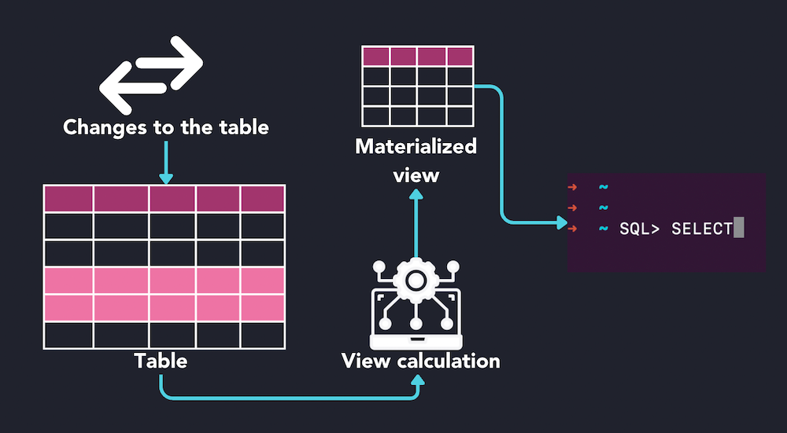
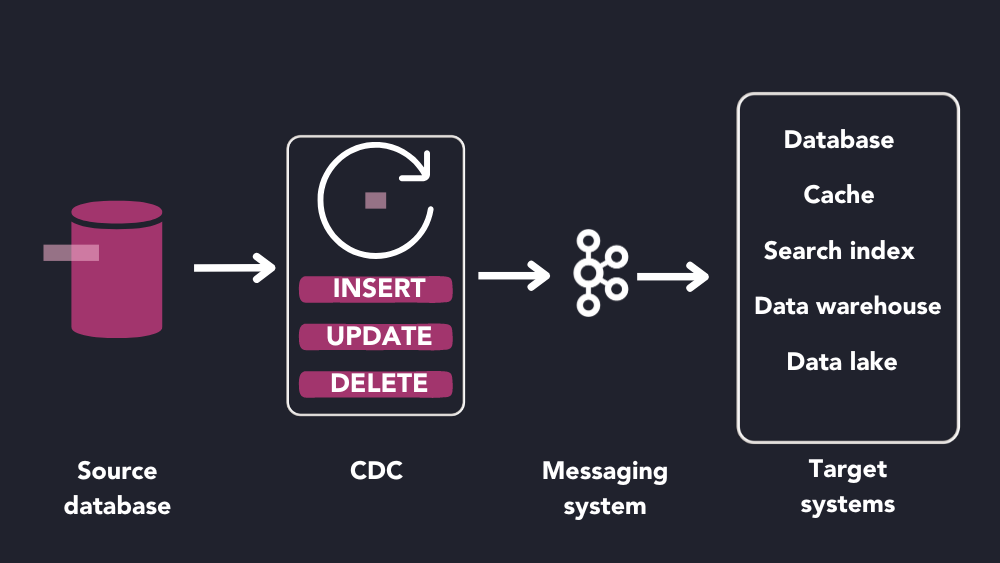
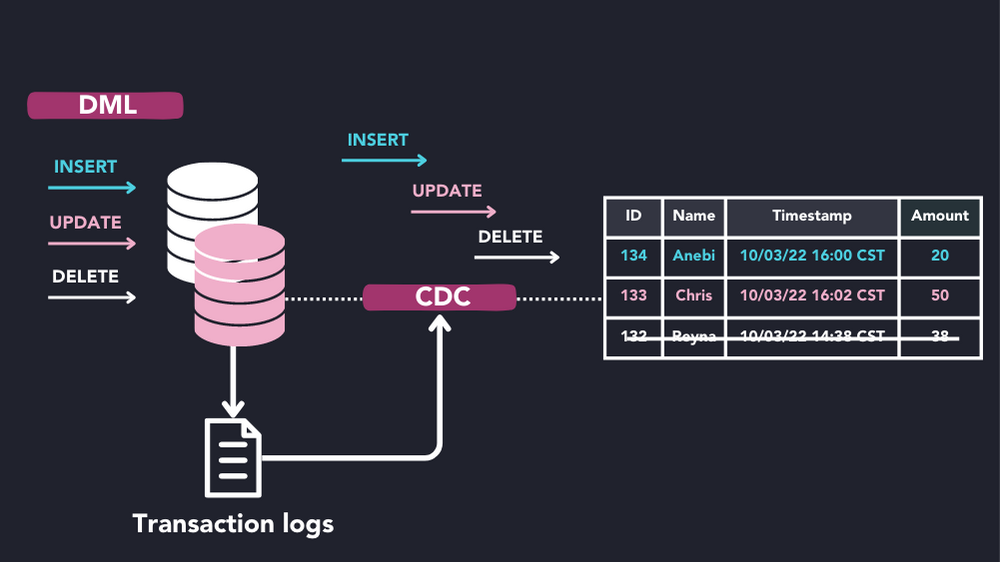

物化视图是一种数据库对象，用于存储预先计算的查询结果。当频繁访问复杂查询的结果时，通常会使用物化视图。通过预先计算和存储这些数据，用户可以更快地访问这些数据，而不必动态地重新计算可能耗时的查询。物化视图会定期刷新，或者由基础数据的更新触发，以使结果视图保持最新状态

变更数据捕获 (CDC) 是一种数据集成技术，用于跟踪数据源的更改并实时将这些更改传递到目标系统。

最常见的是，变更数据捕获用于监视源数据库的更改并将这些更改传播到数据库、数据仓库、数据湖或事件流平台。

CDC 在跨各种系统的数据一致性很重要的情况下很有用。例如，变更数据捕获系统大量用于数据复制、数据迁移和数据处理管道。由于 CDC 系统实时跟踪更改，因此它比使用批处理的解决方案更好地保持了跨系统的数据完整性。

