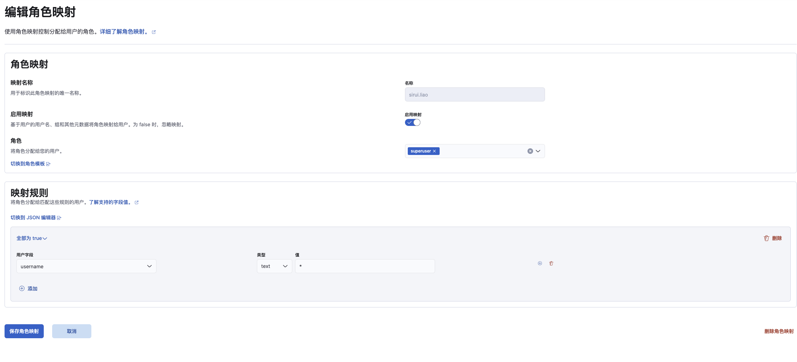

Elasticsearch提供六个带有系统默认角色的默认账号：

- `elastic`：为 Elasticsearch 超级管理员，拥有所有权限。
- `kibana`：用于 Kibana 服务和 Elasticsearch 集群的通信和信息交互。
- `logstash_system`：用于 Logstash 服务和 Elasticsearch 集群的通信和信息交互。
- `beats_system`：用于 Beats 服务和 Elasticsearch 集群的通信和信息交互。
- `apm_system`：用于 APM 服务和 Elasticsearch 集群的通信和信息交互。
- `remote_monitoring_user`：Metricbeat 用户在 Elasticsearch 集群中收集和存储监控信息时使用，它具有远程监视代理和远程监视收集器内置角色。 Elasticsearch 默认角色

