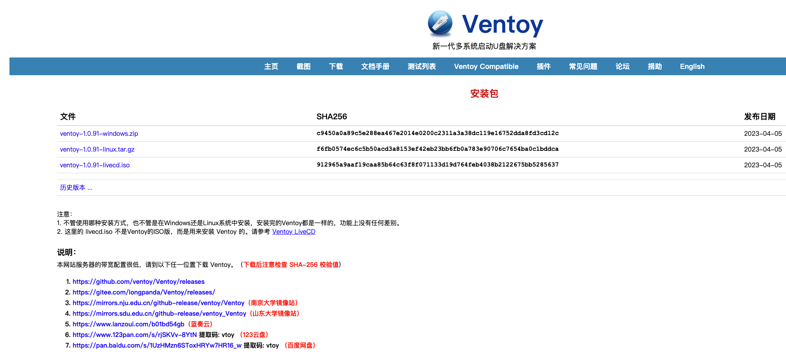

## Ventoy 简介

新一代多系统启动 U 盘解决方案 <https://www.ventoy.net/cn/download.html>

## 安装 Ventoy

首先准备一个空闲的 U 盘，用 Ventoy 一键制作 USB 启动盘

打开 ventoy 下载安装， Ventoy 是开源软件，下载使用都是免费的，直接去官网或者 GitHub 页面下载即可

在 PC 上安装，并运行 Ventoy 软件，程序会自动检测当前 USB 设备；如果插入了多个 U 盘注意识别，别搞错了，造成数据丢失

点击安装开始制作，安装完成后可以看到 U 盘已经被重命名为 Ventoy

打开磁盘管理，可以看到 U 盘被细分为 2 个大分区，Ventoy 分区为活动分区，exFAT 文件系统，用于存放 ISO 文件，exFAT 文件系统也能更好的跨平台使用；Ventoy 的系统分区里其实还有一个只有 1MB 的空间，存有 Legacy BIOS 模式下的启动文件，可见对于老旧设备来说，Ventoy 一样兼容

直接下载需要安装的系统镜像放到 U 盘里就可以了。如果 U 盘够大的话，一些常用的镜像和工具都可以放到里面，以后各个系统装机都可以使用。不管是各版本的 Windows 系统还是 PE 系统甚至是 ubuntu 系统，只要想加载就直接将镜像文件拖入到 Ventoy 文件夹内即可