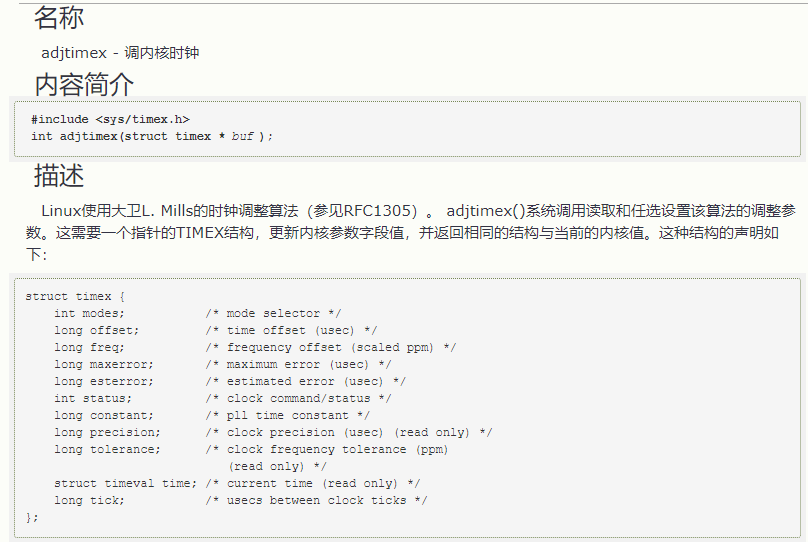

## Linux 时钟原理

在一台计算机上我们有两个时钟：

- 硬件时间时钟 (RTC)
- 系统时钟 (System Clock)

系统时钟就是操作系统的 kernel 所用来计算时间的时钟。它从 1970 年 1 月 1 日 00:00:00 UTC 时间到目前为止秒数总和的值。在 Linux 下，系统时间在开机的时候会和 RTC 硬件时钟同步 (synchronization)，之后也就各自独立运行

系统运行期间，则通过其他硬件时钟源进行 tick 计算（tsc、hpet、acpi_pm）

若安装了 NTP，则通过 ntp 保证时间的准确性


RTC（real time clock）通过主板（CMOS）的电磁供电，精确到秒。用户可手工设置 RTC 时间。

查看 RTC 硬件时钟（需要 root 权限）

```bash
hwclock -r
```

将系统时钟同步到硬件时钟（从 `/etc/adjtime` 获取值，同步到硬件时钟）

```bash
hwclock -w
```

将硬件时钟同步到系统时钟

```bash
hwclock -s
```

查看系统时钟

```bash
date
```

查看操作系统时间的时钟源（clocksource 时钟源都是通过硬件实现的）：

可选源位于：

```
/sys/devices/system/clocksource/clocksource0/available_clocksource
```

可选项：

- tsc：通过 CPU 频率计数，可精确到纳秒级别。rating=300
- hpet：rating=250
- acpi_pm：rating=200
- rating 指标数值越大，越精确

当前时钟源位于：

```
/sys/devices/system/clocksource/clocksource0/current_clocksource
```

查看本地与 ntp 之间的状态

```
ntpq -p

chronyc sources -v
```

以 ntpq 输出为例

``` 
remote            refid     st  t  when poll reach  delay   offset   jitter

==================================================================

*10.247.160.31  10.240.241.5  4  u  53    64  377   0.240  0.374  0.240

```


| 字段           | 含义                                                         | 备注                               |
| -------------- | ------------------------------------------------------------ | ---------------------------------- |
| remote前的符号 | `*` 表示选取的参考时间                                       | `*、+、-` 和空白                   |
| remote         | 响应这个请求的 NTP 服务器的名称                              |                                    |
| refid          | NTP 服务器使用的上一级 NTP 服务器                            |                                    |
| st             | remote远程服务器的级别。由于NTP是层型结构,有顶端的服务器,多层的Relay Server再到客户端.所以服务器从高到低级别可以设定为1-16. 为了减缓负荷和网络堵塞,原则上应该避免直接连接到级别为1的服务器的 | 层数，取值范围：0-15。16表示不可达 |
| t              | 未知                                                         |                                    |
| when           | 上一次成功请求之后到现在的秒数                               | 单位：秒                           |
| poll           | 本地机和远程服务器多少时间进行一次同步。 在一开始运行NTP的时候这个poll值会比较小,那样和服务器同步的频率也就增加了,可以尽快调整到正确的时间范围，之后poll值会逐渐增大,同步的频率也就会相应减小 | 单位：秒                           |
| reach          | 这是一个八进制值,用来测试能否和服务器连接.每成功连接一次它的值就会增加 | 成功访问ntp服务器次数，八进制      |
| delay          | 从本地机发送同步要求到ntp服务器的round trip time             | 一次访问耗时，rtt。单位：毫秒      |
| offset         | 主机通过NTP时钟同步与所同步时间源的时间偏移量，单位为毫秒（ms）。offset越接近于0,主机和ntp服务器的时间越接近 | 时间偏差，单位：毫秒               |
| jitter         | 这是一个用来做统计的值. 它统计了在特定个连续的连接数里offset的分布情况. 简单地说这个数值的绝对值越小，主机的时间就越精确 | 我理解为offst的平均值              |

## node-exporter 对时间同步的监控

node-exporter 对时间同步监控有 2 个维度，一个是 RTC 时钟与系统时钟的同步监控；另外一个是 NTP 与系统时间的同步监控

官网：<https://github.com/prometheus/node_exporter/blob/master/docs/TIME.md>

其中，node_timex_offset 通过查看源码确认，是 RTC 与系统时间的差异

- <https://github.com/prometheus/node_exporter/blob/v1.8.1/collector/timex.go#L167-L191>

源码中，是通过调用 unix 的 adjtimex 函数来计算偏移量的。通过查询 unix 的 adjtimex 函数，即可知道是 RTC 与系统时间的偏移量。

<http://www.hechaku.com/Unix_Linux/adjtimex.html>



node-exporter 也提供系统时间与 NTP 之间的差异，但需要开启 ntp collector 模块

加上 `--collector.ntp` 参数即可