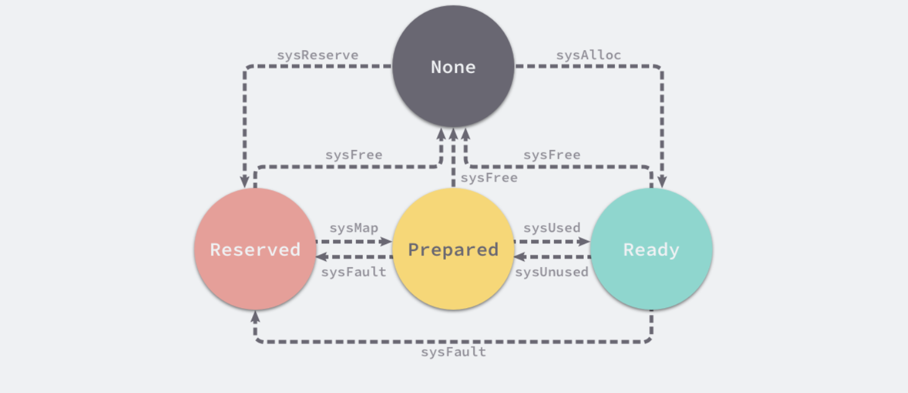

## 内存分配器

程序中的数据和变量都会被分配到程序所在的虚拟内存中，内存空间包含两个重要区域：栈区（Stack）和堆区（Heap）

- 函数调用的参数、返回值以及局部变量大都会被分配到栈上，这部分内存会由编译器进行管理

- 不同编程语言使用不同的方法管理堆区的内存，C++ 等编程语言会由工程师主动申请和释放内存，Go 以及 Java 等编程语言会由工程师和编译器共同管理，堆中的对象由内存分配器分配并由垃圾收集器回收

## 内存管理组件

内存管理一般包含三个不同的组件，分别是用户程序（Mutator）、分配器（Allocator）和收集器（Collector），当用户程序申请内存时，它会通过内存分配器申请新内存，而分配器会负责从堆中初始化相应的内存区域


## 分配方法

编程语言的内存分配器一般包含两种分配方法

- 线性分配器（Sequential Allocator，Bump Allocator）
- 空闲链表分配器（Free-List Allocator）

### 线性分配器

线性分配（Bump Allocator）是一种高效的内存分配方法，但是有较大的局限性。当使用线性分配器时，只需要在内存中维护一个指向内存特定位置的指针，如果用户程序向分配器申请内存，分配器只需要检查剩余的空闲内存、返回分配的内存区域并修改指针在内存中的位置，即移动下图中的指针：


虽然线性分配器实现为它带来了较快的执行速度以及较低的实现复杂度，但是线性分配器无法在内存被释放时重用内存。如果已经分配的内存被回收，线性分配器无法重新利用红色的内存：


因为线性分配器具有上述特性，所以需要与合适的垃圾回收算法配合使用，例如：标记压缩（Mark-Compact）、复制回收（Copying GC）和分代回收（Generational GC）等算法，它们可以通过拷贝的方式整理存活对象的碎片，将空闲内存定期合并，这样就能利用线性分配器的效率提升内存分配器的性能

### 空闲链表分配器

空闲链表分配器（Free-List Allocator）可以重用已经被释放的内存，它在内部会维护一个类似链表的数据结构。当用户程序申请内存时，空闲链表分配器会依次遍历空闲的内存块，找到足够大的内存，然后申请新的资源并修改链表：


因为不同的内存块通过指针构成了链表，所以使用这种方式的分配器可以重新利用回收的资源，但是因为分配内存时需要遍历链表，所以它的时间复杂度是 𝑂(𝑛)。空闲链表分配器可以选择不同的策略在链表中的内存块中进行选择，最常见的是以下四种：

- 首次适应（First-Fit）— 从链表头开始遍历，选择第一个大小大于申请内存的内存块；
- 循环首次适应（Next-Fit）— 从上次遍历的结束位置开始遍历，选择第一个大小大于申请内存的内存块；
- 最优适应（Best-Fit）— 从链表头遍历整个链表，选择最合适的内存块；
- 隔离适应（Segregated-Fit）— 将内存分割成多个链表，每个链表中的内存块大小相同，申请内存时先找到满足条件的链表，再从链表中选择合适的内存块；

Go 语言使用的内存分配策略与隔离适应策略有些相似

隔离适应策略会将内存分割成由 4、8、16、32 字节的内存块组成的链表，当向内存分配器申请 8 字节的内存时，它会在上图中找到满足条件的空闲内存块并返回。隔离适应的分配策略减少了需要遍历的内存块数量，提高了内存分配的效率


## 分级分配

线程缓存分配（Thread-Caching Malloc，TCMalloc）是用于分配内存的机制，它比 glibc 中的 `malloc` 还要快很多

Go 语言的内存分配器就借鉴了 TCMalloc 的设计实现高速的内存分配，它的核心理念是使用多级缓存将对象根据大小分类，并按照类别实施不同的分配策略

### 对象大小

因为程序中的绝大多数对象的大小都在 32KB 以下，而申请的内存大小影响 Go 语言运行时分配内存的过程和开销，所以分别处理大对象和小对象有利于提高内存分配器的性能

|  类别  |     大小      |
| :----: | :-----------: |
| 微对象 |  `(0, 16B)`   |
| 小对象 | `[16B, 32KB]` |
| 大对象 | `(32KB, +∞)`  |

### 多级缓存

内存分配器不仅会区别对待大小不同的对象，还会将内存分成不同的级别分别管理，TCMalloc 和 Go 运行时分配器都会引入线程缓存（Thread Cache）、中心缓存（Central Cache）和页堆（Page Heap）三个组件分级管理内存：


- 线程缓存：线程缓存属于每一个独立的线程，它能够满足线程上绝大多数的内存分配需求，因为不涉及多线程，所以也不需要使用互斥锁来保护内存，这能够减少锁竞争带来的性能损耗

- 中心缓存：当线程缓存不能满足需求时，运行时会使用中心缓存作为补充解决小对象的内存分配
- 页堆：在遇到 32KB 以上的对象时，内存分配器会选择页堆直接分配大内存

这种多层级的内存分配设计与计算机操作系统中的多级缓存有些类似，因为多数的对象都是小对象，可以通过线程缓存和中心缓存提供足够的内存空间，发现资源不足时从上一级组件中获取更多的内存资源

## 虚拟内存布局

在 Go 语言 1.10 以前的版本，堆区的内存空间都是连续的；但是在 1.11 版本，Go 团队使用稀疏的堆内存空间替代了连续的内存，解决了连续内存带来的限制以及在特殊场景下可能出现的问题

### 线性内存

Go 语言程序的 1.10 版本在启动时会初始化整片虚拟内存区域，如下所示的三个区域 `spans`、`bitmap` 和 `arena` 分别预留了 512MB、16GB 以及 512GB 的内存空间，这些内存并不是真正存在的物理内存，而是虚拟内存：


- `spans` 区域存储了指向内存管理单元 `runtime.mspan` 的指针，每个内存单元会管理几页的内存空间，每页大小为 8KB；
- `bitmap` 用于标识 `arena` 区域中的那些地址保存了对象，位图中的每个字节都会表示堆区中的 32 字节是否空闲；
- `arena` 区域是真正的堆区，运行时会将 8KB 看做一页，这些内存页中存储了所有在堆上初始化的对象；

对于任意一个地址，都可以根据 `arena` 的基地址计算该地址所在的页数并通过 `spans` 数组获得管理该片内存的管理单元 `runtime.mspan`，`spans` 数组中多个连续的位置可能对应同一个 `runtime.mspan` 结构

Go 语言在垃圾回收时会根据指针的地址判断对象是否在堆中，并通过上一段中介绍的过程找到管理该对象的 `runtime.mspan`。这些都建立在 `堆区的内存是连续的` 这一假设上。这种设计虽然简单并且方便，但是在 C 和 Go 混合使用时会导致程序崩溃：

1. 分配的内存地址会发生冲突，导致堆的初始化和扩容失败；
2. 没有被预留的大块内存可能会被分配给 C 语言的二进制，导致扩容后的堆不连续；

线性的堆内存需要预留大块的内存空间，但是申请大块的内存空间而不使用是不切实际的，不预留内存空间却会在特殊场景下造成程序崩溃。虽然连续内存的实现比较简单，但是这些问题也没有办法忽略

### 稀疏内存

稀疏内存是 Go 语言在 1.11 中提出的方案，使用稀疏的内存布局不仅能移除堆大小的上限，还能解决 C 和 Go 混合使用时的地址空间冲突问题。不过因为基于稀疏内存的内存管理失去了内存的连续性这一假设，这也使内存管理变得更加复杂：


运行时使用二维的 `runtime.heapArena` 数组管理所有的内存，每个单元都会管理 64MB 的内存空间：

源码：<https://github.com/golang/go/blob/go1.21.4/src/runtime/mheap.go#L235-L319>

```go
// A heapArena stores metadata for a heap arena. heapArenas are stored
// outside of the Go heap and accessed via the mheap_.arenas index.
type heapArena struct {
	_ sys.NotInHeap

	// bitmap stores the pointer/scalar bitmap for the words in
	// this arena. See mbitmap.go for a description.
	// This array uses 1 bit per word of heap, or 1.6% of the heap size (for 64-bit).
	bitmap [heapArenaBitmapWords]uintptr

	// If the ith bit of noMorePtrs is true, then there are no more
	// pointers for the object containing the word described by the
	// high bit of bitmap[i].
	// In that case, bitmap[i+1], ... must be zero until the start
	// of the next object.
	// We never operate on these entries using bit-parallel techniques,
	// so it is ok if they are small. Also, they can't be bigger than
	// uint16 because at that size a single noMorePtrs entry
	// represents 8K of memory, the minimum size of a span. Any larger
	// and we'd have to worry about concurrent updates.
	// This array uses 1 bit per word of bitmap, or .024% of the heap size (for 64-bit).
	noMorePtrs [heapArenaBitmapWords / 8]uint8

	// spans maps from virtual address page ID within this arena to *mspan.
	// For allocated spans, their pages map to the span itself.
	// For free spans, only the lowest and highest pages map to the span itself.
	// Internal pages map to an arbitrary span.
	// For pages that have never been allocated, spans entries are nil.
	//
	// Modifications are protected by mheap.lock. Reads can be
	// performed without locking, but ONLY from indexes that are
	// known to contain in-use or stack spans. This means there
	// must not be a safe-point between establishing that an
	// address is live and looking it up in the spans array.
	spans [pagesPerArena]*mspan

	// pageInUse is a bitmap that indicates which spans are in
	// state mSpanInUse. This bitmap is indexed by page number,
	// but only the bit corresponding to the first page in each
	// span is used.
	//
	// Reads and writes are atomic.
	pageInUse [pagesPerArena / 8]uint8

	// pageMarks is a bitmap that indicates which spans have any
	// marked objects on them. Like pageInUse, only the bit
	// corresponding to the first page in each span is used.
	//
	// Writes are done atomically during marking. Reads are
	// non-atomic and lock-free since they only occur during
	// sweeping (and hence never race with writes).
	//
	// This is used to quickly find whole spans that can be freed.
	//
	// TODO(austin): It would be nice if this was uint64 for
	// faster scanning, but we don't have 64-bit atomic bit
	// operations.
	pageMarks [pagesPerArena / 8]uint8

	// pageSpecials is a bitmap that indicates which spans have
	// specials (finalizers or other). Like pageInUse, only the bit
	// corresponding to the first page in each span is used.
	//
	// Writes are done atomically whenever a special is added to
	// a span and whenever the last special is removed from a span.
	// Reads are done atomically to find spans containing specials
	// during marking.
	pageSpecials [pagesPerArena / 8]uint8

	// checkmarks stores the debug.gccheckmark state. It is only
	// used if debug.gccheckmark > 0.
	checkmarks *checkmarksMap

	// zeroedBase marks the first byte of the first page in this
	// arena which hasn't been used yet and is therefore already
	// zero. zeroedBase is relative to the arena base.
	// Increases monotonically until it hits heapArenaBytes.
	//
	// This field is sufficient to determine if an allocation
	// needs to be zeroed because the page allocator follows an
	// address-ordered first-fit policy.
	//
	// Read atomically and written with an atomic CAS.
	zeroedBase uintptr
}
```

该结构体中的 `bitmap` 和 `spans` 与线性内存中的 `bitmap` 和 `spans` 区域一一对应，`zeroedBase` 字段指向了该结构体管理的内存的基地址。将原有的连续大内存切分成稀疏的小内存，而用于管理这些内存的元信息也被切成了小块

不同平台和架构的二维数组大小可能完全不同，如果 Go 语言服务在 Linux 的 x86-64 架构上运行，二维数组的一维大小会是 1，而二维大小是 4,194,304，因为每一个指针占用 8 字节的内存空间，所以元信息的总大小为 32MB。由于每个 `runtime.heapArena` 都会管理 64MB 的内存，整个堆区最多可以管理 256TB 的内存，这比之前的 512GB 多好几个数量级

由于内存的管理变得更加复杂，上述改动对垃圾回收稍有影响，大约会增加 1% 的垃圾回收开销，这也是为了解决已有问题必须付出的成本

## 地址空间

因为所有的内存最终都是要从操作系统中申请的，所以 Go 语言的运行时构建了操作系统的内存管理抽象层，该抽象层将运行时管理的地址空间分成以下四种状态：

|    状态    |                             解释                             |
| :--------: | :----------------------------------------------------------: |
|   `None`   |         内存没有被保留或者映射，是地址空间的默认状态         |
| `Reserved` |        运行时持有该地址空间，但是访问该内存会导致错误        |
| `Prepared` | 内存被保留，一般没有对应的物理内存访问该片内存的行为是未定义的可以快速转换到 `Ready` 状态 |
|  `Ready`   |                        可以被安全访问                        |

每个不同的操作系统都会包含一组用于管理内存的特定方法，这些方法可以让内存地址空间在不同的状态之间转换，不同状态之间的转换过程：



运行时中包含多个操作系统实现的状态转换方法，所有的实现都包含在以 `mem_` 开头的文件中

运行时使用 Linux 提供的 `mmap`、`munmap` 和 `madvise` 等系统调用实现了操作系统的内存管理抽象层，抹平了不同操作系统的差异，为运行时提供了更加方便的接口，除了 Linux 之外，运行时还实现了 BSD、Darwin、Plan9 以及 Windows 等平台上抽象层

- `runtime.sysAlloc`

从操作系统中获取一大块可用的内存空间，可能为几百 KB 或者几 MB

```go
// sysAlloc transitions an OS-chosen region of memory from None to Ready.
// More specifically, it obtains a large chunk of zeroed memory from the
// operating system, typically on the order of a hundred kilobytes
// or a megabyte. This memory is always immediately available for use.
//
// sysStat must be non-nil.
//
// Don't split the stack as this function may be invoked without a valid G,
// which prevents us from allocating more stack.
//
//go:nosplit
func sysAlloc(n uintptr, sysStat *sysMemStat) unsafe.Pointer {
	sysStat.add(int64(n))
	gcController.mappedReady.Add(int64(n))
	return sysAllocOS(n)
}
```

源码：

<https://github.com/golang/go/blob/go1.21.4/src/runtime/mem.go#L38-L53>  

<https://github.com/golang/go/blob/go1.21.4/src/runtime/mem_linux.go#L17-L35>

- `runtime.sysFree`

在程序发生内存不足（Out-of Memory，OOM）时调用并无条件地返回内存

```go
// sysFree transitions a memory region from any state to None. Therefore, it
// returns memory unconditionally. It is used if an out-of-memory error has been
// detected midway through an allocation or to carve out an aligned section of
// the address space. It is okay if sysFree is a no-op only if sysReserve always
// returns a memory region aligned to the heap allocator's alignment
// restrictions.
//
// sysStat must be non-nil.
//
// Don't split the stack as this function may be invoked without a valid G,
// which prevents us from allocating more stack.
//
//go:nosplit
func sysFree(v unsafe.Pointer, n uintptr, sysStat *sysMemStat) {
	sysStat.add(-int64(n))
	gcController.mappedReady.Add(-int64(n))
	sysFreeOS(v, n)
}
```

源码：

<https://github.com/golang/go/blob/go1.21.4/src/runtime/mem.go#L100-L117>

<https://github.com/golang/go/blob/go1.21.4/src/runtime/mem_linux.go#L144-L150>

- `runtime.sysReserve`

保留操作系统中的一片内存区域，访问这片内存会触发异常

```go
// sysReserve transitions a memory region from None to Reserved. It reserves
// address space in such a way that it would cause a fatal fault upon access
// (either via permissions or not committing the memory). Such a reservation is
// thus never backed by physical memory.
//
// If the pointer passed to it is non-nil, the caller wants the
// reservation there, but sysReserve can still choose another
// location if that one is unavailable.
//
// NOTE: sysReserve returns OS-aligned memory, but the heap allocator
// may use larger alignment, so the caller must be careful to realign the
// memory obtained by sysReserve.
func sysReserve(v unsafe.Pointer, n uintptr) unsafe.Pointer {
	return sysReserveOS(v, n)
}
```

源码：

<https://github.com/golang/go/blob/go1.21.4/src/runtime/mem.go#L133-L147>

<https://github.com/golang/go/blob/go1.21.4/src/runtime/mem_linux.go#L156-L162>

- `runtime.sysMap`

保证内存区域可以快速转换至就绪状态

```go
// sysMap transitions a memory region from Reserved to Prepared. It ensures the
// memory region can be efficiently transitioned to Ready.
//
// sysStat must be non-nil.
func sysMap(v unsafe.Pointer, n uintptr, sysStat *sysMemStat) {
	sysStat.add(int64(n))
	sysMapOS(v, n)
}
```

源码：

<https://github.com/golang/go/blob/go1.21.4/src/runtime/mem.go#L149-L156>

<https://github.com/golang/go/blob/go1.21.4/src/runtime/mem_linux.go#L164-L173>

- `runtime.sysUsed`

通知操作系统应用程序需要使用该内存区域，保证内存区域可以安全访问

```go
// sysUsed transitions a memory region from Prepared to Ready. It notifies the
// operating system that the memory region is needed and ensures that the region
// may be safely accessed. This is typically a no-op on systems that don't have
// an explicit commit step and hard over-commit limits, but is critical on
// Windows, for example.
//
// This operation is idempotent for memory already in the Prepared state, so
// it is safe to refer, with v and n, to a range of memory that includes both
// Prepared and Ready memory. However, the caller must provide the exact amount
// of Prepared memory for accounting purposes.
func sysUsed(v unsafe.Pointer, n, prepared uintptr) {
	gcController.mappedReady.Add(int64(prepared))
	sysUsedOS(v, n)
}
```

源码：

<https://github.com/golang/go/blob/go1.21.4/src/runtime/mem.go#L65-L78>

<https://github.com/golang/go/blob/go1.21.4/src/runtime/mem_linux.go#L84-L95>

- `runtime.sysUnused`

通知操作系统虚拟内存对应的物理内存已经不再需要，可以重用物理内存

```go
// sysUnused transitions a memory region from Ready to Prepared. It notifies the
// operating system that the physical pages backing this memory region are no
// longer needed and can be reused for other purposes. The contents of a
// sysUnused memory region are considered forfeit and the region must not be
// accessed again until sysUsed is called.
func sysUnused(v unsafe.Pointer, n uintptr) {
	gcController.mappedReady.Add(-int64(n))
	sysUnusedOS(v, n)
}
```

源码：

<https://github.com/golang/go/blob/go1.21.4/src/runtime/mem.go#L55-L63>

<https://github.com/golang/go/blob/go1.21.4/src/runtime/mem_linux.go#L41-L82>

- `runtime.sysFault`

将内存区域转换成保留状态，主要用于运行时的调试

```go
// sysFault transitions a memory region from Ready to Reserved. It
// marks a region such that it will always fault if accessed. Used only for
// debugging the runtime.
//
// TODO(mknyszek): Currently it's true that all uses of sysFault transition
// memory from Ready to Reserved, but this may not be true in the future
// since on every platform the operation is much more general than that.
// If a transition from Prepared is ever introduced, create a new function
// that elides the Ready state accounting.
func sysFault(v unsafe.Pointer, n uintptr) {
	gcController.mappedReady.Add(-int64(n))
	sysFaultOS(v, n)
}
```

源码：

<https://github.com/golang/go/blob/go1.21.4/src/runtime/mem.go#L119-L131>

<https://github.com/golang/go/blob/go1.21.4/src/runtime/mem_linux.go#L152-L154>