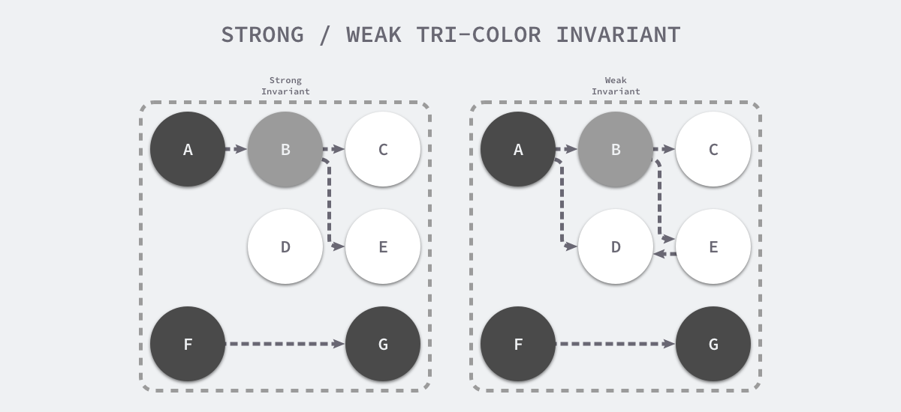

## 垃圾收集器

垃圾收集器：需要负责回收不再使用的对象和内存空间；在几乎所有的现代编程语言中，垃圾收集器都是一个复杂的系统，为了在不影响用户程序的情况下回收废弃的内存需要付出非常多的努力

用户程序（Mutator）会通过内存分配器（Allocator）在堆上申请内存，而垃圾收集器（Collector）负责回收堆上的内存空间，内存分配器和垃圾收集器共同管理着程序中的堆内存空间


编程语言通常会使用手动和自动两种方式管理内存

- C、C++ 以及 Rust 等编程语言使用手动的方式管理内存工程师需要主动申请或者释放内存
- Python、Ruby、Java 和 Go 等语言使用自动的内存管理系统，一般都是垃圾收集机制
  - 不过 Objective-C 却选择了自动引用计数

### GC & RC

- GC：垃圾回收管理内存的方式
- RC：引用计数管理内存的方式

引用计数：

1. 使用前，为了保护对象不被销毁，计数 `+1`
2. 使用完后，计数 `-1`，计数减到 `0` 之后，就可以安全销毁

```c
obj_ref(obj);
{
    do_something ; 
}
obj_unref(obj);
```

### STW

暂停程序（Stop the world，STW）

随着用户程序申请越来越多的内存，系统中的垃圾也逐渐增多；当程序的内存占用达到一定阈值时，整个应用程序就会全部暂停，垃圾收集器会扫描已经分配的所有对象并回收不再使用的内存空间，当这个过程结束后，用户程序才可以继续执行

Go 语言在早期也使用这种策略实现垃圾收集，但是现在的实现已经复杂了很多

## 垃圾收集器设计原理

### 标记清除

标记清除（Mark-Sweep）算法是最常见的垃圾收集算法，标记清除收集器是跟踪式垃圾收集器

其执行过程可以分成两个阶段

- 标记（Mark）标记阶段 — 从根对象出发查找并标记堆中所有存活的对象；
- 清除（Sweep）清除阶段 — 遍历堆中的全部对象，回收未被标记的垃圾对象并将回收的内存加入空闲链表；

内存空间中包含多个对象，从根对象出发依次遍历对象的子对象并将从根节点可达的对象都标记成存活状态，即 A、C 和 D 三个对象，剩余的 B、E 和 F 三个对象因为从根节点不可达，所以会被当做垃圾：


标记阶段结束后会进入清除阶段，在该阶段中收集器会依次遍历堆中的所有对象，释放其中没有被标记的 B、E 和 F 三个对象并将新的空闲内存空间以链表的结构串联起来，方便内存分配器的使用


传统的标记清除算法，垃圾收集器从垃圾收集的根对象出发，递归遍历这些对象指向的子对象并将所有可达的对象标记成存活；标记阶段结束后，垃圾收集器会依次遍历堆中的对象并清除其中的垃圾，整个过程需要标记对象的存活状态，用户程序在垃圾收集的过程中也不能执行，需要用到更复杂的机制来解决 STW 的问题

### 三色抽象

为了解决原始标记清除算法带来的长时间 STW，多数现代的追踪式垃圾收集器都会实现三色标记算法的变种以缩短 STW 的时间。三色标记算法将程序中的对象分成白色、黑色和灰色三类

- 白色对象（可能死亡） — 被回收器访问到的对象；在回收开始阶段，所有对象均为白色，当回收结束后，白色对象均不可达
- 灰色对象（波面） — 已被回收器访问到的对象，但回收器需要对其中的一个或多个指针进行扫描，因为他们可能还指向白色对象
- 黑色对象（确定存活） — 已被回收器访问到的对象，其中所有字段都已被扫描，黑色对象中任何一个指针都不可能直接指向白色对象


在垃圾收集器开始工作时，程序中不存在任何的黑色对象，垃圾收集的根对象会被标记成灰色，垃圾收集器只会从灰色对象集合中取出对象开始扫描，当灰色集合中不存在任何对象时，标记阶段就会结束

可以将其归纳成以下几个步骤：

1. 从灰色对象的集合中选择一个灰色对象并将其标记成黑色；
2. 将黑色对象指向的所有对象都标记成灰色，保证该对象和被该对象引用的对象都不会被回收；
3. 重复上述两个步骤直到对象图中不存在灰色对象；


当三色的标记清除的标记阶段结束之后，应用程序的堆中就不存在任何的灰色对象，只能看到黑色的存活对象以及白色的垃圾对象，垃圾收集器可以回收这些白色的垃圾

下面是使用三色标记垃圾收集器执行标记后的堆内存，堆中只有对象 D 为待回收的垃圾：


因为用户程序可能在标记执行的过程中修改对象的指针，所以三色标记清除算法本身是不可以并发或者增量执行的，它仍然需要 STW，在如下所示的三色标记过程中，用户程序建立了从 A 对象到 D 对象的引用，但是因为程序中已经不存在灰色对象了，所以 D 对象会被垃圾收集器错误地回收


本来不应该被回收的对象却被回收了，这在内存管理中是非常严重的错误，这种错误称为悬挂指针，即指针没有指向特定类型的合法对象，影响了内存的安全性，想要并发或者增量地标记对象还是需要使用屏障技术

### 屏障技术

内存屏障技术是一种屏障指令，它可以让 CPU 或者编译器在执行内存相关操作时遵循特定的约束，目前多数的现代处理器都会乱序执行指令以最大化性能，但是该技术能够保证内存操作的顺序性，在内存屏障前执行的操作一定会先于内存屏障后执行的操作

想要在并发或者增量的标记算法中保证正确性，需要达成以下两种三色不变性（Tri-color invariant）中的一种：

- 强三色不变性 — 黑色对象不会指向白色对象，只会指向灰色对象或者黑色对象
- 弱三色不变性 — 黑色对象指向的白色对象必须包含一条从灰色对象经由多个白色对象的可达路径



遵循上述两个不变性中的任意一个，都能保证垃圾收集算法的正确性，而屏障技术就是在并发或者增量标记过程中保证三色不变性的重要技术

垃圾收集中的屏障技术更像是一个钩子方法，它是在用户程序读取对象、创建新对象以及更新对象指针时执行的一段代码，根据操作类型的不同，可以将它们分成读屏障（Read barrier）和写屏障（Write barrier）两种，因为读屏障需要在读操作中加入代码片段，对用户程序的性能影响很大，所以编程语言往往都会采用写屏障保证三色不变性

#### Dijkstra 插入写屏障

Dijkstra 在 1978 年提出了插入写屏障，通过如下所示的写屏障，用户程序和垃圾收集器可以在交替工作的情况下保证程序执行的正确性：

```go
writePointer(slot, ptr):
    shade(ptr)
    *slot = ptr
```

满足强三色不变性

插入写屏障的伪代码非常好理解，每当执行类似 `*slot = ptr` 的表达式时，会执行上述写屏障通过 `shade` 函数尝试改变指针的颜色。如果 `ptr` 指针是白色的，那么该函数会将该对象设置成灰色，其他情况则保持不变

假设在应用程序中使用 Dijkstra 提出的插入写屏障，在一个垃圾收集器和用户程序交替运行的场景中会出现标记过程：

1. 垃圾收集器将根对象指向 A 对象标记成黑色并将 A 对象指向的对象 B 标记成灰色；
2. 用户程序修改 A 对象的指针，将原本指向 B 对象的指针指向 C 对象，这时触发写屏障将 C 对象标记成灰色；
3. 垃圾收集器依次遍历程序中的其他灰色对象，将它们分别标记成黑色；


Dijkstra 的插入写屏障是一种相对保守的屏障技术，它会将有存活可能的对象都标记成灰色以满足强三色不变性

在如上所示的垃圾收集过程中

- 实际上不再存活的 B 对象最后没有被回收
- 如果在第二和第三步之间将指向 C 对象的指针改回指向 B，垃圾收集器仍然认为 C 对象是存活的，这些被错误标记的垃圾对象只有在下一个循环才会被回收

插入式的 Dijkstra 写屏障虽然实现非常简单并且也能保证强三色不变性，但是它也有明显的缺点。因为栈上的对象在垃圾收集中也会被认为是根对象，所以为了保证内存的安全，Dijkstra 必须为栈上的对象增加写屏障或者在标记阶段完成重新对栈上的对象进行扫描，这两种方法各有各的缺点，前者会大幅度增加写入指针的额外开销，后者重新扫描栈对象时需要暂停程序，垃圾收集算法的设计者需要在这两者之间做出权衡

#### Yuasa 删除写屏障

Yuasa 在 1990 年的论文 Real-time garbage collection on general-purpose machines 中提出了删除写屏障，因为一旦该写屏障开始工作，它会保证开启写屏障时堆上所有对象的可达，所以也被称作快照垃圾收集（Snapshot GC）

该算法会使用如下所示的写屏障保证增量或者并发执行垃圾收集时程序的正确性：

```go
writePointer(slot, ptr)
    shade(*slot)
    *slot = ptr
```

上述代码会在老对象的引用被删除时，将白色的老对象涂成灰色，这样删除写屏障就可以保证弱三色不变性，老对象引用的下游对象一定可以被灰色对象引用

假设在应用程序中使用 Yuasa 提出的删除写屏障，在一个垃圾收集器和用户程序交替运行的场景中会出现如上图所示的标记过程：

1. 垃圾收集器将根对象指向 A 对象标记成黑色并将 A 对象指向的对象 B 标记成灰色
2. 用户程序将 A 对象原本指向 B 的指针指向 C，触发删除写屏障，但是因为 B 对象已经是灰色的，所以不做改变
3. 用户程序将 B 对象原本指向 C 的指针删除，触发删除写屏障，白色的 C 对象被涂成灰色
4. 垃圾收集器依次遍历程序中的其他灰色对象，将它们分别标记成黑色


上述过程中的第三步触发了 Yuasa 删除写屏障的着色，因为用户程序删除了 B 指向 C 对象的指针，所以 C 和 D 两个对象会分别违反强三色不变性和弱三色不变性：

- 强三色不变性 — 黑色的 A 对象直接指向白色的 C 对象
- 弱三色不变性 — 垃圾收集器无法从某个灰色对象出发，经过几个连续的白色对象访问白色的 C 和 D 两个对象

Yuasa 删除写屏障通过对 C 对象的着色，保证了 C 对象和下游的 D 对象能够在这一次垃圾收集的循环中存活，避免发生悬挂指针以保证用户程序的正确性

#### 混合写屏障

混合写屏障就是插入写屏障和删除写屏障的混合

### 增量和并发

传统的垃圾收集算法会在垃圾收集的执行期间暂停应用程序，一旦触发垃圾收集，垃圾收集器会抢占 CPU 的使用权占据大量的计算资源以完成标记和清除工作，然而很多追求实时的应用程序无法接受长时间的 STW


下面的策略优化垃圾收集器：

- 增量垃圾收集 — 增量地标记和清除垃圾，降低应用程序暂停的最长时间
- 并发垃圾收集 — 利用多核的计算资源，在用户程序执行时并发标记和清除垃圾

因为增量和并发两种方式都可以与用户程序交替运行，所以需要使用屏障技术保证垃圾收集的正确性；与此同时，应用程序也不能等到内存溢出时触发垃圾收集，因为当内存不足时，应用程序已经无法分配内存，这与直接暂停程序没有什么区别，增量和并发的垃圾收集需要提前触发并在内存不足前完成整个循环，避免程序的长时间暂停

#### 增量收集器

增量式（Incremental）的垃圾收集是减少程序最长暂停时间的一种方案，它可以将原本时间较长的暂停时间切分成多个更小的 GC 时间片，虽然从垃圾收集开始到结束的时间更长了，但是这也减少了应用程序暂停的最大时间：


增量式的垃圾收集需要与三色标记法一起使用，为了保证垃圾收集的正确性，需要在垃圾收集开始前打开写屏障，这样用户程序修改内存都会先经过写屏障的处理，保证了堆内存中对象关系的强三色不变性或者弱三色不变性

虽然增量式的垃圾收集能够减少最大的程序暂停时间，但是增量式收集也会增加一次 GC 循环的总时间，在垃圾收集期间，因为写屏障的影响用户程序也需要承担额外的计算开销，所以增量式的垃圾收集也不是只带来好处的，但是总体来说还是利大于弊

#### 并发收集器

并发（Concurrent）的垃圾收集不仅能够减少程序的最长暂停时间，还能减少整个垃圾收集阶段的时间，通过开启读写屏障、利用多核优势与用户程序并行执行，并发垃圾收集器确实能够减少垃圾收集对应用程序的影响：


虽然并发收集器能够与用户程序一起运行，但是并不是所有阶段都可以与用户程序一起运行，部分阶段还是需要暂停用户程序的，不过与传统的算法相比，并发的垃圾收集可以将能够并发执行的工作尽量并发执行；当然，因为读写屏障的引入，并发的垃圾收集器也一定会带来额外开销，不仅会增加垃圾收集的总时间，还会影响用户程序，这是我们在设计垃圾收集策略时必须要注意的

## 参考资料

- <https://liqingqiya.github.io/golang/gc/%E5%9E%83%E5%9C%BE%E5%9B%9E%E6%94%B6/%E5%86%99%E5%B1%8F%E9%9A%9C/2020/07/24/gc5.html>
- <https://liqingqiya.github.io/golang/gc/%E5%9E%83%E5%9C%BE%E5%9B%9E%E6%94%B6/2020/06/02/gc1.html>