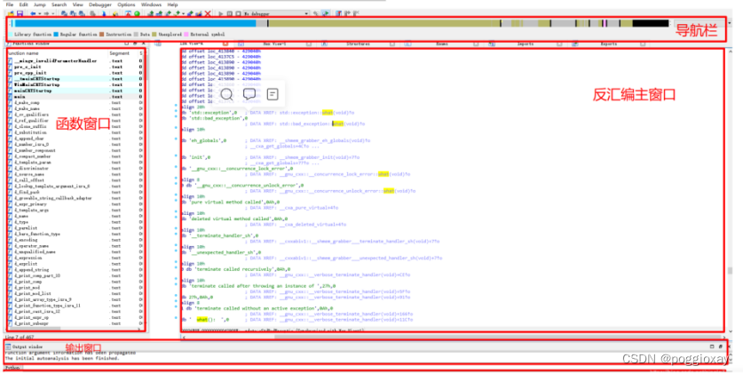

`IDA` 是运行于 `32/64` 位下，可用作反编译和调试的一个完整的逆向工具。使用 `IDA` 尽管是个更加复杂的学习过程，但它提供了 `Ollydbg` 无法实现的静态逆向分析 手段，并且使用户能够在 `Windows`、`Linux` 或 `Macosx` 本地环境以及以下环境中远程操作

- <https://www.hex-rays.com/products/ida/>

参考文档：

- <https://blog.csdn.net/m0_55854679/article/details/127746844>

## IDA 使用

### IDA 文件加载

IDA 会生成一个可能的文件类型列表，在顶部显示，它将显示最适合处理文件的加载器。

Binary File (二进制文件) 是列表最后一个选项，会一直显示，是 IDA 加载无法识别文件的默认选项，提供最低级的加载方法。需要使用二进制加载器的情形包括：分析从网络数据包或日志文件中提取出来的 rom 镜像和破解程序负载。

在 processor type【处理器类型】下拉菜单中，可以指定在反汇编过程中使用的处理器模块【在 ida 的 procs 目录中】。多数情况下，ida 将根据可执行文件头中读取信息，选择合适的处理器。

### 界面介绍

导航栏：显示程序的不同类型数据【普通函数、未定义函数的代码、数据、未定义等】。

反汇编的主窗口：显示反汇编的结果、控制流图等，可以进行拖动、选择等操作

函数窗口：显示所有的函数名称和地址【拖动下方滚动条即可查看】，通过 Ctrl+F 组合进行筛选。

输出窗口：显示运行过程中 IDA 的日志，也可以在下方的输入框中输入命令并执行。

状态指示器：显示为 “AU:idle” 即代表 IDA 已经完成了对程序的自动化分析。

