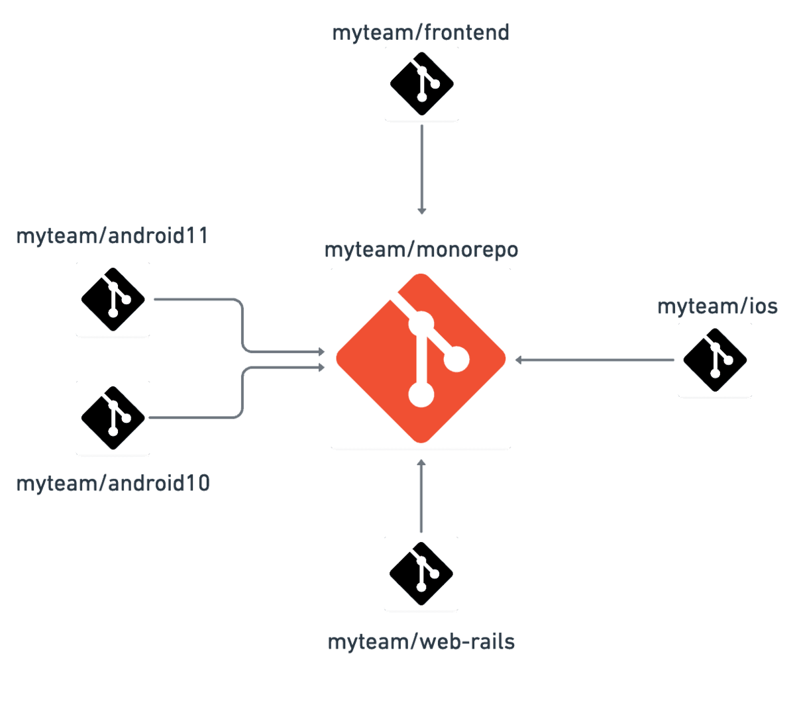

## 单一代码库（monorepos） vs 多代码库（multirepos）

Monorepo 意味着把所有项目的所有代码统一维护在一个单一的代码版本库中，和多代码库方案相比，两者各有优劣，需要根据公司文化和产品特性进行取舍

Monorepos 有时被称为单体代码库（monolithic repositories），但不应该与单体架构（monolithic architecture）相混淆，单体架构是一种用于编写自包含应用程序的软件开发实践

与单一代码库相反的是多代码库（multirepos），每个项目都储存在一个完全独立的、版本控制的代码库中。多代码库是很自然的选择——我们大多数人在开始一个新项目时都愿意开一个新的代码库，毕竟，谁都喜欢从 0 开始。从多代码库到单一代码库的变化就意味着将所有项目移到一个代码库中

## 单一代码库的好处

乍一看，单一代码库和多代码库之间的选择似乎不是什么大问题，但这是一个会深刻影响到公司开发流程的决定。至于单一代码库的好处，可以列举如下：

- 可见性（Visibility）：每个人都可以看到其他人的代码，这样可以带来更好的协作和跨团队贡献——不同团队的开发人员都可以修复代码中的 bug，而你甚至都不知道这个 bug 的存在。
- 更简单的依赖关系管理（Simpler dependency management）：共享依赖关系很简单，因为所有模块都托管在同一个存储库中，因此都不需要包管理器。
- 唯一依赖源（Single source of truth）：每个依赖只有一个版本，意味着没有版本冲突，没有依赖地狱。
- 一致性（Consistency）：当你把所有代码库放在一个地方时，执行代码质量标准和统一的风格会更容易。
- 共享时间线（Shared timeline）：API 或共享库的变更会立即被暴露出来，迫使不同团队提前沟通合作，每个人都得努力跟上变化。
- 原子提交（Atomic commits）：原子提交使大规模重构更容易，开发人员可以在一次提交中更新多个包或项目。
- 隐式 CI（Implicit CI）：因为所有代码已经统一维护在一个地方，因此可以保证持续集成。
- 统一的 CI/CD（Unified CI/CD）：可以为代码库中的每个项目使用相同的 CI/CD 部署流程。
- 统一的构建流程（Unified build process）：代码库中的每个应用程序可以共享一致的构建流程。

## 单一代码库的缺陷

随着单一代码库的发展，我们在版本控制工具、构建系统和持续集成流水线方面达到了设计极限。这些问题可能会让一家公司走上多代码库的道路：

- 性能差（Bad performance）：单一代码库难以扩大规模，像 git blame 这样的命令可能会不合理的花费很长时间执行，IDE 也开始变得缓慢，生产力受到影响，对每个提交测试整个 repo 变得不可行。
- 破坏主线（Broken main/master）：主线损坏会影响到在单一代码库中工作的每个人，这既可以被看作是灾难，也可以看作是保证测试既可以保持简洁又可以跟上开发的好机会。
- 学习曲线（Learning curve）：如果代码库包含了许多紧密耦合的项目，那么新成员的学习曲线会更陡峭。
- 大量的数据（Large volumes of data）：单一代码库每天都要处理大量的数据和提交。
- 所有权（Ownership）：维护文件的所有权更有挑战性，因为像 Git 或 Mercurial 这样的系统没有内置的目录权限。
- Code reviews：通知可能会变得非常嘈杂。例如，GitHub 有有限的通知设置，不适合大量的 pull request 和 code review。