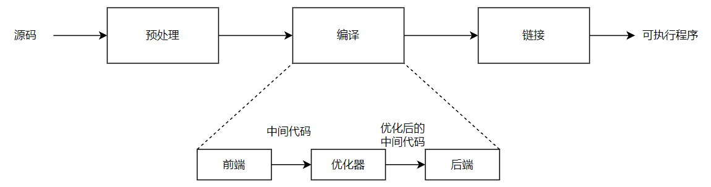
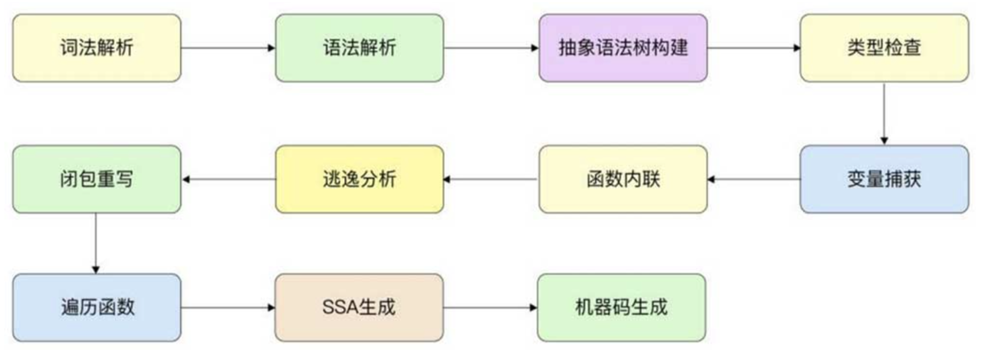

## Go 编译器

编译器是一个大型且复杂的系统，一个好的编译器会很好地结合形式语言理论、算法、人工智能、系统设计、计算机体系结构及编程语言理论

`Go `语言的编译器遵循了主流编译器采用的经典策略及相似的处理流程和优化规则（例如经典的递归下降的语法解析、抽象语法树的构建）

另外，`Go` 语言编译器有一些特殊的设计，例如内存的逃逸等

### 为什么要了解 Go 语言编译器

通过了解 `Go` 语言编译器，不仅可以了解大部分高级语言编译器的一般性流程与规则，也能指导我们写出更加优秀的程序

### 三阶段编译器

在经典的编译原理中，一般将编译器分为

- 编译器前端
- 优化器
- 编译器后端

这种编译器被称为三阶段编译器（`three-phase compiler`）

三个阶段的详细作用如下：

- **编译器前端**

专注于理解源程序、扫描解析源程序并进行精准的语义表达

- **优化器（中间阶段）**

编译器会使用多个 `IR` 阶段、多种数据结构表示代码，并在中间阶段对代码进行多次优化

例如：识别冗余代码、识别内存逃逸等

编译器的中间阶段离不开编译器前端记录的细节

- **编译器后端**

专注于生成特定目标机器上的程序，这种程序可能是可执行文件，也可能是需要进一步处理的中间形态 `obj` 文件、汇编语言等

> 编译器优化并不是一个非常明确的概念
>
> 优化的主要目的一般是降低程序资源的消耗，比较常见的是降低内存与 `CPU` 的使用率
>
> 但在很多时候，这些目标可能是相互冲突的，对一个目标的优化可能降低另一个目标的效率

## Go 编译器阶段

`Go` 语言编译器一般缩写为小写的 `gc（go compiler）`，需要和大写的 `GC`（垃圾回收）进行区分

和 `Go` 语言编译器有关的代码主要位于 `https://github.com/golang/go/tree/go1.20.1/src/cmd/compile`

Go 的编译器在逻辑上可以被分成四个阶段：

- 词法与语法分析
- 类型检查和 AST 转换
- 通用 SSA 生成
- 机器代码生成

`Go`语言编译器的执行流程可细化为多个阶段，包括

- 词法与语法分析

  - [词法解析](词法解析.md) lexical analysis（lexer）
  - [语法解析](语法解析.md) syntax analysis
  
- 类型检查和 AST 转换

  - [抽象语法树构建](抽象语法树构建.md) syntax tree
  - [类型检查](类型检查.md) type checking

  - [变量捕获](变量捕获.md) compiler types

  - [函数内联](函数内联.md) function call inlining

  - [逃逸分析](逃逸分析.md) escape analysis

  - [闭包重写](闭包重写.md)

  - [遍历函数](遍历函数.md) devirtualization of known interface method calls

- 通用 SSA 生成

  - [SSA 生成](SSA生成.md)

- 机器代码生成
  - [机器码生成](机器码生成.md) machine code generation

执行顺序如下图所示：

