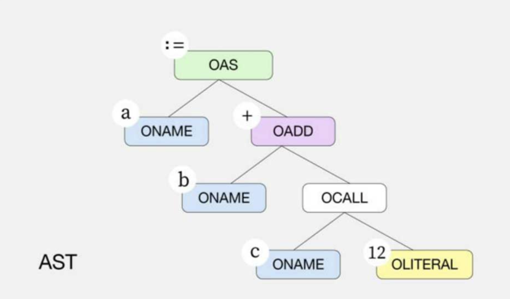

编译器前端必须构建程序的中间表示形式，以便在编译器中间阶段及后端使用，抽象语法树`[Abstract Syntax Tree，AST]`是一种常见的树状结构的中间态

在`Go`语言源文件中的任何一种 `import、type、const、func` 声明都是一个根节点，在根节点下包含当前声明的子节点

通过使用 `decls` 函数，将源文件中的所有声明语句转为节点数组。每个节点都包含了当前节点属性的 `Op` 字段，以 `O` 开头

- 与词法解析阶段中的 `token` 相同的是，`Op` 字段也是一个整数

- 不同的是，每个 `Op` 字段都包含了语义信息，源码：<https://github.com/golang/go/blob/go1.20.1/src/cmd/compile/internal/ir/node.go#L106-L314>

```go
//go:generate stringer -type=Op -trimprefix=O node.go

type Op uint8

// Node ops.
const (
	OXXX Op = iota

	// names
	ONAME // var or func name
	// Unnamed arg or return value: f(int, string) (int, error) { etc }
	// Also used for a qualified package identifier that hasn't been resolved yet.
	ONONAME
	OTYPE    // type name
	OLITERAL // literal
	ONIL     // nil

	// expressions
	OADD          // X + Y
	OSUB          // X - Y
	OOR           // X | Y
	OXOR          // X ^ Y
	OADDSTR       // +{List} (string addition, list elements are strings)
	OADDR         // &X
	OANDAND       // X && Y
	OAPPEND       // append(Args); after walk, X may contain elem type descriptor
	OBYTES2STR    // Type(X) (Type is string, X is a []byte)
	OBYTES2STRTMP // Type(X) (Type is string, X is a []byte, ephemeral)
	ORUNES2STR    // Type(X) (Type is string, X is a []rune)
	OSTR2BYTES    // Type(X) (Type is []byte, X is a string)
	OSTR2BYTESTMP // Type(X) (Type is []byte, X is a string, ephemeral)
	OSTR2RUNES    // Type(X) (Type is []rune, X is a string)
	OSLICE2ARR    // Type(X) (Type is [N]T, X is a []T)
	OSLICE2ARRPTR // Type(X) (Type is *[N]T, X is a []T)
	// X = Y or (if Def=true) X := Y
	// If Def, then Init includes a DCL node for X.
	OAS
	// Lhs = Rhs (x, y, z = a, b, c) or (if Def=true) Lhs := Rhs
	// If Def, then Init includes DCL nodes for Lhs
	OAS2
	OAS2DOTTYPE // Lhs = Rhs (x, ok = I.(int))
	OAS2FUNC    // Lhs = Rhs (x, y = f())
	OAS2MAPR    // Lhs = Rhs (x, ok = m["foo"])
	OAS2RECV    // Lhs = Rhs (x, ok = <-c)
	OASOP       // X AsOp= Y (x += y)
	OCALL       // X(Args) (function call, method call or type conversion)

	// OCALLFUNC, OCALLMETH, and OCALLINTER have the same structure.
	// Prior to walk, they are: X(Args), where Args is all regular arguments.
	// After walk, if any argument whose evaluation might requires temporary variable,
	// that temporary variable will be pushed to Init, Args will contains an updated
	// set of arguments.
	OCALLFUNC  // X(Args) (function call f(args))
	OCALLMETH  // X(Args) (direct method call x.Method(args))
	OCALLINTER // X(Args) (interface method call x.Method(args))
	OCAP       // cap(X)
	OCLOSE     // close(X)
	OCLOSURE   // func Type { Func.Closure.Body } (func literal)
	OCOMPLIT   // Type{List} (composite literal, not yet lowered to specific form)
	OMAPLIT    // Type{List} (composite literal, Type is map)
	OSTRUCTLIT // Type{List} (composite literal, Type is struct)
	OARRAYLIT  // Type{List} (composite literal, Type is array)
	OSLICELIT  // Type{List} (composite literal, Type is slice), Len is slice length.
	OPTRLIT    // &X (X is composite literal)
	OCONV      // Type(X) (type conversion)
	OCONVIFACE // Type(X) (type conversion, to interface)
	OCONVIDATA // Builds a data word to store X in an interface. Equivalent to IDATA(CONVIFACE(X)). Is an ir.ConvExpr.
	OCONVNOP   // Type(X) (type conversion, no effect)
	OCOPY      // copy(X, Y)
	ODCL       // var X (declares X of type X.Type)

	// Used during parsing but don't last.
	ODCLFUNC  // func f() or func (r) f()
	ODCLCONST // const pi = 3.14
	ODCLTYPE  // type Int int or type Int = int

	ODELETE        // delete(Args)
	ODOT           // X.Sel (X is of struct type)
	ODOTPTR        // X.Sel (X is of pointer to struct type)
	ODOTMETH       // X.Sel (X is non-interface, Sel is method name)
	ODOTINTER      // X.Sel (X is interface, Sel is method name)
	OXDOT          // X.Sel (before rewrite to one of the preceding)
	ODOTTYPE       // X.Ntype or X.Type (.Ntype during parsing, .Type once resolved); after walk, Itab contains address of interface type descriptor and Itab.X contains address of concrete type descriptor
	ODOTTYPE2      // X.Ntype or X.Type (.Ntype during parsing, .Type once resolved; on rhs of OAS2DOTTYPE); after walk, Itab contains address of interface type descriptor
	OEQ            // X == Y
	ONE            // X != Y
	OLT            // X < Y
	OLE            // X <= Y
	OGE            // X >= Y
	OGT            // X > Y
	ODEREF         // *X
	OINDEX         // X[Index] (index of array or slice)
	OINDEXMAP      // X[Index] (index of map)
	OKEY           // Key:Value (key:value in struct/array/map literal)
	OSTRUCTKEY     // Field:Value (key:value in struct literal, after type checking)
	OLEN           // len(X)
	OMAKE          // make(Args) (before type checking converts to one of the following)
	OMAKECHAN      // make(Type[, Len]) (type is chan)
	OMAKEMAP       // make(Type[, Len]) (type is map)
	OMAKESLICE     // make(Type[, Len[, Cap]]) (type is slice)
	OMAKESLICECOPY // makeslicecopy(Type, Len, Cap) (type is slice; Len is length and Cap is the copied from slice)
	// OMAKESLICECOPY is created by the order pass and corresponds to:
	//  s = make(Type, Len); copy(s, Cap)
	//
	// Bounded can be set on the node when Len == len(Cap) is known at compile time.
	//
	// This node is created so the walk pass can optimize this pattern which would
	// otherwise be hard to detect after the order pass.
	OMUL              // X * Y
	ODIV              // X / Y
	OMOD              // X % Y
	OLSH              // X << Y
	ORSH              // X >> Y
	OAND              // X & Y
	OANDNOT           // X &^ Y
	ONEW              // new(X); corresponds to calls to new in source code
	ONOT              // !X
	OBITNOT           // ^X
	OPLUS             // +X
	ONEG              // -X
	OOROR             // X || Y
	OPANIC            // panic(X)
	OPRINT            // print(List)
	OPRINTN           // println(List)
	OPAREN            // (X)
	OSEND             // Chan <- Value
	OSLICE            // X[Low : High] (X is untypechecked or slice)
	OSLICEARR         // X[Low : High] (X is pointer to array)
	OSLICESTR         // X[Low : High] (X is string)
	OSLICE3           // X[Low : High : Max] (X is untypedchecked or slice)
	OSLICE3ARR        // X[Low : High : Max] (X is pointer to array)
	OSLICEHEADER      // sliceheader{Ptr, Len, Cap} (Ptr is unsafe.Pointer, Len is length, Cap is capacity)
	OSTRINGHEADER     // stringheader{Ptr, Len} (Ptr is unsafe.Pointer, Len is length)
	ORECOVER          // recover()
	ORECOVERFP        // recover(Args) w/ explicit FP argument
	ORECV             // <-X
	ORUNESTR          // Type(X) (Type is string, X is rune)
	OSELRECV2         // like OAS2: Lhs = Rhs where len(Lhs)=2, len(Rhs)=1, Rhs[0].Op = ORECV (appears as .Var of OCASE)
	OREAL             // real(X)
	OIMAG             // imag(X)
	OCOMPLEX          // complex(X, Y)
	OALIGNOF          // unsafe.Alignof(X)
	OOFFSETOF         // unsafe.Offsetof(X)
	OSIZEOF           // unsafe.Sizeof(X)
	OUNSAFEADD        // unsafe.Add(X, Y)
	OUNSAFESLICE      // unsafe.Slice(X, Y)
	OUNSAFESLICEDATA  // unsafe.SliceData(X)
	OUNSAFESTRING     // unsafe.String(X, Y)
	OUNSAFESTRINGDATA // unsafe.StringData(X)
	OMETHEXPR         // X(Args) (method expression T.Method(args), first argument is the method receiver)
	OMETHVALUE        // X.Sel   (method expression t.Method, not called)

	// statements
	OBLOCK // { List } (block of code)
	OBREAK // break [Label]
	// OCASE:  case List: Body (List==nil means default)
	//   For OTYPESW, List is a OTYPE node for the specified type (or OLITERAL
	//   for nil) or an ODYNAMICTYPE indicating a runtime type for generics.
	//   If a type-switch variable is specified, Var is an
	//   ONAME for the version of the type-switch variable with the specified
	//   type.
	OCASE
	OCONTINUE // continue [Label]
	ODEFER    // defer Call
	OFALL     // fallthrough
	OFOR      // for Init; Cond; Post { Body }
	OGOTO     // goto Label
	OIF       // if Init; Cond { Then } else { Else }
	OLABEL    // Label:
	OGO       // go Call
	ORANGE    // for Key, Value = range X { Body }
	ORETURN   // return Results
	OSELECT   // select { Cases }
	OSWITCH   // switch Init; Expr { Cases }
	// OTYPESW:  X := Y.(type) (appears as .Tag of OSWITCH)
	//   X is nil if there is no type-switch variable
	OTYPESW
	OFUNCINST // instantiation of a generic function

	// misc
	// intermediate representation of an inlined call.  Uses Init (assignments
	// for the captured variables, parameters, retvars, & INLMARK op),
	// Body (body of the inlined function), and ReturnVars (list of
	// return values)
	OINLCALL       // intermediary representation of an inlined call.
	OEFACE         // itable and data words of an empty-interface value.
	OITAB          // itable word of an interface value.
	OIDATA         // data word of an interface value in X
	OSPTR          // base pointer of a slice or string.
	OCFUNC         // reference to c function pointer (not go func value)
	OCHECKNIL      // emit code to ensure pointer/interface not nil
	ORESULT        // result of a function call; Xoffset is stack offset
	OINLMARK       // start of an inlined body, with file/line of caller. Xoffset is an index into the inline tree.
	OLINKSYMOFFSET // offset within a name
	OJUMPTABLE     // A jump table structure for implementing dense expression switches

	// opcodes for generics
	ODYNAMICDOTTYPE  // x = i.(T) where T is a type parameter (or derived from a type parameter)
	ODYNAMICDOTTYPE2 // x, ok = i.(T) where T is a type parameter (or derived from a type parameter)
	ODYNAMICTYPE     // a type node for type switches (represents a dynamic target type for a type switch)

	// arch-specific opcodes
	OTAILCALL    // tail call to another function
	OGETG        // runtime.getg() (read g pointer)
	OGETCALLERPC // runtime.getcallerpc() (continuation PC in caller frame)
	OGETCALLERSP // runtime.getcallersp() (stack pointer in caller frame)

	OEND
)

```

还是以 `a := b + c（12）`为例，该赋值语句最终会变为如下图所示的抽象语法树，节点之间具有从上到下的层次结构和依赖关系

