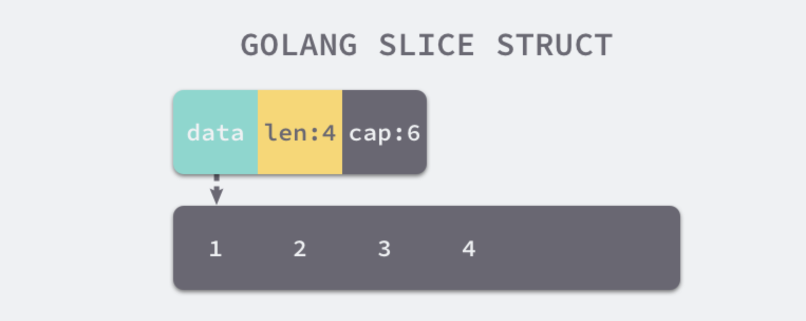

## 切片介绍

切片是`Go`语言中非常常用的数据类型之一，使用方式和数组一样，但是其长度并不固定，我们可以向切片中追加元素，它会在容量不足时自动扩容。

## 声明

在 `Go` 语言中，切片类型的声明方式与数组有一些相似，不过由于切片的长度是动态的，所以声明时只需要指定切片中的元素类型：

```go
[]int

[]interface{}
```

从切片的定义能推测出，切片在编译期间的生成的类型只会包含切片中的元素类型，即 `int` 或者 `interface{}` 等

`cmd/compile/internal/types.NewSlice` 是编译期间用于创建切片类型的函数，源码：<https://github.com/golang/go/blob/go1.20.1/src/cmd/compile/internal/types/type.go#L637-L659>

```go
// NewSlice returns the slice Type with element type elem.
func NewSlice(elem *Type) *Type {
	if t := elem.cache.slice; t != nil {
		if t.Elem() != elem {
			base.Fatalf("elem mismatch")
		}
		if elem.HasTParam() != t.HasTParam() || elem.HasShape() != t.HasShape() {
			base.Fatalf("Incorrect HasTParam/HasShape flag for cached slice type")
		}
		return t
	}

	t := newType(TSLICE)
	t.extra = Slice{Elem: elem}
	elem.cache.slice = t
	if elem.HasTParam() {
		t.SetHasTParam(true)
	}
	if elem.HasShape() {
		t.SetHasShape(true)
	}
	return t
}

```

上述方法返回结构体中的 `extra` 字段是一个只包含切片内元素类型的结构，也就是说切片内元素的类型都是在编译期间确定的，编译器确定了类型之后，会将类型存储在 `extra` 字段中帮助程序在运行时动态获取

`cmd/compile/internal/types.Type` 源码如下：<https://github.com/golang/go/blob/go1.20.1/src/cmd/compile/internal/types/type.go#L132-L202>

```go
// A Type represents a Go type.
//
// There may be multiple unnamed types with identical structure. However, there must
// be a unique Type object for each unique named (defined) type. After noding, a
// package-level type can be looked up by building its unique symbol sym (sym =
// package.Lookup(name)) and checking sym.Def. If sym.Def is non-nil, the type
// already exists at package scope and is available at sym.Def.(*ir.Name).Type().
// Local types (which may have the same name as a package-level type) are
// distinguished by the value of vargen.
type Type struct {
	// extra contains extra etype-specific fields.
	// As an optimization, those etype-specific structs which contain exactly
	// one pointer-shaped field are stored as values rather than pointers when possible.
	//
	// TMAP: *Map
	// TFORW: *Forward
	// TFUNC: *Func
	// TSTRUCT: *Struct
	// TINTER: *Interface
	// TFUNCARGS: FuncArgs
	// TCHANARGS: ChanArgs
	// TCHAN: *Chan
	// TPTR: Ptr
	// TARRAY: *Array
	// TSLICE: Slice
	// TSSA: string
	// TTYPEPARAM:  *Typeparam
	// TUNION: *Union
	extra interface{}

	// width is the width of this Type in bytes.
	width int64 // valid if Align > 0

	// list of base methods (excluding embedding)
	methods Fields
	// list of all methods (including embedding)
	allMethods Fields

	// canonical OTYPE node for a named type (should be an ir.Name node with same sym)
	obj Object
	// the underlying type (type literal or predeclared type) for a defined type
	underlying *Type

	// Cache of composite types, with this type being the element type.
	cache struct {
		ptr   *Type // *T, or nil
		slice *Type // []T, or nil
	}

	vargen int32 // unique name for OTYPE/ONAME

	kind  Kind  // kind of type
	align uint8 // the required alignment of this type, in bytes (0 means Width and Align have not yet been computed)

	flags bitset8

	// For defined (named) generic types, a pointer to the list of type params
	// (in order) of this type that need to be instantiated. For instantiated
	// generic types, this is the targs used to instantiate them. These targs
	// may be typeparams (for re-instantiated types such as Value[T2]) or
	// concrete types (for fully instantiated types such as Value[int]).
	// rparams is only set for named types that are generic or are fully
	// instantiated from a generic type, and is otherwise set to nil.
	// TODO(danscales): choose a better name.
	rparams *[]*Type

	// For an instantiated generic type, the base generic type.
	// This backpointer is useful, because the base type is the type that has
	// the method bodies.
	origType *Type
}

```

## 数据结构

编译期间的切片是 `cmd/compile/internal/types.Slice` 类型，源码：<https://github.com/golang/go/blob/go1.20.1/src/cmd/compile/internal/types/type.go#L476-L479>

```go
// Slice contains Type fields specific to slice types.
type Slice struct {
	Elem *Type // element type
}

```

但是在运行时切片会转换成 `reflect.SliceHeader` 结构体，源码：<https://github.com/golang/go/blob/go1.20.1/src/reflect/value.go#L2752-L2764>

```go
// SliceHeader is the runtime representation of a slice.
// It cannot be used safely or portably and its representation may
// change in a later release.
// Moreover, the Data field is not sufficient to guarantee the data
// it references will not be garbage collected, so programs must keep
// a separate, correctly typed pointer to the underlying data.
//
// In new code, use unsafe.Slice or unsafe.SliceData instead.
type SliceHeader struct {
	Data uintptr
	Len  int
	Cap  int
}

```

- `Data` 是指向数组的指针;
- `Len` 是当前切片的长度；
- `Cap` 是当前切片的容量，即 `Data` 数组的大小。

`Data` 是一片连续的内存空间，这片内存空间可以用于存储切片中的全部元素，数组中的元素只是逻辑上的概念，底层存储其实都是连续的，所以可以将切片理解成一片连续的内存空间加上长度与容量的标识

如下图所示:



会发现切片与数组的关系非常密切，切片引入了一个抽象层，提供了对数组中部分连续片段的引用，而作为数组的引用，可以在运行区间可以修改它的长度和范围

当切片底层的数组长度不足时就会触发扩容，切片指向的数组可能会发生变化，不过在上层看来切片是没有变化的，上层只需要与切片打交道不需要关心数组的变化

## 切片初始化

Go 语言中包含三种初始化切片的方式：

- 通过下标的方式获得数组或者切片的一部分
- 使用字面量初始化新的切片
- 使用关键字 `make` 创建切片

### 使用下标

使用下标创建切片是最原始也最接近汇编语言的方式，它是所有方法中最为底层的一种，编译器会将 `arr[0:3]` 或者 `slice[0:3]` 等语句转换成 `OpSliceMake` 操作

可以通过下面的代码来验证：

```go
```


## 切片扩容