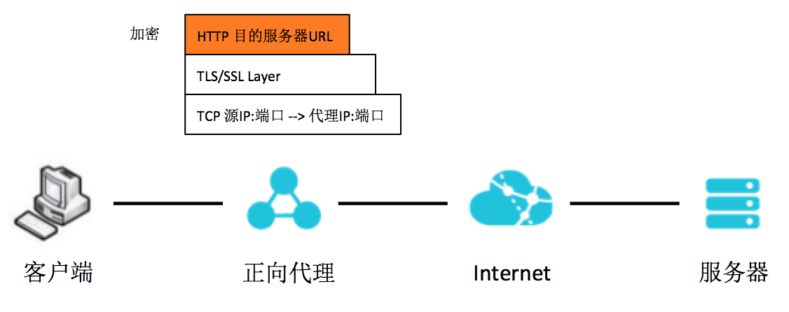
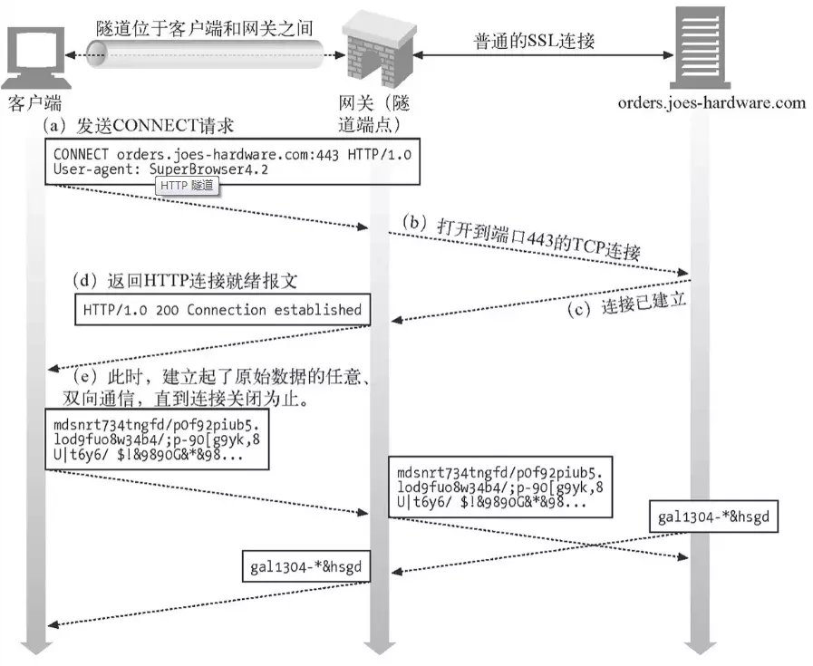

## HTTP / HTTPS 正向代理的分类

### 按客户端有无感知的分类

- 普通代理：在客户端需要在浏览器中或者系统环境变量手动设置代理的地址和端口，在客户端指定服务器 IP 和端口 3128
- 透明代理：客户端不需要做任何代理设置，“代理”这个角色对于客户端是透明的。如企业网络链路中的 Web Gateway 设备

### 按代理是否解密 HTTPS 的分类

- 隧道代理：也就是透传代理代理服务器只是在 TCP 协议上透传 HTTPS 流量，对于其代理的流量的具体内容不解密不感知客户端和其访问的目的服务器做直接 TLS / SSL 交互
- 中间人（MITM，Man-in-the-Middle）代理：代理服务器解密 HTTPS 流量，对客户端利用自签名证书完成 TLS / SSL 握手，对目的服务器端完成正常 TLS 交互。在客户端 - 代理 - 服务器的链路中建立两段 TLS / SSL 会话，例如 Charles
  - 注：这种情况客户端在 TLS 握手阶段实际上是拿到的代理服务器自己的自签名证书，证书链的验证默认不成功，需要在客户端信任代理自签证书的根 CA 证书。所以过程中是客户端有感的。如果要做成无感的透明代理，需要向客户端推送自建的根 CA 证书，在企业内部环境下是可实现的

## 为什么正向代理处理 HTTPS 流量需要特殊处理

作为反向代理时，代理服务器通常终结（终止）HTTPS 加密流量，再转发给后端实例。HTTPS 流量的加解密和认证过程发生在客户端和反向代理服务器之间

而作为正向代理在处理客户端发过来的流量时，HTTP 加密封装在了 TLS / SSL 中，代理服务器无法看到客户端请求的 URL 中想要访问的域名，如下图。所以代理 HTTPS 流量，相比于 HTTP，需要做一些特殊处理



## NGINX 的解决方案

NGINX 解决 HTTPS 代理的方式都属于透传（隧道）模式，即不解密不感知上层流量

具体的方式有如下 7 层和 4 层的两类解决方案

### HTTP CONNECT 隧道（7 层解决方案）

#### HTTP CONNECT

过程：

1. 客户端给代理服务器发送 HTTP CONNECT 请求
2. 代理服务器利用 HTTP CONNECT 请求中的主机和端口与目的服务器建立 TCP 连接
3. 代理服务器给客户端返回 HTTP 200 响应
4. 客户端和代理服务器建立起 HTTP CONNECT 隧道，HTTPS 流量到达代理服务器后，直接通过 TCP 透传远端目的服务器。代理服务器的角色是透传 HTTPS 流量，并不需要解密 HTTPS



####  ngx_http_proxy_connect_module 模块

NGINX 作为反向代理服务器，官方一直没有支持 HTTP CONNECT 方法。但是基于 NGINX 的模块化，可扩展性好的特性，阿里的 `@chobits` 提供了 `ngx_http_proxy_connect_module` 模块，来支持 HTTP CONNECT 方法，从而让 NGINX 可以扩展为正向代理

- https://github.com/chobits/ngx_http_proxy_connect_module

#### 代理配置

```nginx
server {
     listen  443;
    
     # dns resolver used by forward proxying
     resolver  114.114.114.114;

     # forward proxy for CONNECT request
     proxy_connect;
     proxy_connect_allow            443;
     proxy_connect_connect_timeout  10s;
     proxy_connect_read_timeout     10s;
     proxy_connect_send_timeout     10s;

     # forward proxy for non-CONNECT request
     location / {
         proxy_pass http://$host;
         proxy_set_header Host $host;
     }
 }

```

#### 模拟访问

7 层需要通过 HTTP CONNECT 来建立隧道，属于客户端有感知的普通代理方式，需要在客户端手动配置 HTTP（S）代理服务器 IP 和端口。在客户端用 curl 加-x 参数访问如下：

```bash
> curl https://www.baidu.com -svo /dev/null -x 10.244.244.3:443
* About to connect() to proxy 10.244.244.3 port 443 (#0)
*   Trying 10.244.244.3...
* Connected to 10.244.244.3 (10.244.244.3) port 443 (#0)
* Establish HTTP proxy tunnel to www.baidu.com:443
> CONNECT www.baidu.com:443 HTTP/1.1
> Host: www.baidu.com:443
> User-Agent: curl/7.29.0
> Proxy-Connection: Keep-Alive
>
< HTTP/1.1 200 Connection Established
< Proxy-agent: nginx
<
* Proxy replied OK to CONNECT request
* Initializing NSS with certpath: sql:/etc/pki/nssdb
*   CAfile: /etc/pki/tls/certs/ca-bundle.crt
  CApath: none
* SSL connection using TLS_ECDHE_RSA_WITH_AES_128_GCM_SHA256
* Server certificate:
*     subject: CN=baidu.com,O="Beijing Baidu Netcom Science Technology Co., Ltd",OU=service operation department,L=beijing,ST=beijing,C=CN
...
> GET / HTTP/1.1
> User-Agent: curl/7.29.0
> Host: www.baidu.com
> Accept: */*
>
< HTTP/1.1 200 OK
...
```

从上面-v 参数打印出的细节，可以看到客户端先往代理服务器 10.244.244.3 建立了 HTTP CONNECT 隧道，代理回复 HTTP / 1.1 200 连接建立后就开始交互 TLS / SSL 握手和流量了

### NGINX 流（4 层解决方案）

#### ngx_stream_core_module 模块

NGINX 官方从 1.9.0 版本开始支持 `ngx_stream_core_module` 模块，模块默认不建立，需要配置时加上 `–with` 流选项来开启

- http://nginx.org/en/docs/stream/ngx_stream_core_module.html

用 NGINX stream 在 TCP 层面上代理 HTTPS 流量肯定会遇到本文一开始提到的那个问题：代理服务器无法获取客户端想要访问的目的域名。因为在 TCP 的层面获取的信息仅限于 IP 和端口层面，没有任何机会拿到域名信息。要拿到目的域名，必须要有拆上层报文获取域名信息的能力，所以 NGINX stream 的方式不是完全严格意义上的 4 层代理，还是要略微借助些上层能力

#### ngx_stream_ssl_preread_module 模块

要在不解密的情况下拿到 HTTPS 流量访问的域名，只有利用 TLS / SSL 握手的第一个客户端 Hello 报文中的扩展地址 SNI（服务器名称指示）来获取

- <http://nginx.org/en/docs/stream/ngx_stream_ssl_preread_module.html>

NGINX 官方从 1.11.5 版本开始支持利用 `ngx_stream_ssl_preread_module` 模块来获得这个能力，模块主要用于获取客户端 Hello 报文中的 SNI 和 ALPN 信息。对于 4 层正向代理来说，从客户端 Hello 报文中提取 SNI 的能力是至关重要的，否则 NGINX stream 的解决方案无法成立。同时这也带来了一个限制，要求所有客户端都需要在 TLS / SSL 握手中带上 SNI 字段，否则 NGINX stream 代理完全没办法知道客户端需要访问的目的域名。

#### 代理配置

NGINX stream 与 HTTP 不同，需要在流块中进行配置，但是指令参数与 HTTP 块都是类似的，主要配置部分如下：

```nginx
stream {
    resolver 114.114.114.114;
    server {
        listen 443;
        ssl_preread on;
        proxy_connect_timeout 5s;
        proxy_pass $ssl_preread_server_name:$server_port;
    }
}

```

#### 模拟访问

对于 4 层正向代理，NGINX 对上层流量基本上是透传，也不需要 HTTP CONNECT 来建立隧道。适合于透明代理的模式，比如将访问的域名利用 DNS 解定向到代理服务器。可以通过在客户端绑定 `/etc/hosts` 中来模拟。

在客户端：

```bash
> cat /etc/hosts

...
# 把域名 www.baidu.com 绑定到正向代理服务器 10.244.244.3
10.244.244.3 www.baidu.com

# 正常利用 curl 来访问 www.baidu.com 即可
> curl https://www.baidu.com -svo /dev/null
```

（1）客户端手动设置代理导致访问不成功：

4 层正向代理是透传上层 HTTPS 流量，不需要 HTTP 连接来建立隧道，也就是说不需要客户端设置 HTTP（S）代理。如果在客户端手动设置 HTTP（S）代理是否能访问成功呢？可以用 curl -x 来设置代理为这个正向服务器访问测试，看看结果：

```bash
# curl https://www.baidu.com -svo /dev/null -x 10.244.244.3:443
* About to connect() to proxy 10.244.244.3 port 443 (#0)
*   Trying 10.244.244.3...
* Connected to 10.244.244.3 (10.244.244.3) port 443 (#0)
* Establish HTTP proxy tunnel to www.baidu.com:443
> CONNECT www.baidu.com:443 HTTP/1.1
> Host: www.baidu.com:443
> User-Agent: curl/7.29.0
> Proxy-Connection: Keep-Alive
>
* Proxy CONNECT aborted
* Connection #0 to host 10.244.244.3 left intact

```

可以看到客户端试图于正向 NGINX 前建立 HTTP CONNECT 隧道，但是由于 NGINX 是透传，所以把 CONNECT 请求直接转发给了目的服务器。目的服务器不接受 CONNECT 方法，所以最终出现“Proxy CONNECT aborted”，导致访问不成功

（2）客户端没有带 SNI 导致访问不成功

上文提到用 NGINX 流做正向代理的关键因素之一是利用 ngx_stream_ssl_preread_module 提取出客户端中的 SNI 字段。如果客户端客户端不携带 SNI 字段，会造成代理服务器无法获知目的域名的情况，导致访问不成功。

在透明代理模式下（用手动绑定承载的方式模拟），可以在客户端用的 OpenSSL 来模拟：

```bash
> openssl s_client -connect www.baidu.com:443 -msg
CONNECTED(00000003)
>>> TLS 1.2  [length 0005]
    16 03 01 01 1c
>>> TLS 1.2 Handshake [length 011c], ClientHello
    01 00 01 18 03 03 6b 2e 75 86 52 6c d5 a5 80 d7
    a4 61 65 6d 72 53 33 fb 33 f0 43 a3 aa c2 4a e3
    47 84 9f 69 8b d6 00 00 ac c0 30 c0 2c c0 28 c0
    24 c0 14 c0 0a 00 a5 00 a3 00 a1 00 9f 00 6b 00
    6a 00 69 00 68 00 39 00 38 00 37 00 36 00 88 00
    87 00 86 00 85 c0 32 c0 2e c0 2a c0 26 c0 0f c0
    05 00 9d 00 3d 00 35 00 84 c0 2f c0 2b c0 27 c0
    23 c0 13 c0 09 00 a4 00 a2 00 a0 00 9e 00 67 00
    40 00 3f 00 3e 00 33 00 32 00 31 00 30 00 9a 00
    99 00 98 00 97 00 45 00 44 00 43 00 42 c0 31 c0
    2d c0 29 c0 25 c0 0e c0 04 00 9c 00 3c 00 2f 00
    96 00 41 c0 12 c0 08 00 16 00 13 00 10 00 0d c0
    0d c0 03 00 0a 00 07 c0 11 c0 07 c0 0c c0 02 00
    05 00 04 00 ff 01 00 00 43 00 0b 00 04 03 00 01
    02 00 0a 00 0a 00 08 00 17 00 19 00 18 00 16 00
    23 00 00 00 0d 00 20 00 1e 06 01 06 02 06 03 05
    01 05 02 05 03 04 01 04 02 04 03 03 01 03 02 03
    03 02 01 02 02 02 03 00 0f 00 01 01
140285606590352:error:140790E5:SSL routines:ssl23_write:ssl handshake failure:s23_lib.c:177:
---
no peer certificate available
---
No client certificate CA names sent
---
SSL handshake has read 0 bytes and written 289 bytes
...
```

openssl s_client 默认不带 SNI，可以看到上面的请求在 TLS / SSL 握手阶段，发出客户端 Hello 后就结束了。因为代理服务器不知道要把客户端 Hello 往哪个目的域名转发

如果用 OpenSSL 的带服务器名参数来指定 SNI，则可以正常访问成功，命令如下：

```bash
> openssl s_client -connect www.baidu.com:443 -servername www.baidu.com
```

