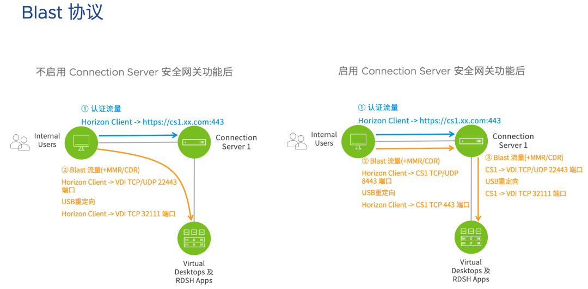

## NSX ALB 简介

Horizon 的连接服务器支持多节点部署，但并不提供单一的入口，管理员可以在 DNS 上为多台 CS 配置同一个外部域名，这样用户在进行域名解析时就可以获得不同 CS 的真实地址，从而让不同的用户连到不同的 CS 节点。但 DNS 并不能监测后端 CS 是否正常工作，CS 节点故障时可能会导致部分 Client 无法正常使用桌面。因此使用负载均衡器是一个更优的选择

## Horizon 流量

在 Horizon 环境中共有两大类流量：

- 用户认证流量（HTTPS）：用户登陆时的身份认证均使用此协议传输。认证功能由 CS 提供，在 Horizon 下 CS 本身默认提供 TLS 加密功能，如果要给 CS 配置负载均衡，则要做端到端的 TLS 加解密；

- 虚拟桌面流量：用户访问 VDI/虚拟应用时的流量，以及多媒体重定向、USB 重定向等功能的流量。共包含 RDP、PCoIP、Blast、MMR/CDR、USB 重定向等 5 种协议，每协议在不同的配置下可能使用不同的端口。其中 RDP、PCoIP、Blast 用于传输桌面的流量，一般使用 Blast 协议。MMR/CDR 分别表示多媒体重定向和客户端驱动器重定向

当在纯内网中使用 Horizon 时，可以只部署 CS。如果不开启 CS 的安全网关功能，则 Horizon Client 直接和 VDI VM 通信传输桌面流量；如果开启了 CS 的安全网关功能，则认证流量和桌面流量均需要通过 CS 进行传输

在 Horizon 下，仅能对 CS 的认证流量进行负载均衡，安全网关的流量不能进行负载。如果开启了 CS 安全网关功能，则认证流量和桌面流量必须经同一台 CS 处理。

为 CS 配置负载均衡后，流量路径如下两张图所示：（NSX Advanced Load Balancer (ALB)，原名为 Avi Networks，是 VMware 提供的一款企业级的负载均衡解决方案，特别适用于多云环境中的L4-L7应用交付）

