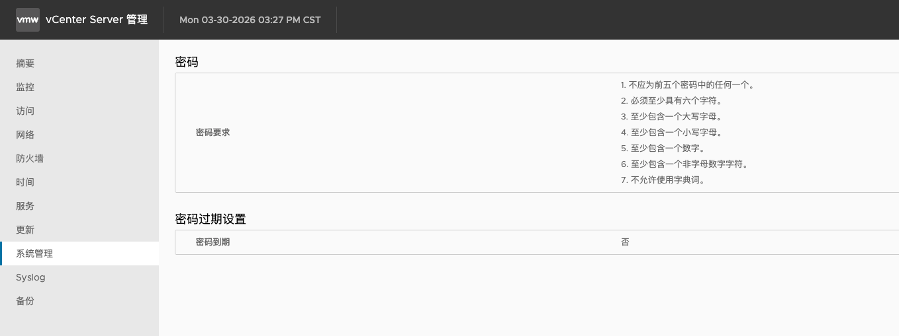
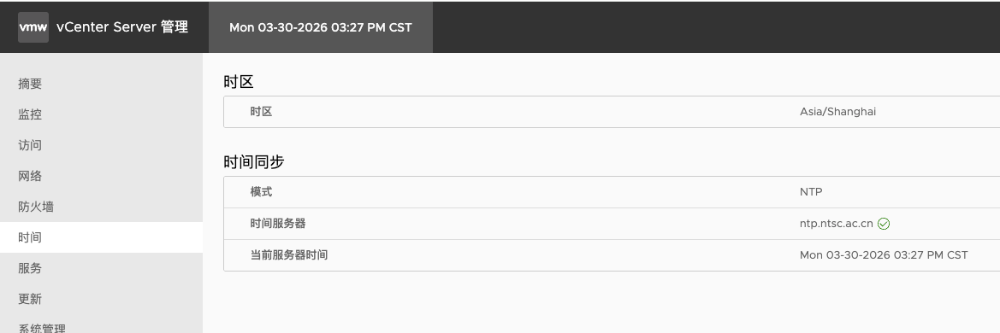

## 安装后配置

### 调整密码策略



### 时间服务器和时区

进入 vCenter 管理，通常运行在 5480 端口。

修改时区，时间同步使用 NTP 模式。



### 许可证

## 其他

修改域

```bash
cmsso-util domain-repoint -m execute --src-emb-admin Administrator --dest-domain-name vsphere.local
```

