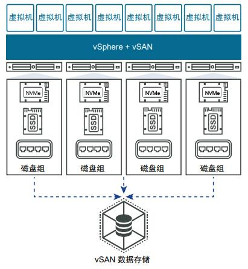

## vSAN 简介

VMware vSAN（Virtual SAN，虚拟存储局域网）是 VMware 公司提出的软件定义存储架构的企业存储解决方案，支持 HCI（Hyper-Converged Infrastructure，超融合基础架构）系统，把多台服务器上的计算、存储和网络加以整合利用，避免连接外部环境产生的网络延迟，实现服务器资源的有效利用。

VMware vSAN 使用软件定义的方法为虚拟机创建共享存储，将多台安装有 VMware ESXi 系统的 x86 服务器上的本地磁盘加以整合，组成磁盘组，在这之上使用 vSphere 和 vCenter 管理，通过内部的网络相连，形成一个大容量的存储，然后可根据虚拟机和应用程序的服务质量要求划分这些存储池并分配给这些虚拟机和应用程序。

VMware vSAN 集群包括混合群集和全闪存群集。在混合群集中，闪存设备用于缓存层，磁盘用于存储容量层。在全闪存群集中，闪存设备同时用作缓存和容量设备。VMware vSAN 目前广泛应用在如 VDI 云桌面服务、开发测试系统云服务、Cloud 私有云服务等场景。

## 全闪

全闪存（SSD）集群，NVMe 硬盘作为缓存设备，SSD 硬盘作为存储设备

## vSAN DiskGroup

### 两级存储架构

盘组内部采用两级存储架构：

- 用于数据的临时缓存 / 缓冲，被称为“缓存层（Cache Tier）”，每个盘组内的缓存必须有且仅有 1 个采用闪存的高速存储设备，通常为固态硬盘 SSD；
- 用于最终存储数据，被称为“容量层（Capacity Tier）”，由 1~7 个固态硬盘或普通磁介质硬盘 HDD 组成

vSAN 允许每个主机使用 1~5 个这样的磁盘组

由两级不同的存储设备构成的盘组结构，最主要的目的是将经常使用的“热数据”存放在高速 SSD 中，减少对低速 HDD 的直接访问，从而提升整个盘组的平均读 / 写速度

### vSAN 盘组技术在实现中的限制

高速缓存盘的容量至少为盘组中所有低速盘总容量的 10%

- 如果低于这个比例，可能达不到理想的缓存提速效果——通俗说，就是“缓存盘太小，带不动容量盘”
- vSAN 还有一个技术限制：全闪配置下每个缓存盘上，只有 600GB 空间可以被真正用于对写数据进行缓冲

盘组中唯一的缓存盘存在单点故障的可能，如果它损坏了：

- 该盘组将从集群资源池中退出
- 该盘组内所有容量盘上的数据无法读取
- 损失的数据（数 TB ~ 数十 TB）有可能通过保存在其他节点上的数据进行恢复，但后台的数据恢复过程中（几小时 ~ 几十小时），集群存储性能不可避免地会出现一定程度的下降

### vSAN 部署方案中应对盘组技术限制的思路

为了降低这些限制对 vSAN 集群部署的影响，VMware 的 vSAN 部署方案设计中给出的应对思路是：增加集群中每台主机上的盘组数量

vSAN 集群的单台主机上，最多可以允许设置 5 个盘组。因此，可以通过增加主机内部的盘组数量方法，一定程度上减轻单个缓存盘故障的影响范围，也就是“把鸡蛋放到多个篮子里”。VMware 经过测试，给出的最佳盘组设计方案是：每台主机内设置 2~3 个盘组，每个盘组内设置 3~5 个容量盘。这种设计与 vSAN 存储策略中的条带化数量设置相结合，可以把原本由单块存储盘承担的读 / 写工作，尽可能地分散到多个主机、多个盘组的多个 SSD 上来完成，实现了集群级别存储性能的最优化

- 硬件成本提高：缓存层 SSD 和容量层 HDD 单盘容量减小，但数量都要增加，有可能还要增加 RAID 卡的数量
- 内存消耗增加：每增加 1 个盘组要增加 ~8GB 内存消耗，每增加 1 个容量盘要增加 240~300MB 内存消耗

## 快速存储架构

vSAN 8 中，引入了“快速存储架构（Express Storage Architecture）”，这为 vSAN 用户提供了一种可选替代架构，目标是以全新级别的效率、可扩展性和性能来处理和存储数据。ESA 不再使用“DiskGroup 盘组”的概念，而是使用“Storage Pool 存储池”，主机中所有符合要求的存储设备不再被分为不同的“组”，不再被分为“缓存层”和“容量层”

vSAN 原有的基于盘组的架构仍然保留，作为可选的 vSAN 方案之一，它现在被称为 OSA（Original Storage Architecture）

采用高速闪存的存储设备越来越普及，能够负担全闪存储价格的用户也越来越多，在大量需要高速读 / 写的应用场景中，直接通过全闪配置就可以满足性能的要求。因此，VMware 认为使用 SSD 作为 HDD 加速杠杆的做法可以不再保留。

ESA 给出的思路是：推广并普及基于纠删码（Erasure Coding）的数据高可用方法和数据压缩。这两种技术可以减少原始数据在存储设备上占用的空间，从而减少昂贵的闪存盘的数量。

ESA 所宣传的“不需要专门的缓存盘”，不意味着不使用缓存机制，它只是把“缓存盘”改成了“性能分支”。写缓冲数据不再独占某个闪盘，而是将临时数据作为“性能分支”分散到所有闪盘上的

## 参考资料

- <https://www.smartx.com/blog/2022/10/disks-vs-vmware/>

- <https://www.h3c.com/cn/Service/Document_Software/Document_Center/Server/Catalog/Rack_server/H3C_UniServer_R4900_G3/Configure/Practice/R4900_VMware_vSAN-6W100/>

- <https://blog.csdn.net/u011783233/article/details/139241971>