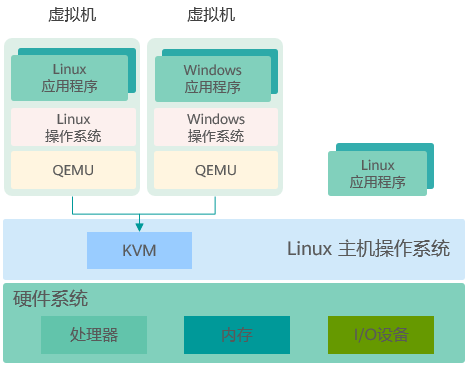

## Linux 虚拟化方案

Libvirt、qemu 和 kvm 的组合提供了完整的虚拟化功能，它们是解决 Linux 虚拟化方案的重要部分。

### Libvirt

官方：

- 官网：<https://libvirt.org/>

- GitHub Mirror：<https://github.com/libvirt/libvirt>

Libvirt 是一个开源项目，以守护进程的方式运行，管理虚拟化平台 (kvm、qemu、Xen、lxc、...)

通常使用 libvirt 提供的接口管理 kvm，图形化工具 virt-manager 就是调用 libvirt，管理远程或本地的 hypervisors；Libvirt 提供的 virsh 命令行工具，是主流的 hypervisor 命令行管理工具

### QEMU

QEMU 是通用和开源的机器模拟器和虚拟化器。在作为虚拟化器的时候，以近乎原生的性能运行 kvm 和 Xen 虚拟机。

### KVM

KVM (Kernel-based Virtual Machine) 是基于硬件辅助的开源全虚拟化解决方案。它包括名为 `kvm.ko` 的通用内核模块、以及基于硬件的 (如基于 Intel 的 `kvm-intel.ko` 或基于 AMD 的 `kvm-adm.ko` 模块) 内核模块。KVM 加载这些模块，将 Linux 内核变成 hypervisor，从而实现虚拟化。

除了内核模块，KVM 中还包括 qemu-kvm。QEMU-KVM 是 kvm 团队针对 qemu 开发的、用于管理和创建虚拟机的工具。

通过 kvm 的 `/dev/kvm` 设备文件，应用程序可以执行 ioctl() 函数的系统调用。QEMU-KVM 使用 `/dev/kvm` 设备文件与 kvm 通信，并创建、初始化和管理虚拟机的 kernel-mode 上下文。

## QEMU 简介

QEMU (需要一个专门的内核) 

QEMU 是一套由法布里斯・贝拉 (Fabrice Bellard) 所编写的模拟处理器的自由软件。它与 Bochs (Bochs 是一个 x86 硬件平台的开源模拟器。它可以模拟各种硬件的配置。)，PearPC (实现 PC 机上安装 Mac OS) 近似，但其具有某些后两者所不具备的特性，如高速度及跨平台的特性。经由 KVM (早期为 kqemu 加速器，现在 kqemu 已被 KVM 取代) 这个开源的加速器，QEMU 能模拟至接近真实电脑的速度。

QEMU 有两种主要运作模式：

- User mode 模拟模式，亦即是用户模式。QEMU 能引导那些为不同中央处理器编译的 Linux 程序。而 Wine (运行 Windows 应用的兼容层。) 及 Dosemu (DOS 模拟器) 是其主要目标。
- System mode 模拟模式，亦即是系统模式。QEMU 能模拟整个电脑系统，包括中央处理器及其他周边设备。它使得为系统源代码进行测试及除错工作变得容易。其亦能用来在一部主机上模拟数部不同虚拟电脑。性能特别好，但是需要使用专门修改之后的内核。　　

