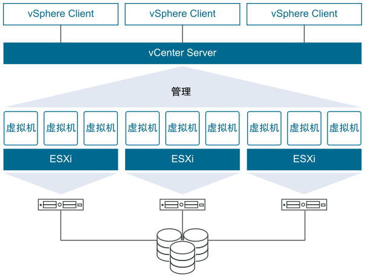

## vSphere 简介

### 核心组件



ESXi 只是 vSphere 里的一个组件，vSphere 的两个核心组件是 ESXi 和 vCenter Server，vSphere 是包含了 ESXi

- ESXi 是用于创建并运行虚拟机和虚拟设备的虚拟化平台

- vCenter Server 是一项服务，用于管理网络中连接的多个主机，并将主机资源池化

ESXi 是直接安装在物理机器上的，是采用 Linux 内核的虚拟化专用操作系统

### 版本

Mware vSphere 有各种版本

平常说的ESXi Free(免费) 版本严格意义上讲：指的应该是 VMware vSphere Hypervisor

vSphere Essentials 和 Essentials Plus 专门为刚开始体验虚拟化的小型组织而设计。两个版本都提供最多三台服务器主机的虚拟化和集中化管理。vSphere Essentials 可以整合服务器以帮助您充分利用硬件


# 下载链接

8.0 下载：<https://customerconnect.vmware.com/downloads/info/slug/datacenter_cloud_infrastructure/vmware_vsphere/8_0>

其他下载链接：<https://www.dinghui.org/vmware-iso-download.html>

```
ESXi 8 4V492-44210-48830-931GK-2PRJ4
ESXi 8 4F40H-4ML1K-M89U0-0C2N4-1AKL4
ESXi 8 HG00K-03H8K-48929-8K1NP-3LUJ4

VCSA 8 0Z20K-07JEH-08030-908EP-1CUK4
VCSA 8 0F41K-0MJ4H-M88U1-0C3N0-0A214
VCSA 8 4F282-0MLD2-M8869-T89G0-CF240
 
vSAN 8 NF212-08H0K-488X8-WV9X6-1F024
vSAN 8 witness JF61H-48K8K-488X9-W98Z0-1FH24

Horizon Enterprise v8.x 0G4DA-49J81-M80R1-012N4-86KH4
```

## 安装参考

<https://post.smzdm.com/p/a8x6o5on/>

<https://post.smzdm.com/p/a5op28x7/>

