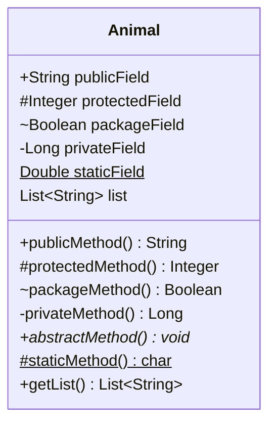
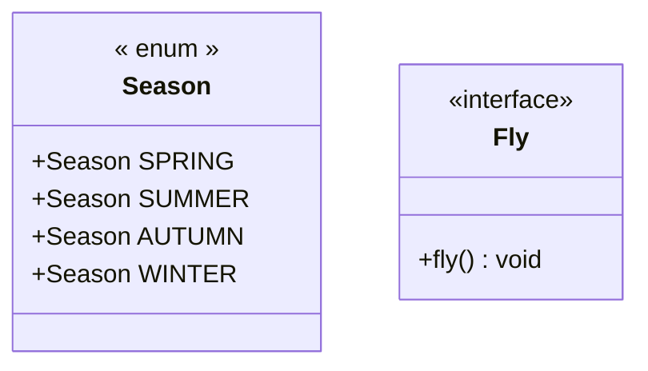
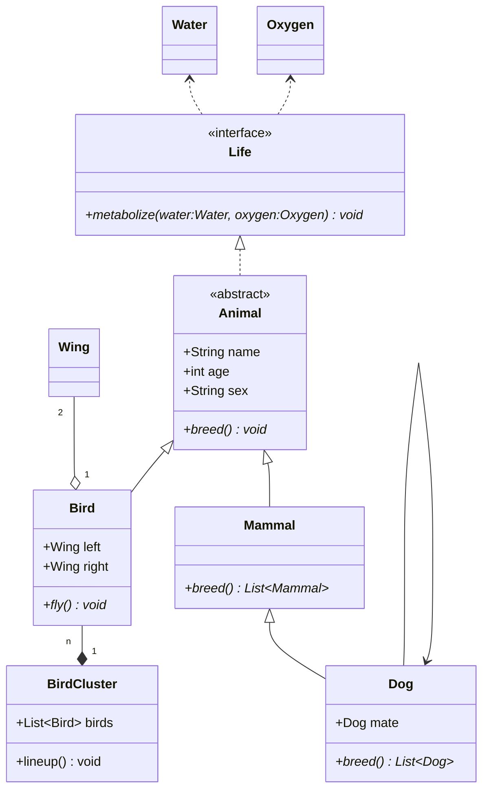

## 类图

类图 (class diagram) 由许多（静态）说明性的模型元素（例如类、包和它们之间的关系，这些元素和它们的内容互相连接）组成。 类图可以组织在（并且属于）包中，仅显示特定包中的相关内容。类图 (Class diagram) 是最常用的 UML 图， 显示出类、接口以及它们之间的静态结构和关系；它用于描述系统的结构化设计。类图 (Class diagram) 最基本的元素是类或者接口

### 访问修饰符

| 符号 | 作用域                                      | 含义               |
| :--- | :------------------------------------------ | :----------------- |
| `+`  | 方法、字段                                  | `public`           |
| `-`  | 方法、字段                                  | `private`          |
| `#`  | 方法、字段                                  | `protected`        |
| `~`  | 方法、字段                                  | `package/friendly` |
| `$`  | 方法、字段                                  | `static`           |
| `*`  | 方法                                        | `abstract`         |
| `~~` | 类型(字段类型、返回类型、class/interface等) | `泛型`             |

```plain
classDiagram
    %% 按类型批量添加
    class Animal {
        +String publicField
        #Integer protectedField
        ~Boolean packageField
        -Long privateField
        Double staticField$

        +publicMethod() String
        #protectedMethod() Integer
        ~packageMethod() Boolean
        -privateMethod() Long
        +abstractMethod()* void
        #staticMethod()$ char
    }
    %% 单条添加
    Animal: List~String~ list
    Animal: +getList() List~String~
```




### 类注释

用于标记一个类的元素据，以`<<`开始，以`>>`结束，如`<<interface>>`， 在 html 中，需要开关前后有一个空格即`<< interface >>`。一个类型只会对第一个类注释生效

常用标记有，`<<interface>>`、`<<abstract>>`、`<<enum>>`，分表代码接口、抽象类、枚举。 元素据可以是自定义的任意内容。

类注释语法如下:

```plain
classDiagram
%% 结构体声明
class Season {
    << enum >>
    +Season SPRING
    +Season SUMMER
    +Season AUTUMN
    +Season WINTER
}

%% 单行声明
class Fly
<< interface >> Fly
%% 第二个注释无效
<< enum>> Fly
Fly: +fly() void
```




### 方向

语法`direction TB/BT/RL/LR`，默认`TB`

### 关系基数

关系基数主要用于`聚合`与`组合`，表名类与类之间的关联关系。
语法如下 `[classA] "cardinality1" [Arrow] "cardinality2" [ClassB]:LabelText`

| 基数   | 含义           |
| :----- | :------------- |
| `1`    | 有且只有1个    |
| `0..1` | 0个或1个       |
| `1..*` | 1个或多个      |
| `*`    | 多个           |
| `n`    | n个，n大于1    |
| `0..n` | 0至n个，n大于1 |
| `1..n` | 1至n个，n大于1 |

### 类关系

| 关系 | 左值   | 右值   | 描述                                                         |
| :--- | :----- | :----- | :----------------------------------------------------------- |
| 继承 | `<|--` | `--|>` | 类继承另一个类或接口继承另一个接口                           |
| 实现 | `<|..` | `..|>` | 类实现接口                                                   |
| 关联 | `<--`  | `-->`  | 表示一种`拥有`关系，A类作为了B类的成员变量，若B类也使用了A类作为成员变量则为双向关联 |
| 依赖 | `<..`  | `..>`  | 表示一种`使用`关系，参数依赖、局部变量、静态方法/变量依赖    |
| 聚合 | `o--`  | `--o`  | 聚合是一种强关联关系，在代码语法上与关联无法区分             |
| 组合 | `*--`  | `--*`  | 组合也是一种强关联关系，比聚合关系还要强                     |

- 继承

```plain
classDiagram
direction LR
Parent <|-- Child
```

- 实现

```plain
classDiagram
direction LR
class Parent {
    << interface >>
}
Child ..|> Parent
```

- 关联

```plain
classDiagram
direction LR
class Car {
    +run() void
}
class Driver {
    +Car car
    +drive() void
}
Driver --> Car
```

- 依赖

```plain
classDiagram
direction LR
class Car {
    +run() void
}
class Driver {
    +drive(car:Car) void
}
Driver ..> Car
```

- 聚合

```plain
classDiagram
direction LR
class Car {
    +run() void
}
class Driver {
    +Car car
    +drive() void
}
Driver "1" o-- "1" Car
```

- 组合

```plain
classDiagram
direction LR
Company "1" *-- "N" Dept
```

### 链接

点击类跳转链接

```plain
classDiagram
class Baidu
link Baidu "https://www.baidu.com" "This is a tooltip for a link"
```

## 示例

语法解释：`<|--` 表示继承，`+` 表示 `public`，`-` 表示 `private`

```plain
classDiagram
direction BT
%% 代谢基础水和氧气
class Water
class Oxygen
%% 生命接口
class Life {
    <<interface>>
    +metabolize(water:Water, oxygen:Oxygen)* void
}
Life ..> Water
Life ..> Oxygen
%% 动物
class Animal {
    <<abstract>>
    +String name
    +int age
    +String sex
    
    +breed()* void
}
%% 实现生命接口
Animal ..|> Life

%% 哺乳动物继承动物
class Mammal {
    +breed()* List~Mammal~
}
Mammal --|> Animal

class Dog {
    +Dog mate
    +breed()* List~Dog~
}
Dog --|> Mammal
Dog --> Dog

%% 鸟类继承动物，并且鸟有一双翅膀
class Wing
class Bird {
    +Wing left
    +Wing right
    +fly()* void
}
Bird "1" o-- "2" Wing
Bird --|> Animal

%% 鸟群
class BirdCluster {
    +List~Bird~ birds
    
    +lineup() void
}

BirdCluster "1" *-- "n" Bird
```

