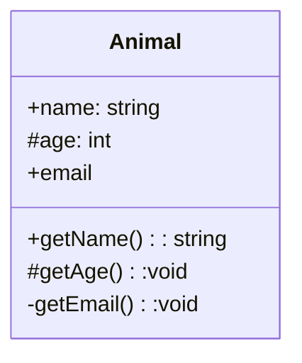
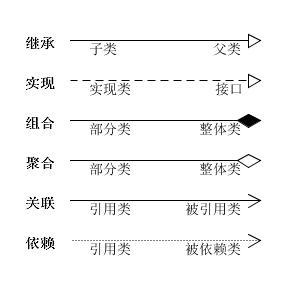
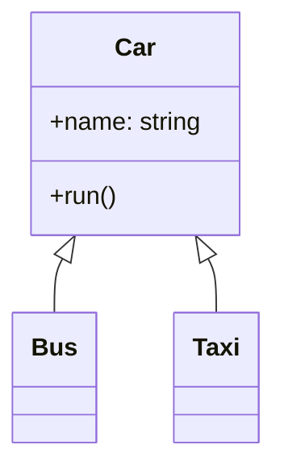
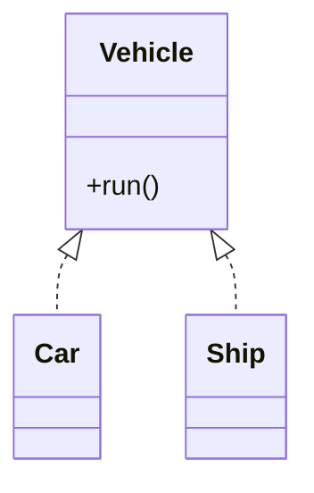
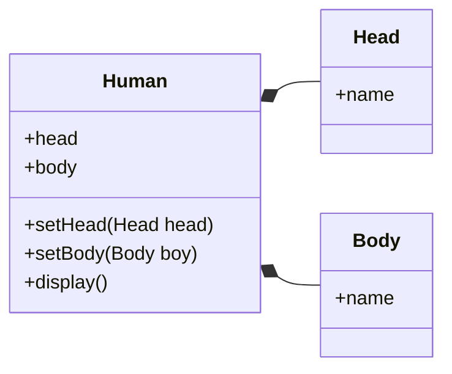
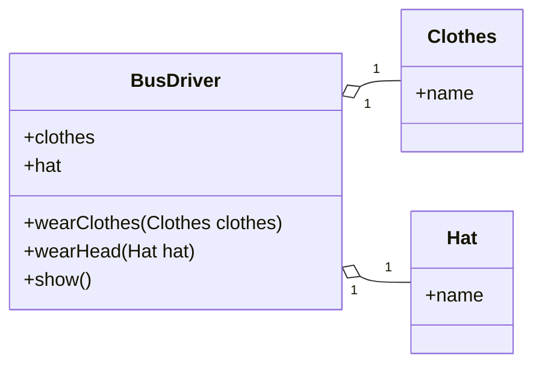
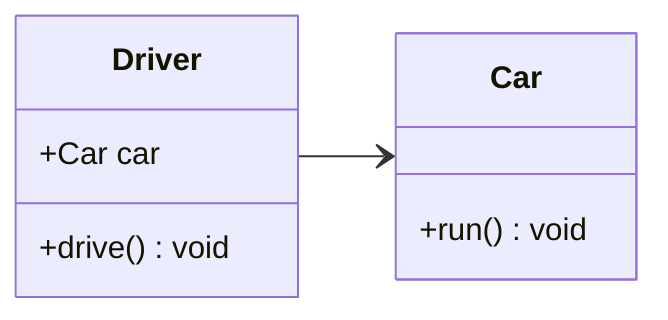
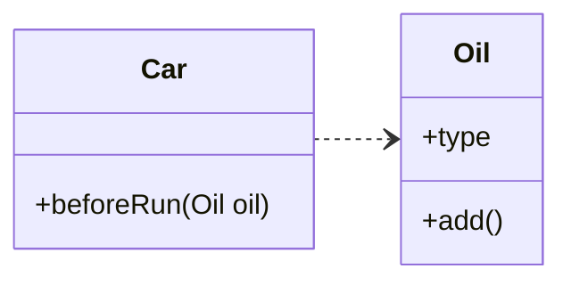

## UML 类图

UML 类图是一种结构图，用于描述一个系统的静态结构。类图以反映类结构和类之间关系为目的，用以描述软件系统的结构，是一种静态建模方法。类图中的类，与面向对象语言中的类的概念是对应的

在系统设计阶段，类图直接引导面向对象的编程语言实现类。类图是生成代码的核心要图。如果类图设计得好，整个系统的代码框架可以有类图自动生成，大大简化了系统编码所耗费的时间。因此，进一步：利用类图，使得代码的编写编程一种自动化工作，而整个信息系统的建设中心都可以集中到分析设计上来

## 类结构

在类的 UML 图中，使用长方形描述一个类的主要构成，长方形垂直地分为三层，以此放置类的名称、属性和方法

其中，类名表示

- 一般类的类名用正常字体粗体表示
- 抽象类名用斜体字粗体
- 接口则需在上方加上 `<<interface>>`。

属性和方法都需要标注可见性符号：

- `+` 代表 public
- `#` 代表 protected（friendly 也归入这类）
- `-` 代表 private

另外，还可以用冒号 `:` 表明属性的类型和方法的返回类型，如 `+$name:string`、`+getName():string`

（1）属性的完整表示方式是这样的：

```plain
可见性 名称:类型 [=缺省值]
```

中括号中的内容表示是可选的

（2）方法的完整表示方式如下：

```plain
可见性 名称(参数列表) [:返回类型]
```

同样，中括号中的内容是可选的



## 类关系

类与类之间的关系主要有六种：继承、实现、组合、聚合、关联和依赖，这六种关系的箭头表示如下



各种关系的强弱顺序：

继承 > 实现 > 组合 > 聚合 > 关联 > 依赖

### 继承关系

继承关系也称泛化关系（Generalization），用于描述父类与子类之间的关系。父类又称作基类，子类又称作派生类

继承关系中，子类继承父类的所有功能，父类所具有的属性、方法，子类应该都有。子类中除了与父类一致的信息以外，还包括额外的信息

【箭头指向】：带三角箭头的实线，箭头指向父类

例如：公交车、出租车和小轿车都是汽车，他们都有名称，并且都能在路上行驶



### 实现关系

实现关系（Implementation），主要用来规定接口和实现类的关系

接口（包括抽象类）是方法的集合，在实现关系中，类实现了接口，类中的方法实现了接口声明的所有方法

【箭头指向】：带三角箭头的虚线，箭头指向接口（还有一种棒棒糖表示法）

例如：汽车和轮船都是交通工具，而交通工具只是一个可移动工具的抽象概念，船和车实现了具体移动的功能



### 组合关系

组合关系（Composition）：整体与部分的关系，但是整体与部分不可以分开

组合关系表示类之间整体与部分的关系，整体和部分有一致的生存期。一旦整体对象不存在，部分对象也将不存在，是同生共死的关系

【代码体现】：成员变量

【箭头及指向】：带实心菱形的实线，菱形指向整体

例如：人由头部和身体组成，两者不可分割，共同存在



### 聚合关系

聚合关系（Aggregation）：整体和部分的关系，整体与部分可以分开

聚合关系也表示类之间整体与部分的关系，成员对象是整体对象的一部分，但是成员对象可以脱离整体对象独立存在

【代码体现】：成员变量

【箭头及指向】：带空心菱形的实心线，菱形指向整体

例如：公交车司机和工衣、工帽是整体与部分的关系，但是可以分开，工衣、工帽可以穿在别的司机身上，公交司机也可以穿别的工衣、工帽




### 关联关系

关联关系（Association）：表示一个类的属性保存了对另一个类的一个实例（或多个实例）的引用

关联关系是类与类之间最常用的一种关系，表示一类对象与另一类对象之间有联系。组合、聚合也属于关联关系，只是关联关系的类间关系比其他两种要弱

关联关系有四种：双向关联、单向关联、自关联、多重数关联

【代码体现】：成员变量

【箭头及指向】：带普通箭头的实心线，指向被拥有者

例如：汽车和司机，一辆汽车对应特定的司机，一个司机也可以开多辆车




在 UML 图中，双向的关联可以有两个箭头或者没有箭头，单向的关联或自关联有一个箭头

### 依赖关系

依赖关系（Dependence）：假设 A 类的变化引起了 B 类的变化，则说名 B 类依赖于 A 类

大多数情况下，依赖关系体现在某个类的方法使用另一个类的对象作为参数

依赖关系是一种“使用”关系，特定事物的改变有可能会影响到使用该事物的其他事物，在需要表示一个事物使用另一个事物时使用依赖关系

【代码表现】：局部变量、方法的参数或者对静态方法的调用

【箭头及指向】：带箭头的虚线，指向被使用者

例如：汽车依赖汽油，如果没有汽油，汽车将无法行驶



