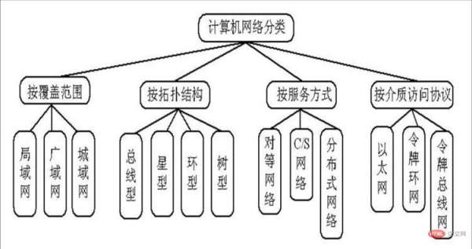
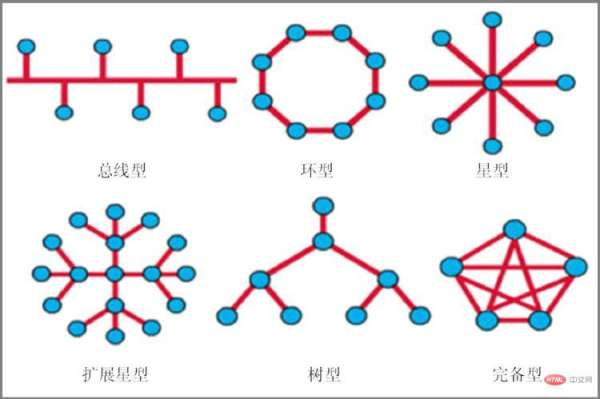

## 计算机网络分类

- 按照计算机网络的地理覆盖范围，可分为

  - 局域网
  - 城域网
  - 广域网

- 按照网络构成的拓扑结构，可分为

  - 总线型
  - 星型
  - 环型
  - 树型

- 按照网络服务的提供方式，可分为
  - 对等网络
  - 服务器网络
- 按照介质访问协议，可分为
  - 以太网
  - 令牌环网
  - 令牌总线网

### 按网络覆盖范围分类

计算机网络按其覆盖的地理范围可分为如下3类：

- 局域网(LAN)。局域网是一种在小区域内使用的，由多台计算机组成的网络，覆盖范围通常局限在10 千米范围之内，属于一个单位或部门组建的小范围网。
- 城域网(MAN)。城域网是作用范围在广域网与局域网之间的网络，其网络覆盖范围通常可以延伸到整个城市，借助通信光纤将多个局域网联通公用城市网络形成大型网络，使得不仅局域网内的资源可以共享，局域网之间的资源也可以共享。
- 广域网(WAN) 广城网是一种远程网，涉及长距离的通信，覆盖范围可以是个国家或多个国家，甚至整个世界。由于广域网地理上的距离可以超过几千千米，所以信息衰减非常严重，这种网络一般要租用专线，通过接口信息处理协议和线路连接起来，构成网状结构，解决寻径问题。

### 按拓扑结构分类

拓扑结构是借用数学上的一个词汇，从英文Topology音译而来。拓扑学是数学中一个重要的、基础性的分支。它最初是几何学的一个分支，主要研究几何图形在连续变形下保持不变的性质，现在已成为研究连续性现象的重要数学分支。计算机网络的拓扑结构指表示网络传输介质和节点的连接形式，即线路构成的几何形状。

计算机网络的拓扑结构通常有3种，即总线型、环型和星型。应当说明的是，这3种形状指线路电气连接原理，即逻辑结构，实际铺设线路时可能与画的形状完全不同。常见的拓扑图形如图所示。

- 总线型

  计算机网络拓扑结构中，总线型就是一根主干线连接多个节点而形成的网络结构。在总线型网络结构中，网络信息都是通过主干线传输到各个节点的。总线型结构的特点主要在于它的简单灵活、构建方便、性能优良。其主要的缺点在于总干线将对整个网络起决定作用，主干线的故障将引起整个网络瘫痪。

- 环型

  计算机网络拓扑结构中，环型结构主要是各个节点之间进行收尾连接，一个节点连接着一个节点而形成一个环路。在环形网络拓扑结构中，网络信息的传输都是沿着一个方向进行的，是单向的，并且，在每一个节点中，都需要装设一个中继器，用来收发信息和对信息的扩大读取。环形网络拓扑结构的主要特点在于它的建网简单、结构易构、便于管理。而它的缺点主要表现为节点过多，传输效率不高，不便于扩充。

- 星型

  在计算机网络拓扑结构中，星型结构主要是指一个中央节点周围连接着许多节点而组成的网络结构，其中中央节点上必须安装一个集线器。所有的网络信息都是通过中央集线器（节点）进行通信的，周围的节点将信息传输给中央集线器，中央节点将所接收的信息进行处理加工从而传输给其他的节点。星型网络拓扑结构的主要特点在于建网简单、结构易构、便于管理等等。而它的缺点主要表现为中央节点负担繁重，不利于扩充线路的利用效率。

- 树型

  在计算机网络拓扑结构中，树形网络结构主要是指各个主机进行分层连接，其中处在越高的位置，此节点的可靠性就越强。树形网络结构其实是总线性网络结构的复杂化，如果总线型网络结构通过许多层集线器进行主机连接，从而形成了树形网络结构，如图4所示。在互联网中，树形结构中的不同层次的计算机或者是节点，它们的地位是不一样的，树根部位（最高层）是主干网，相当于广域网的某节点，中间节点所表示的应该是大局域网或者城域网，叶节点所对应的就是最低的小局域网。树型结构中，所有节点中的两个节点之间都不会产生回路，所有的通路都能进行双向传输。其优点是成本较低、便于推广、灵活方便，比较适合那些分等级的主次较强的层次型的网络。

- 网状

  在计算机网络拓扑结构中，网型结构是最复杂的网络形式，它是指网络中任何一个节点都会连接着两条或者以上线路，从而保持跟两个或者更多的节点相连。网型拓扑结构各个节点跟许多条线路连接着，其可靠性和稳定性都比较强，其将比较适用于广域网。同时由于其结构和联网比较复杂，构建此网络所花费的成本也是比较大的。