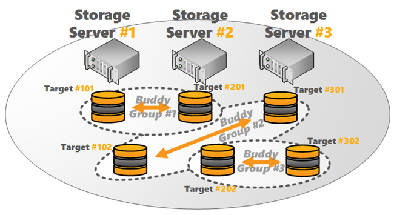

## 概述

从 2012.10 版本开始，BeeGFS 支持元数据（MetaData）和文件内容（File Contents）镜像。镜像功能集成到正常 BeeGFS 服务，所以，不需要单独的服务或第三方工具。这两种类型的镜像 （元数据镜像和文件内容镜像） 可以相互独立的使用。从 BeeGFS v6.0 开始，元数据镜像也扩展成为高可用性的特性。

存储和元数据镜像的高可用性是基于 Buddy Group。一般来说，一个 Buddy Group 是一对两个目标，内部管理彼此之间的数据复制。

Buddy Group 允许存储服务在两个目标之一失败时仍可以访问所有数据。它也支持把 Buddy Group 放在不同灾备区域，例如不同的机架或不同的服务器机房。

Storage Buddy Mirroring: 4 Servers with 1 Target per Server


存储服务器 Buddy 镜像也可以用于奇数个存储服务器。因为 BeeGFS Buddy Group 由独立的存储目标组成，独立于它们对服务器的分配是可行的，

如下面的示例图所示，每个服务器有 3 个服务器和 6 个存储目标组成。

Storage Buddy Mirroring: 3 Servers with 2 Targets per Server




注意，这在元数据服务器上是不可能的，因为 BeeGFS 中元数据没有目标的概念。需要偶数个元数据服务器，以便每个元数据服务器都可以属于一个 Buddy Group。

在正常操作中，Buddy Group 中的一个存储目标（或元数据服务器）被认为是主存储服务，而另一个是辅存储服务。修改操作总是先发送到主服务器，主服务器负责镜像过程。文件内容和元数据是同步镜像的，即在将两个数据副本传输到服务器后，客户端操作完成。

如果无法访问 Buddy Group 的主存储目标或元数据服务器，则会将其标记为脱机，并发出到辅存储的故障转移。在这种情况下，以前的辅存储将成为新的主存储。这样的故障转移是透明的，并且在运行应用程序时不会丢失任何数据。故障转移将在短暂的延迟后发生，以确保在将更改信息传播到所有节点时系统的一致性。如果服务只是重新启动（例如，在滚动更新的情况下），此短延迟还可以避免不必要的重新同步。 

可以通过以下命令方面查询存储服务和元数据服务的节点状态

```bash
beegfs-ctl --listtargets --nodetype=storage --state

beegfs-ctl --listtargets --nodetype=meta --state 
```

只有在 BeeGFS 管理服务正在运行时，才能对 Buddy Group 进行故障转移。这意味着，如果具有 BeeGFS 管理服务的节点崩溃，则不会发生故障转移。因此，建议在不同的机器上运行 BeeGFS 管理服务。但是，不必为 BeeGFS 管理服务提供专用服务器。

参考文档：<https://aws.amazon.com/cn/blogs/china/how-to-build-a-parallel-file-system-beegfs-on-aws-high-availability/>

### 配置 Meta Buddy / Storage Buddy

### 故障恢复

BeeGFS 的 Buddy Group 支持自动的故障转移和恢复。如果存储目标或元数据服务发生故障，会将其标记为脱机，并且不会获取数据更新。通常，当目标或服务器重新注册时，它将自动与 Buddy Group 中的剩余镜像同步（自动修复）。但是，在某些情况下，也可以支持手动启动同步过程。

以下通过分别模拟存储服务和元数据服务的故障，演示在发生故障时如何进行服务恢复和数据同步操作。

获取元数据服务的同步状态

```bash
> beegfs-ctl --resyncstats --nodetype=meta --mirrorgroupid=1

Job state: Not started
# of discovered dirs: 0
# of discovery errors: 0
# of synced dirs: 0
# of synced files: 0
# of dir sync errors: 0
# of file sync errors: 0
# of client sessions to sync: 0
# of synced client sessions: 0
session sync error: No
# of modification objects synced: 0
# of modification sync errors: 0
```

获取存储服务的同步状态

```bash
> beegfs-ctl --resyncstats --nodetype=storage --mirrorgroupid=1

Job state: Not started
# of discovered dirs: 0
# of discovered files: 0
# of dir sync candidates: 0
# of file sync candidates: 0
# of synced dirs: 0
# of synced files: 0
# of dir sync errors: 0
# of file sync errors: 0
```

（1）模拟 Buddy Group 存储服务的 Failover

首先模拟写入 1GB 数据

```bash
> cd /mnt/beegfs/buddy-dir

> dd if=/dev/zero of=testdata bs=1G count=1
1+0 records in
1+0 records out
1073741824 bytes (1.1 GB, 1.0 GiB) copied, 1.59144 s, 675 MB/s
```

登陆 node301，停止 beegfs-storage 服务

```bash
systemctl stop beegfs-storage
```

查询存储服务，301 的目标服务已经变为 Offline 状态

```bash
> beegfs-ctl --listtargets --nodetype=storage --state

TargetID     Reachability  Consistency   NodeID
========     ============  ===========   ======
    3011          Offline         Good      301
    3012          Offline         Good      301
    3021           Online         Good      302
    3022           Online         Good      302
    3031           Online         Good      303
    3032           Online         Good      303
```

继续模拟写入 1GB 数据，服务是可用的

```bash
> dd if=/dev/zero of=testdata2 bs=1G count=1

1+0 records in
1+0 records out
1073741824 bytes (1.1 GB, 1.0 GiB) copied, 3.67663 s, 292 MB/s
```

恢复 301 节点的存储服务

```bash
systemctl start beegfs-storage
```

301 节点的存储服务在自动恢复

```bash
> beegfs-ctl --listtargets --nodetype=storage --state

TargetID     Reachability  Consistency   NodeID
========     ============  ===========   ======
    3011           Online         Good      301
    3012           Online Needs-resync      301
    3021           Online         Good      302
    3022           Online         Good      302
    3031           Online         Good      303
    3032           Online         Good      303
```

使用命令手动触发数据同步

```bash
> beegfs-ctl --startresync --nodetype=storage --targetid=3011 --timestamp=0 --restart

Waiting for running resyncs to abort.
Resync request sent.

> beegfs-ctl --startresync --nodetype=storage --targetid=3012 --timestamp=0 --restart

Waiting for running resyncs to abort.
Resync request sent.
```

检查 301 节点的存储服务已经完全恢复

```bash
> beegfs-ctl --listtargets --nodetype=storage --state

TargetID     Reachability  Consistency   NodeID
========     ============  ===========   ======
    3011           Online         Good      301
    3012           Online         Good      301
    3021           Online         Good      302
    3022           Online         Good      302
    3031           Online         Good      303
    3032           Online         Good      303
```

（2）模拟元数据服务的 Failover

查询元数据服务状态

```bash
> beegfs-ctl --listtargets --nodetype=meta --state

TargetID     Reachability  Consistency   NodeID
========     ============  ===========   ======
     201           Online         Good      201
     202           Online         Good      202
```

登陆 node201，停止 beegfs-meta 服务

```bash
systemctl stop beegfs-meta
```

查询元数据服务状态，201 节点已经在脱机状态

```bash
> beegfs-ctl --listtargets --nodetype=meta --state

TargetID     Reachability  Consistency   NodeID
========     ============  ===========   ======
     201 Probably-offline         Good      201
     202           Online         Good      202
```

模拟写入 1GB 数据，成功写入

```bash
> dd if=/dev/zero of=testdata3 bs=1G count=1

1+0 records in
1+0 records out
1073741824 bytes (1.1 GB, 1.0 GiB) copied, 1.71778 s, 625 MB/s
```

查询元数据服务状态，已经完全离线

```bash
> beegfs-ctl --listtargets --nodetype=meta --state

TargetID     Reachability  Consistency   NodeID
========     ============  ===========   ======
     201          Offline Needs-resync      201
     202           Online         Good      202
```

恢复 201 节点的元数据服务  

```bash
systemctl start beegfs-meta
```

201 节点的元数据在自动恢复

```bash
> beegfs-ctl --listtargets --nodetype=meta --state

TargetID     Reachability  Consistency   NodeID
========     ============  ===========   ======
     201           Online Needs-resync      201
     202           Online         Good      202
```

可以使用命令手动触发数据同步

```bash
> beegfs-ctl --startresync --nodetype=meta --nodeid=201

Resync request sent.
```

查询元数据服务，已经完全恢复

```bash
> beegfs-ctl --listtargets --nodetype=meta --state

TargetID     Reachability  Consistency   NodeID
========     ============  ===========   ======
     201           Online         Good      201
     202           Online         Good      202
```
