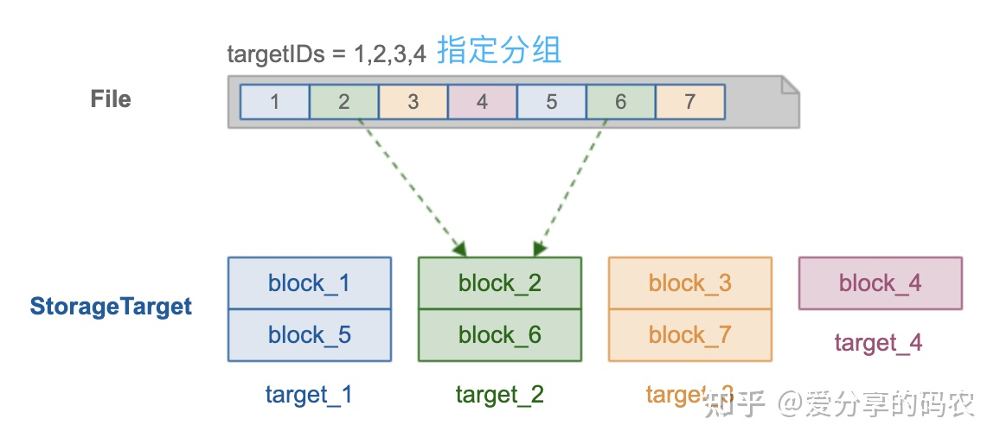
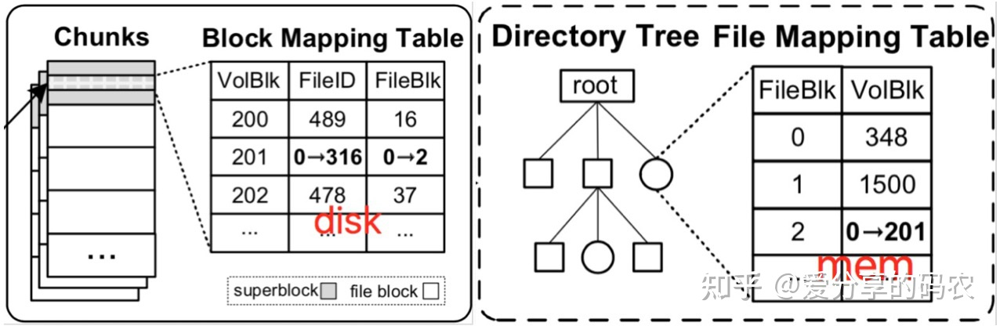

分布式块管理作为分布式存储中比较重要的一项元数据管理操作，需要结合集群的使用规模、元数据的访问效率以及后续的扩展能力来做综合评估，以便确定采用哪一种块管理方式更加合理。

以下主要是针对一些比较常用的分布式文件系统（或对象存储系统）所做的汇总分析，意在了解每个系统内部的数据块管理方式。

## 集中式 Map 管理

集中式元数据管理是最为简单的一种处理方式，可通过本地 map 来记录每个 block 与其对应的 location 信息，从而可以在 `O(1)` 的时间复杂度内快速定位到目标块的存储位置。

具有代表性的解决方案：

- HDFS 的 BlockManager，NN 通过与 DN 做周期性心跳来维护当前 BlockMap 的内存状态，从而无需对其进行持久化存储。

该方式虽然访问效率比较高，但缺点也同样明显，元数据规模大了以后很难在做横向扩展，以至于出现单点瓶颈。

## 分组管理

具有代表性的解决方案：

- BeeGFS

采用分组方式进行管理，元数据层面无需在记录每个文件块的 location 信息，而只需在文件层面记录其所使用的目标分组（如图所示，分组由 4 个存储节点构成），从而有效降低需要管理的元数据总量（大文件场景作用明显）

在对文件进行保存操作的时候，需要按照指定大小来对文件进行切片，在将这些切片基于 round-roubin 模式依次写入目标分组对应的存储节点上。

需要注意的是针对大文件场景，该方式虽然能有效降低需要管理的元数据总量，但也有可能造成分组之间的 IO 负载极不均衡的现象，因为在对大文件做读取操作时，只会访问其对应的分组节点，而不能将整个集群的 IO 资源利用上。

## 分层管理

具有代表性的解决方案：

- PolarFS

- OZone

分层管理（PolarFS）

采用分层的方式进行管理，可以将元数据的存储粒度由粗到细逐层打散，顶层节点负责维护粗粒度的元数据信息（由于量比较少，可采用集中式进行管理），而将细粒度的元数据维护交给底层叶子节点去做。

以 PolarFS 为例，每个 volumn 相当于一块逻辑盘，其空间被划分成了多个 chunk（大小默认为 10G），每个 chunk 会分散存储到不同的 chunkserver 上，Chunk 与 chunkserver 之间的映射关系采用集中式进行管理（无需持久化，ChunkServer 与 PolarCtrl 心跳会上报）；而文件内容会分散存储到不同的 chunk 上面，每个文件块对应一个 volblk，volblk 与 file 的映射关系则由 chunk 内部负责维护（通过其 superblock），以此将元数据划分成双层结构。

在对 volumn 执行 mount时，需要将 chunk 所管理的元数据信息载入内存，赋予对应的 inode 结构，这样通过 offset 和 len 便能够确定目标数据保存在哪个 volBlk 上，进而确定要访问的 chunk

分层管理（Ozone）

与 PolarFS 一样，通过划分 volumn 进行管理，volumn 在逻辑上又被拆分成多个 container。不同的是 container 在逻辑上没有顺序要求（对象不会跨 container），volumn 中的对象会均匀散列到每个 container 进行存储。

全局的元数据包括：

(1) 对象隶属于哪个 Container（通过 OM 进行管理）

(2) container 隶属于哪个 DN（通过 SCM 进行管理，通过心跳上报）

这些元数据采用集中式进行管理，而对象包含哪些 chunk 则在 Container 内部进行维护

与 PolarFS 相比，文件块的定位逻辑要慢一些，原因如下：

(1) client 一侧缺少 agent 组件来缓存 container 与 DN 的映射关系，每次都需要查询 OM

(2) 对象与数据块的映射关系目前采用 rocksdb 来维护，PolarFS 则是通过内存（挂载 volumn 时加载每个 chunk 的 superblock）

## 公式计算

分布式块管理的另一种实现思路是通过指定的伪随机算法将每个块的存储位置计算出来，从而无需在以元数据的形式进行保存，以此来降低元数据的管理压力，并有效解决元数据扩展性问题。

比较有代表性的算法如一致性 hash、CRUSH，这里主要看下 Ceph 基于 CRUSH 的实现。

首先将文件按照指定大小进行切片，每个切片对应一个 Object（objectId 由 inodeId 和切片索引来决定），然后将这些 Object 通过 hash 均匀散列到每个 PG 上面(PG 起到逻辑分区的作用，相当于一致性 hash 中的虚拟节点)，而每个 PG 所采用的 OSD 则是通过 CRUSH 算法计算出来的，从而无需在对文件块的位置做持久化存储。

CRUSH 作为一个伪随机算法，其在一致性 hash 的基础之上，还同时考虑了多副本以及故障域隔离功能，该算法要做的事情可通过一个公式来描述：

> mapping(pgid, placement rules, cluster map) = OSDs

其中，clusterMap 定义了集群拓扑结构（room、rack、host、device），placementRule 则定义了副本的放置规则，与传统 hash 相比，CRUSH 可以在 clusterMap 发生变动时，仅对少部分数据进行迁移，而不会打乱所有数据的分配布局。
