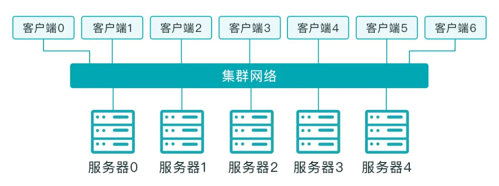

## 文件存储

文件存储作为存储三个接口形态中占比最高的一个（块、文件、对象）

用户在使用计算机时，不管是游戏、视频、文档编辑的普通应用程序，还是 AI、渲染、高性能计算的应用，这些应用使用的都是操作系统的“文件系统”。操作系统的“文件系统”模块提供了一个直观的界面（不光指所看到的可视化的用户界面，同时也指从应用程序角度的 SDK 访问接口）来访问数据，而需要人或应用程序记住数据在硬盘上的物理或逻辑位置（磁道，扇区号等）

### 三个关键的概念

- 文件：文件的真实数据可能不会在硬盘中的连续位置，但最终用户可以将文件以一长串连续字节的形式进行访问（这是因为文件系统对硬盘的数据分布进行了抽象和管理）
- 文件名：用户或应用程序可以通过诸如 doc01.txt 这类直观的文件名称访问文件，而无需记住任何物理的存储信息
- 目录树：文件系统（不管是本地的 ext4、xfs 文件系统，还是远程的共享文件系统）以目录树的形式管理所有文件

### NFS

NFS（Network File System，网络文件系统），是 Sun 基于 C/S 架构开发的一个文件系统，它允许用户通过网络访问文件，用户在使用的时候，感觉这些文件就像是位于本地文件目录中。这是通过 NFS 服务器导出（/etc/exports），并提供相应的文件访问权限，和 NFS 客户端挂载（使文件系统可用于应用程序所处的操作系统）的过程来完成的

### 并行文件系统

并行文件系统中，文件数据被切分并放置到多个存储设备中（各个被切分的数据如何放置，由并行文件系统通过算法来控制，可以基于元数据服务或类似一致性哈希的方式实现），系统使用全局名称空间来进行数据访问。并行文件系统的客户端可以同时使用多个 IO 路径将数据读/写到多个存储设备

## 并行文件系统 vs 分布式文件系统

并行文件系统是分布式文件系统的一种。分布式文件系统和并行文件系统都可以将数据分布在多个存储服务器上，可横向扩展从而容纳PB级数据，并支持高带宽

分布式文件系统通常也像并行文件系统一样，支持共享的全局名称空间

- 对于分布式文件系统而言，即使部分文件数据被分配和放置在不同服务器上，客户端在访问数据或元数据时，仍然需要通过指定的协议服务器来完成，协议服务器可能会成为 IO 路由的瓶颈。现在市场上主流的分布式文件存储为了解决这个协议服务器瓶颈的问题，使用 DNS 技术将不同的客户端连接至多个协议服务器，实现一定程度的负载均衡，但即使通过负载分发，也只是将不同客户端的 IO 拆分至多个协议服务器，协议服务器仍然需要进行一次 IO 转发，从而带来一定程度的性能损耗
- 使用并行文件系统，客户端系统可以直接访问所有存储节点以进行数据传输，而不必通过协议服务器

其他区别：

- 分布式文件系统通常使用标准的网络文件访问协议（例如 NFS 或 SMB ）来访问存储服务器。并行文件系统通常需要安装基于客户端的软件驱动程序（甚至推出基于 Windows 的客户端程序，例如 YRCloudFile、Panasas 等），通过以太网或 InfiniBand 等高速网络访问共享存储，因为只有基于这些客户端程序，才能实现区别于 NFS 的多 IO 路径访问
- 部分分布式文件系统将单个文件存储在单个存储节点上，而并行文件系统通常将文件分解并跨多个存储节点对数据块进行条带化
- 分布式文件系统倾向于带宽型或归档型应用程序。并行文件系统专注于高并发、高IOPS、海量数据的高性能工作负载
- 分布式文件系统通常使用诸如三副本或纠删码等技术来提供数据可靠性，而许多并行文件系统还支持后端挂载磁盘阵列（例如 Lustre、Spectrum Scale、YRCloudFile 等）
