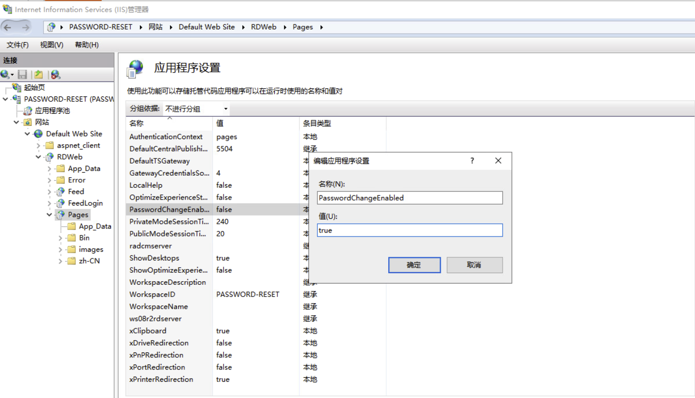

参考：<https://www.xh86.me/?p=924>

在公司日常运维中会发现目前很多公司 的 AD 域成员（域用户）密码到期后修改密码的方法只有两种：

第一种，密码到期提醒策略，用户电脑接入公司内网自行进 行修改，修改办法：CTrl+Alt+delete 键进行修改，此办法对于公司的销售人员、外出办公或出差同事来说，不适宜。

第二种，用户密码到期后，无法登陆，申请后台进行重置密 码，此办法可以解决问题，但是不是长久之计，一般制度健 全的公司，申请流程审批很漫长，浪费时间。

推荐通过 WEB 界面自行修改密码

在打开的服务器管理界面点击”添加角色和功能”；选择”基于角色或基于功能的安装”；选择 Web 服务和远程桌面 Web 服务；等待片刻，安装滚动条完成后，重启服务器来完成配置

配置 IIS 服务：打开”管理工具”选择 IIS 管理器；配置IIS 启用密码修改功能，将 “PasswordChangeEnabled”的值改为”True”

