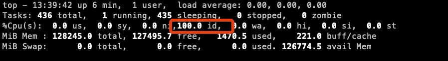

## `cpufreq`子系统

- `cpufreq`子系统负责在运行时对 CPU 频率和电压的动态调整，以达到性能和功耗的平衡，它也叫`DVFS(Dynamic Voltage Frequency Scaling)`
- `DVFS`原理：CMOS 电路中功耗与电压的平方成正比，与频率也成正比。此外，频率越高，性能也越强，相应的能耗就增大（需要 Trade-off）

### 原理：CPU performance/frequency scaling

处理器硬件有接口暴露给内核，可以设置 CPU 的运行 frequency/voltage，或者说选择不同的 **`P-state`**.

一般来说，

- 内核调度器会在一些重要事件发生时（例如新建或销毁进程）， 或者定期（every iteration of the scheduler tick）回调 cpufreq update 方法，更新 cpufreq 状态。
- cpufreq 根据状态状态信息，可以动态调整 p-state 级别。

这个功能称为 CPU performance scaling or CPU frequency scaling

### 架构：governor+driver

代码分为三块：

- the core：模型实现和状态维护；
- scaling governors：不同的管理算法；
- scaling drivers：与硬件对接的驱动。

governors 几个比较重要的：（详见五种模式）

1. performance：性能优先
2. powersave：节能优先
3. userspace：折中

drivers

1. `acpi-cpufreq`
2. `intel_pstate`

### cpufreq 的五种模式

1. performance: 顾名思义只注重效率，将 CPU 频率固定工作在其支持的最高运行频率上，而不动态调节。
2. Userspace: 最早的 cpufreq 子系统通过 userspace governor 为用户提供了这种灵活性。系统将变频策略的决策权交给了用户态应用程序，并提供了相应的接口供用户态应用程序调节 CPU 运行频率使用。也就是长期以来都在用的那个模式。可以通过手动编辑配置文件进行配置
3. powersave: 将 CPU 频率设置为最低的所谓 “省电” 模式，CPU 会固定工作在其支持的最低运行频率上。因此这两种 governors 都属于静态 governor，即在使用它们时 CPU 的运行频率不会根据系统运行时负载的变化动态作出调整。这两种 governors 对应的是两种极端的应用场景，使用 performance governor 是对系统高性能的最大追求，而使用 powersave governor 则是对系统低功耗的最大追求。
4. ondemand: 按需快速动态调整 CPU 频率， 一有 cpu 计算量的任务，就会立即达到最大频率运行，等执行完毕就立即回到最低频率；ondemand：userspace 是内核态的检测，用户态调整，效率低。而 ondemand 正是人们长期以来希望看到的一个完全在内核态下工作并且能够以更加细粒度的时间间隔对系统负载情况进行采样分析的 governor。 在 ondemand governor 监测到系统负载超过 up_threshold 所设定的百分比时，说明用户当前需要 CPU 提供更强大的处理能力，因此 ondemand governor 会将 CPU 设置在最高频率上运行。但是当 ondemand governor 监测到系统负载下降，可以降低 CPU 的运行频率时，到底应该降低到哪个频率呢？ ondemand governor 的最初实现是在可选的频率范围内调低至下一个可用频率，例如 CPU 支持三个可选频率，分别为 1.67GHz、1.33GHz 和 1GHz ，如果 CPU 运行在 1.67GHz 时 ondemand governor 发现可以降低运行频率，那么 1.33GHz 将被选作降频的目标频率。
5. conservative: 与 ondemand 不同，平滑地调整 CPU 频率，频率的升降是渐变式的，会自动在频率上下限调整，和 ondemand 的区别在于它会按需分配频率，而不是一味追求最高频率；

## sysfs 中配置 cpufreq

在 sysfs 目录，每个 CPU 一个目录 **`/sys/devices/system/cpu/cpu{id}/cpufreq/`**

cpufreq 是一个动态调整 cpu 频率的模块，系统启动时生成一个文件夹 `/sys/devices/system/cpu/cpu0/cpufreq/`

```bash
# ls /sys/devices/system/cpu/cpu0/cpufreq/

affected_cpus
bios_limit
cpuinfo_cur_freq
cpuinfo_max_freq
cpuinfo_min_freq
cpuinfo_transition_latency
freqdomain_cpus
related_cpus
scaling_available_frequencies
scaling_available_governors
scaling_cur_freq
scaling_driver
scaling_governor
scaling_max_freq
scaling_min_freq
scaling_setspeed
```

里面有几个文件，其中 scaling_min_freq 代表最低频率，scaling_max_freq 代表最高频率，scalin_governor 代表 cpu 频率调整模式，用它来控制 CPU 频率

查看 vendor 调节器

```bash
# 查看当前的调节器
cat /sys/devices/system/cpu/cpu0/cpufreq/scaling_governor
conservative
```

### Intel CPU node

```bash
# cpupower frequency-info
analyzing CPU 1:
  driver: intel_pstate
  CPUs which run at the same hardware frequency: 1
  CPUs which need to have their frequency coordinated by software: 1
  maximum transition latency:  Cannot determine or is not supported.
  hardware limits: 800 MHz - 4.70 GHz
  available cpufreq governors: performance powersave
  current policy: frequency should be within 800 MHz and 4.70 GHz.
                  The governor "performance" may decide which speed to use
                  within this range.
  current CPU frequency: Unable to call hardware
  current CPU frequency: 2.90 GHz (asserted by call to kernel)
  boost state support:
    Supported: yes
    Active: yes
```

- driver：**`intel_pstate`**，这个 driver 比较特殊，它绕过了 governor layer，直接在驱动里实现了频率调整算法。
- CPU 频率范围硬限制：`800MHz - 4.7GHz`
- 可用 cpufreq governors：`performance` `powersave`
- 正在使用的 cpufreq governor：**`performance`**
- 当前策略
  - 频率范围运行在 800MHz - 4.7GHz 之间；
  - 具体频率由 `performance` governor 决定。
- 当前 CPU 的频率：
  - 从硬件未获取到；
  - 从内核获取到的是 2.9GHz
- 是否支持 boost，即 `turbo frequency`
  - 支持
  - 当前已经开启

### AMD CPU node

```bash
analyzing CPU 18:
  driver: acpi-cpufreq
  CPUs which run at the same hardware frequency: 18
  CPUs which need to have their frequency coordinated by software: 18
  maximum transition latency:  Cannot determine or is not supported.
  hardware limits: 2.20 GHz - 3.50 GHz
  available frequency steps:  3.50 GHz, 2.80 GHz, 2.20 GHz
  available cpufreq governors: conservative ondemand userspace powersave performance schedutil
  current policy: frequency should be within 2.20 GHz and 3.50 GHz.
                  The governor "performance" may decide which speed to use
                  within this range.
  current CPU frequency: 3.50 GHz (asserted by call to hardware)
  boost state support:
    Supported: yes
    Active: yes
    Boost States: 0
    Total States: 3
    Pstate-P0:  3500MHz
    Pstate-P1:  2800MHz
    Pstate-P2:  2200MHz
```

- driver：**`acpi-cpufreq`**
- CPU 频率范围硬限制：`2.2GHz - 3.5GHz`
- 可用的频率步长：2.2G 2.8G 3.5G
- 可用 cpufreq governors：conservative ondemand userspace powersave performance schedutil
- 正在使用的 cpufreq governor：**`performance`**
- 当前策略：
  - 频率范围运行在 2.2GHz - 3.5GHz 之间；
  - 具体频率由 `performance` governor 决定。
- 当前 CPU 的频率：
  - 从硬件获取到 3.5GHz
- 是否支持 boost，即 turbo
  - 支持
  - 当前已经开启
  - 支持的`p-state`频率
    - Pstate-P0: 3500MHz
    - Pstate-P1: 2800MHz
    - Pstate-P2: 2200MHz

## idle task

如果调度队列（rq）为空，或者队列中的所有任务都处于 non runnable 状态，就称这个 CPU 是空闲的， 接下来就可以进入某个 c-state 以便降低功耗。从设计上来说，这里可以有两种选择：

1. 将进入 c-state 的逻辑直接暴露给调度器，由调度器直接控制；
2. 将进入 c-state 的逻辑封装成一个标准的任务（task），放到调度队列里，作为优先级最低的任务。 如果没有任何其他任务可执行，就调度执行这个特殊任务。

Linux 选择的第二种，引入的特殊任务称为 **`"idle task"`**。

严格来说：

- 早期系统中真的是进程（线程），优先级最低；干掉这个线程可能是搞垮小型机最简单的方式之一；
- 现代系统中，比如 Linux 内核中，已经是更加轻量级的实现（`ps` 搜索 `idle` 等字样看不到这些进程） 。

一般都是在 CPU 无事可做时通过某种形式的 wait 指令让 CPU 降低功耗。

### idle task 历史

处理器比大多数人想象中要空闲的多。

1. Unix：Unix 似乎一直都有一个某种形式的 idle loop（但不一定是一个真正的 idle task）。 比如在 V1 中，它使用了一个 WAIT 指令， 实现了让处理器停止工作，直到中断触发，处理器重新开始执行。
2. DOS、OS/2、早期 Windows：包括 DOS、IBM OS/2、早期 Windows 等操作系统， 都使用 busy loops 实现 idle task。

### Linux idle task 设计

为了保证设计的一致性，Linux 引入了一个特殊的进程 idle task，没有其他 task 可调度时，就执行它。

- 复用标准进程结构 `struct task`，将“无事可做时做什么”的逻辑封装为 idle task；
- 为每个 CPU 创建一个这样的进程（idle task），只会在这个 CPU 上运行；
- 无事可做时就调度这个 task 执行（因此优先级最低），所花的时间记录在 `top` 等命令的 `idle` 字段里。



### 实现：idle loop

简化版本：

```c
while (1) {
    while(!need_resched()) {
        cpuidle_idle_call();
    }

    /*
      [Note: Switch to a different task. We will return to this loop when the
      idle task is again selected to run.]
    */
    schedule_preempt_disabled();
}
```

### 运行时

`1` 号进程（`PID=1`）

系统启动之后的第一个进程是 **`init`** 进程， 它的 PID 是 1，所有其他进程都是这个进程的（N 代）子进程。这句话也不算错，但 `init` 其实是一个逻辑概念， 真正的 1 号进程名字可能并不叫 “init”。

```bash
# cat /proc/1/cmdline | tr '\0' ' ' && echo ""
/usr/lib/systemd/systemd --switched-root --system --deserialize 17

# /sbin/init is a symlink
# ls -ahl /sbin/init
lrwxrwxrwx. 1 root root 22 Nov  8  2022 /sbin/init -> ../lib/systemd/systemd
```

可以看到最终是执行的 **`systemd`**

用 pstree 可以直接看到从 PID 1 开始的进程树：

```bash
# pstree -p | head -10
systemd(1)-+-NetworkManager(1306)-+-{NetworkManager}(1369)
           |                      `-{NetworkManager}(1371)
           |-agetty(1438)
           |-chronyd(1313)
           |-crond(1422)
           |-dbus-daemon(1299)
           |-mdadm(1308)
           |-polkitd(1307)-+-{polkitd}(1368)
           |               |-{polkitd}(1370)
           |               |-{polkitd}(1376)
```

`0` 号进程（`PID=0`）

`ps` 查看所有进程，指定 **`-a`** 按 PID 升序排列

```bash
# ps -eaf | head
UID          PID    PPID  C STIME TTY          TIME CMD
root           1       0  0 Apr29 ?        00:00:00 /usr/lib/systemd/systemd --switched-root --system --deserialize 17
root           2       0  0 Apr29 ?        00:00:00 [kthreadd]
root           3       2  0 Apr29 ?        00:00:00 [rcu_gp]
root           4       2  0 Apr29 ?        00:00:00 [rcu_par_gp]
```

还真能看到 `0` 号进程，不过它只出现在父进程 PPID 列，是两个进程的父进程：

1. **`systemd`**：`PID=1`
2. **`kthreadd`**：`PID=2`，这是所有内核进程/线程的父进程
   - 内核进程是 `ps` 输出中用中括号 **`[]`** 括起来的进程，比如上面看到的 `[rcu_gp]`；

系统启动后

1. 所有系统进程（操作系统服务）和用户进程都是从 `PID=1` 的 `init` 进程直接或间接 fork 出来的；
2. 所有内核进程都是从 `PID=2` 的 `kthreadd` 进程 fork 出来的；

PID=0 简单把它理解成内核本身（内核最最骨干的执行逻辑）， 在所有进程之上，能管理（PID=1）和（PID=2）

### idle task - `0` 号进程的一部分

- 它的优先级最低，没有其他进程可调度时才会调度到它；
- 它叫“进程”（任务，task），但不是普通进程，而是 0 号进程的一部分，或者说是内核的一部分。

从执行上来说，它是直接在内核本身内执行，而并不是切换到某个进程执行。

### 从 idle task 进入 c-state 管理逻辑


## 参考资料

- <https://blog.51cto.com/u_11529070/9175151>
- <https://docs.kernel.org/6.0/translations/zh_CN/cpu-freq/cpufreq-stats.html>
- <https://www.cnblogs.com/LoyenWang/p/11385811.html>
- <https://huataihuang.gitbooks.io/cloud-atlas/content/os/linux/kernel/cpu/acpi_cpufreq.html>
- <https://blog.csdn.net/zhouhuaooo/article/details/127419771>