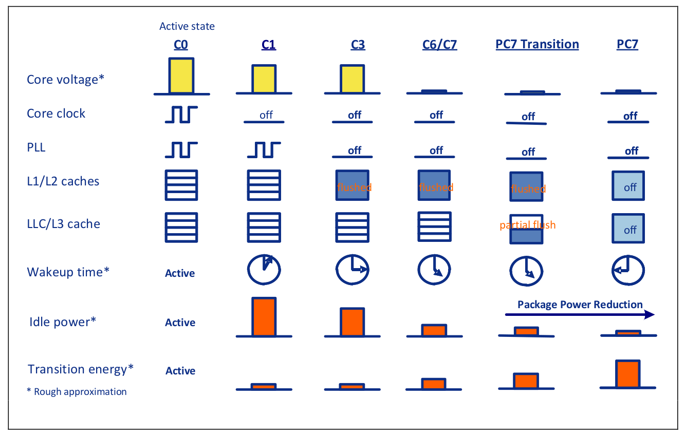
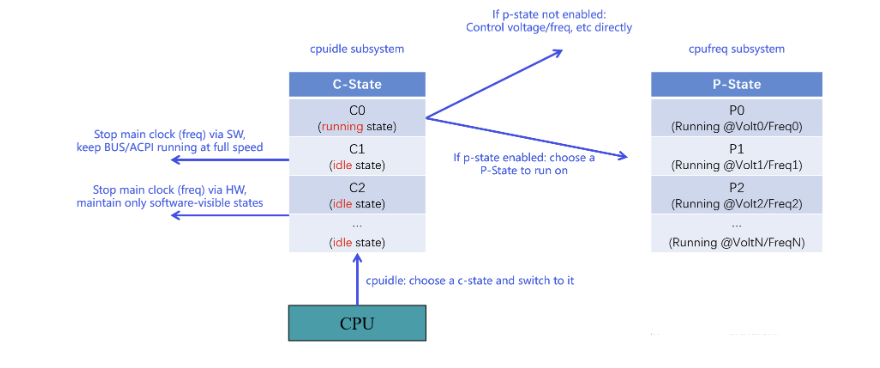
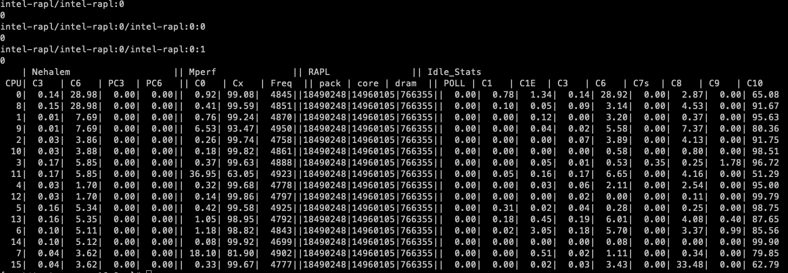

## CPU 空闲管理子系统（`cpudile`）

空闲时如何节能（`c-state`）

如果队列中没有任务，或者任务都是 wait 状态， 内核调度器该做什么呢？取决于处理器提供的能力，

- 如果处理器本身非常简单（特定场景的低成本处理器），没有什么功耗控制能力，调度器就只能执行一些无意义的指令来让处理器空转了；
- 现代处理器都有功耗控制能力，一般都是关闭部分 processor，进入到某种程度的 sleep 状态，实现节能。 但是，中断控制器（interrupt controller）必现保持开启状态。外设触发中断时，能给处理器发信号，唤醒处理器。

实际上，现代处理器有着非常复杂的电源/能耗管理系统。 OS 能预测处理器停留在 idle mode 的时长，选择不同的 low-power modes。每个 mode 功耗高低、进出耗时、频率等等都是不同的。

## idle state

区分不同的 CPU 空闲级别：引入 **`c-state`** (idle state)

为了增强灵活性，引入了 c-state，在处理器 idle 时节能



### ACPI p-states & c-states

ACPI 定义了处理器电源管理的规范，里面有两种状态

1. Power performance states (**`ACPI P states`**)

   不同厂商、不同处理器的 p-states 一般都不同。

2. Processor idle sleep states (**`ACPI C states`**)

   关闭 CPU 部分功能。不同处理器支持的 C-states 可能不同，区别在于能关掉哪些部分。 数字越大，关掉的功能越多，约省电。

### C-State 定义

| Mode | Definition                                                   |
| ---- | ------------------------------------------------------------ |
| C0   | Operational state. CPU fully turned on.                      |
| C1   | First idle state. Stops CPU main internal clocks via software. Bus interface unit and APIC are kept running at full speed. |
| C2   | Stops CPU main internal clocks via hardware. State in which the processor maintains all software-visible states, but may take longer to wake up through interrupts. |
| C3   | Stops all CPU internal clocks. The processor does not need to keep its cache coherent, but maintains other states. Some processors have variations of the C3 state that differ in how long it takes to wake the processor through interrupts. |

- c0 比较特殊，是工作状态； 但是工作在什么频率/电压，或者工作在哪个 p-state，是可以配置的，比如为了省电工作在较低的频率和电压；
- c1 是第一个空闲状态，表示 cpu 无事可干时，进入这个状态比 c0 省电。
- c2 c3 … 可选的更低功耗 idle 状态，唤醒延迟相应也越大。较深的睡眠状态唤醒时还可能会破坏 L2 cache 数据。

### 和 p-state 的区别

区别：

- c-state 独立于厂商和处理器，p-state 跟厂商和具体处理器直接相关
- 要想运行在某个 p-state，处理器必现工作在 C0 状态，也就是说处理器得进入工作状态，而不是空闲状态；



### 定义不同 idle 状态 / c-states 的决定因素

每个 idle state 考虑两个参数来描述

1. **`target residency`**（目标驻留时间）

   硬件能够保证的在这个状态下的最短时间，包括进入该状态所需的时间（可能很长）。

2. （最坏情况下的）**`exit latency`**（退出延迟）

   从该状态唤醒后开始执行第一条指令所需的最长时间。

## 如何**选择 c-state**：governor + driver

跟 `cpufreq` 子系统类似，将管理部分封装为一个 governor，有结构体和方法， 通过 driver 实现 governor 的一些方法。

使得架构独立于厂商和处理器。

四种 cpuidle governor：`menu`, `TEO`, `ladder`, `haltpoll`

### governors

有两类信息可以影响 governor 的决策。

下一个事件何时到来。分为两种情况：

1. 定时器事件。这个是确定的，因为内核控制着定时器（the kernel programs timers），所以 governor 知道何时触发。 在下一个定时器到来之前，就是这个 CPU 所在硬件可以在 idle state 下花费的最长时间，包括进入和退出所需的时间。
2. 非定时器事件。CPU 可能随时被非定时器事件唤醒，而且通常不可预测。 governor 只能在 CPU 被唤醒后看到 CPU 实际上空闲了多长时间（这段时间将被称为idle duration），

governor 可以基于以上两种时间，来估计未来的 idle duration。 如何使用这些信息取决于算法，这也是为什么有多个 governor 的主要原因。

### 四种 governor

- `menu` governor

`menu` governor 是 tickless 系统的默认 `cpuidle` governor。 非常复杂，但基本原理很简单：预测 idle duration，使用预测值进行 c-state 选择。

- haltpoll

- ladder

- teo (Timer Events Oriented)

用于 tickless systems。 跟 `menu` 一样，永远寻找最深的 idle state。 但算法不同。（kernel-doc: `drivers/cpuidle/governors/teo.c`）

### driver

用哪个 `cpuidle` driver 通常取决于内核运行的平台，例如，有大多数 Intel 平台都支持两种驱动：

- `intel_idle` hardcode 了一些 idle state 信息；
- `acpi_idle` 从系统的 ACPI 表中读取 idle state 信息。

## Linux node

### Intel CPU node

```bash
# cpupower idle-info
CPUidle driver: intel_idle
CPUidle governor: menu
analyzing CPU 12:

Number of idle states: 9
Available idle states: POLL C1 C1E C3 C6 C7s C8 C9 C10
POLL:
Flags/Description: CPUIDLE CORE POLL IDLE
Latency: 0
Usage: 8238446
Duration: 31481706
C1:
Flags/Description: MWAIT 0x00
Latency: 2
Usage: 8568115
Duration: 785207525
C1E:
Flags/Description: MWAIT 0x01
Latency: 10
Usage: 20182796
Duration: 3690558779
C3:
Flags/Description: MWAIT 0x10
Latency: 70
Usage: 5040348
Duration: 875383430
C6:
Flags/Description: MWAIT 0x20
Latency: 85
Usage: 33938357
Duration: 24228184604
C7s:
Flags/Description: MWAIT 0x33
Latency: 124
Usage: 28246
Duration: 44085295
C8:
Flags/Description: MWAIT 0x40
Latency: 200
Usage: 26473481
Duration: 25123231900
C9:
Flags/Description: MWAIT 0x50
Latency: 480
Usage: 188382
Duration: 1033806911
C10:
Flags/Description: MWAIT 0x60
Latency: 890
Usage: 34561330
Duration: 3380649413108
```

可以看到，

- cpuidle driver：**`intel_idle`**

- cpuidle governor: **`menu`**

- 支持的 idle states 种类

  1. POLL：即 C0，无事可做时执行一个轻量级线程，避免处理器进入 C1 状态；
  2. C1
  3. C1E
  4. C6：未启用
  5. ...

  此外还提供了每种 idle 状态的延迟、使用率、累积时长等等统计信息。

还可以通过 `cpupower monitor` 查看每个 CPU 的具体状态分布：



### AMD CPU node

最大睡眠深度 C2

```bash
# cpupower idle-info
CPUidle driver: acpi_idle
CPUidle governor: menu
analyzing CPU 9:

Number of idle states: 3
Available idle states: POLL C1 C2
POLL:
Flags/Description: CPUIDLE CORE POLL IDLE
Latency: 0
Usage: 62
Duration: 3330
C1:
Flags/Description: ACPI FFH MWAIT 0x0
Latency: 1
Usage: 4404
Duration: 1675915
C2:
Flags/Description: ACPI IOPORT 0x414
Latency: 400
Usage: 16537
Duration: 1645628548
```

没有 idle state，CPU 工作在 `idle=poll` 模式

```bash
# cpupower idle-info
CPUidle driver: none
CPUidle governor: menu
analyzing CPU 11:

CPU 11: No idle states
```

### 内核启动日志

内核启动日志说可以看到一些 idle task 相关的信息：

```bash
# dmesg | grep idle
[    0.011769] clocksource: refined-jiffies: mask: 0xffffffff max_cycles: 0xffffffff, max_idle_ns: 1910969940391419 ns
[    0.057164] clocksource: hpet: mask: 0xffffffff max_cycles: 0xffffffff, max_idle_ns: 79635855245 ns
[    0.068218] clocksource: tsc-early: mask: 0xffffffffffffffff max_cycles: 0x33e452fbb2f, max_idle_ns: 440795236593 ns
[    0.068441] process: using mwait in idle threads
[    0.175516] clocksource: jiffies: mask: 0xffffffff max_cycles: 0xffffffff, max_idle_ns: 1911260446275000 ns
[    0.176308] cpuidle: using governor menu
[    0.371506] clocksource: acpi_pm: mask: 0xffffff max_cycles: 0xffffff, max_idle_ns: 2085701024 ns
[    1.437289] clocksource: tsc: mask: 0xffffffffffffffff max_cycles: 0x33e499fc43d, max_idle_ns: 440795299786 ns
```


