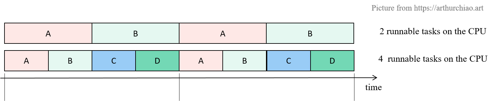
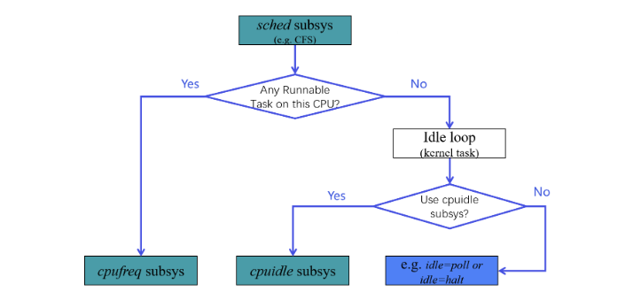

## 调度器：时分复用 + 任务调度（sched）

内核给每个 CPU 创建一个任务队列或称运行队列（run queue）， 根据算法（例如 CFS）将 runnable 任务依次放到 CPU 上执行，这个过程就称为调度。

本质上就是一个时分复用系统



## 有任务：用哪个频率执行任务（cpufreq）

CPU 有任务需要执行时，该以哪个频率/电压来执行呢？ 这里就需要一个管理组件，它的主要功能就是管理 CPU 执行任务时所用的频率/电压

其实就是为 CPU 选择一个合适的 p-state

Linux 内核中，对应的就是 cpufreq 子系统

```bash
# cpupower frequency-info
analyzing CPU 1:
  driver: intel_pstate
  CPUs which run at the same hardware frequency: 1
  CPUs which need to have their frequency coordinated by software: 1
  maximum transition latency:  Cannot determine or is not supported.
  hardware limits: 800 MHz - 4.70 GHz
  available cpufreq governors: performance powersave
  current policy: frequency should be within 800 MHz and 4.70 GHz.
                  The governor "performance" may decide which speed to use
                  within this range.
  current CPU frequency: Unable to call hardware
  current CPU frequency: 2.93 GHz (asserted by call to kernel)
  boost state support:
    Supported: yes
    Active: yes
```

## 无任务：执行轻量级程序（idle task）

如果 run queue 中没有 runnable tasks，CPU 无事可做，内核调度器该做什么？

- 从原理来说，非常简单。产品经理：什么都不做。
- 从实现来说，非常模糊。程序员：“什么都不做”的代码怎么写？
- 开发 leader 理解一下需求，从中翻译一下：
  - 先保证一个目标：有任务变成 runnable 时（比如等到了键盘输入），能够恢复调度执行 —— 这决定了内核不能完全退出，比如至少要能主动或被动的响应系统事件；
  - 在保证以上目标的前提下，内核做的事情越少越好 —— 延长处理器使用寿命，降本增效。

引入一个特殊任务 **`idle task`**（很多资料中也叫 idle loop）， 没有其他任务可调度时，就调度执行它。

- 从功能上来说，可以认为是一个优先级最低的占坑任务。
- 从实现来说，idle task 里面做什么都可以 —— 反正这时候这个 CPU 上没有任何其他 runnable tasks。根据目的的不同，具体实现可以分为两大类：
  - 节能；
  - 低延迟。

### 直接降低电压和频率-节能

这是主流行为，idle task 里面实现某种降低功耗的逻辑，避免 CPU 空转，节能。 

典型配置如 Linux 内核启动项 **`idle=halt`**。

这种方式的缺点是从较低功耗（某种程度的睡眠状态）唤醒时有一定的延迟。

### 仍然全速运行，保持最低唤醒延迟

这类场景比较特殊，比如追求极低延迟的高频交易场景。 没有任务时仍然让 CPU 保持电压和频率空转，不要降压降频， 这样有任务变成 runnable 时可以立即切换执行，延迟最低。 

在 Linux 启动项中，对应 **`idle=poll`** 配置。

### 动态降低电压和频率，节能 —— `cpuidle` 和 `c-states`

通过一个单独的子系统（`cpuidle`）来实现不同级别的节能（`c-states`）。

这里注意和 turbo freq 的区别：

- turbo 是部分 CORE 空闲时，有任务在运行的 CORE 可以动态超频， 目的是提高这几个有任务在运行的 CORE 的性能；
- cpuidle/c-states 是当前 CORE/CPU 没有任务要运行（空闲 CPU），通过动态降频来节能。

## `idle loop`  空闲时间管理（cpuidle）

队列中如果没有 runnable task，比如所有任务都在等待 IO 事件。 这时候是没有任务需要 CPU 的，因此称为 CPU 空闲状态（idle states）。

内核又引入了另外一个子系统： cpu 空闲时间管理子系统 `cpudile`

## `cpuidle` + 响应延迟保证：电源管理服务等级（PM QoS）

如果没有任务时 cpuidle 选择进入某种低电压/低频率的节能模式，当有任务到来时， 它的唤醒时间可能无法满足要求。针对这种情况，内核又引入了功耗管理或称电源管理服务等级 （PM QoS）子系统。

PM QoS 允许应用注册一个最大 latency，内核确保唤醒时间不会高于这个阈值， 在尽量节能的同时实现快速响应。 

## 总结

