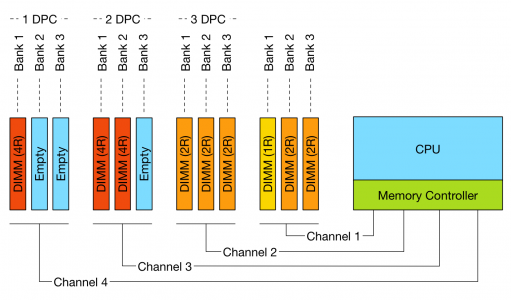
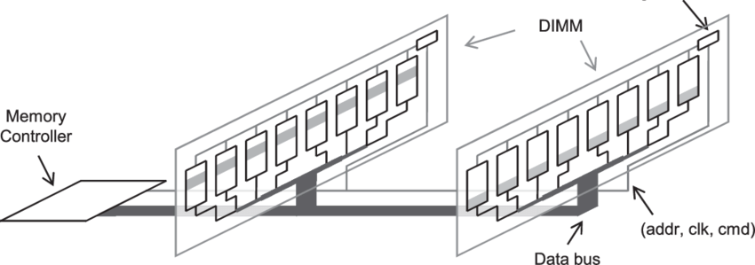

1DPC（每通道只插一根内存条）

现在的主流的台式机 CPU 内存控制器都支持双内存通道，一个内存通道可以接多个内存条。一个通道一根内存条叫做 1DPC（1 DIMM per Channel）；一个通道两根内存条叫做 2DPC（2 DIMM per Channel）；一个通道三根内存条叫做3DPC（3 DIMM per Channel，现在基本不再支持）

每个 channel 有不同的信号线，它们之间的传输是并行的，这就是它们可以并发存取数据，进而提高性能。同一个 Channel 的内存条是共享信号线的，不能并发操作。那么具体是怎么共享信号线呢？有两种：T-Topology（T 型）和 daisy chain（串联）。现代的主板大多采用 daisy chain：

也就是先连到近端，再连到远端。正因为信号共享，在现代内存总线如此高速的情况下，多个内存会影响信号的完整性。于是在 DDR4 这一代，3DPC 基本上淡出人们的视野。2DPC 也会比 1DPC 信号差，所以 CPU 和主板的支持清单中，大多会注明 2DPC 支持的最高主频和 1DPC 支持的最高主频，往往 1DPC 主频相对更高。因为台式机主板往往有四个内存条插槽，也就是每个通道两根内存条，共四根

## 参考资料

- 内存子系统 <https://frankdenneman.nl/2015/02/18/memory-tech-primer-memory-subsystem-organization/>