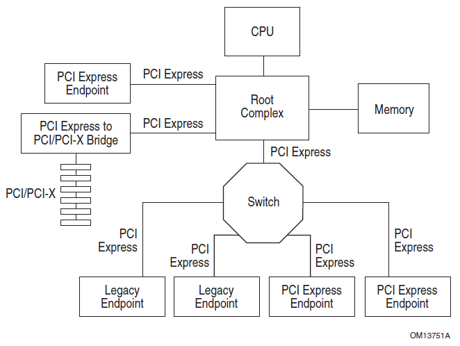

## PCIe

PCIe 的全称是 Peripheral Component Interconnect Express，是一种用于连接外设的总线

它于 2003 年提出来，作为替代 PCI 和 PCI-X 的方案，现在已经成了现代 CPU 和其他几乎所有外设交互的标准或者基石，比如，我们马上能想到的 GPU，网卡，USB 控制器，声卡，网卡等等，这些都是通过 PCIe 总线进行连接的，然后现在非常常见的基于 m.2 接口的 SSD，也是使用 NVMe 协议，通过 PCIe 总线进行连接的

## PCIe 总体框图

PCIe 的架构主要由五个部分组成：Root Complex，PCIe Bus，Endpoint，Port and Bridge，Switch。其整体架构呈现一个树状结构



### Root Complex（RC）

Root Complex 是整个 PCIe 设备树的根节点，CPU 通过它与 PCIe 的总线相连，并最终连接到所有的 PCIe 设备上

由于 Root Complex 是管理外部 IO 设备的，所以在早期的 CPU 上，Root Complex 其实是放在了北桥（MCU）上，后来随着技术的发展，现在已经都集成进了 CPU 内部

虽然是根节点，但是系统里面可以存在不只一个 Root Complex。随着 PCIe Lane 的增加，PCIe 控制器和 Root Complex 的数量也随之增加

```bash
> lspci -t -v

-+-[0000:e0]-+-00.0  Advanced Micro Devices, Inc. [AMD] Starship/Matisse Root Complex
 +-[0000:c0]-+-00.0  Advanced Micro Devices, Inc. [AMD] Starship/Matisse Root Complex
 +-[0000:a0]-+-00.0  Advanced Micro Devices, Inc. [AMD] Starship/Matisse Root Complex
 +-[0000:80]-+-00.0  Advanced Micro Devices, Inc. [AMD] Starship/Matisse Root Complex
 +-[0000:60]-+-00.0  Advanced Micro Devices, Inc. [AMD] Starship/Matisse Root Complex
 +-[0000:40]-+-00.0  Advanced Micro Devices, Inc. [AMD] Starship/Matisse Root Complex
 +-[0000:20]-+-00.0  Advanced Micro Devices, Inc. [AMD] Starship/Matisse Root Complex
 \-[0000:00]-+-00.0  Advanced Micro Devices, Inc. [AMD] Starship/Matisse Root Complex
```


## 参考文档

- <https://r12f.com/posts/pcie-1-basics/>

- <https://r12f.com/posts/pcie-2-config/>
- <https://r12f.com/posts/pcie-3-tl-dll/>
- <https://r12f.com/posts/pcie-4-phy/>