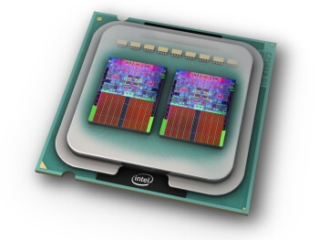

对于 Linux 机器，可以用 `lscpu`、`cat /proc/info` 等命令查看它的 CPU 信息

```
lscpu
```

展示的信息如下

```bash
Architecture:            x86_64
  CPU op-mode(s):        32-bit, 64-bit
  Address sizes:         43 bits physical, 48 bits virtual
  Byte Order:            Little Endian
CPU(s):                  256
  On-line CPU(s) list:   0-255
Vendor ID:               AuthenticAMD
  BIOS Vendor ID:        Advanced Micro Devices, Inc.
  Model name:            AMD EPYC 7742 64-Core Processor
    BIOS Model name:     AMD EPYC 7742 64-Core Processor
    CPU family:          23
    Model:               49
    Thread(s) per core:  2
    Core(s) per socket:  64
    Socket(s):           2
    Stepping:            0
    Frequency boost:     enabled
    CPU(s) scaling MHz:  92%
    CPU max MHz:         2250.0000
    CPU min MHz:         1500.0000
    BogoMIPS:            4499.65
    Flags:               fpu ...
Virtualization features:
  Virtualization:        AMD-V
Caches (sum of all):
  L1d:                   4 MiB (128 instances)
  L1i:                   4 MiB (128 instances)
  L2:                    64 MiB (128 instances)
  L3:                    512 MiB (32 instances)
NUMA:
  NUMA node(s):          2
  NUMA node0 CPU(s):     0-63,128-191
  NUMA node1 CPU(s):     64-127,192-255
Vulnerabilities:
  Gather data sampling:  Not affected
  Itlb multihit:         Not affected
  L1tf:                  Not affected
  Mds:                   Not affected
  Meltdown:              Not affected
  Mmio stale data:       Not affected
  Retbleed:              Mitigation; untrained return thunk; SMT enabled with STIBP protection
  Spec rstack overflow:  Mitigation; Safe RET
  Spec store bypass:     Mitigation; Speculative Store Bypass disabled via prctl
  Spectre v1:            Mitigation; usercopy/swapgs barriers and __user pointer sanitization
  Spectre v2:            Mitigation; Retpolines, IBPB conditional, STIBP always-on, RSB filling, PBRSB-eIBRS Not affected
  Srbds:                 Not affected
  Tsx async abort:       Not affected
```

可以看到有 255 个 CPU，但无法看到 CPU 在物理上是怎么分布的（layout）

## 拓扑

（1）Package

如下图，package（直译为“封装”）是我们能直接在主板上看到的一个东西，里面封装一个或多个处理器核心（称为 core 或 processor）


（2）Core (processor)

指硬件核心/硬件处理器。一个 package 里面可能会包含多个处理器，如下图所示


