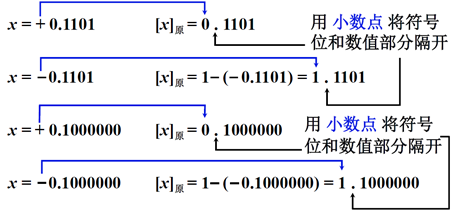
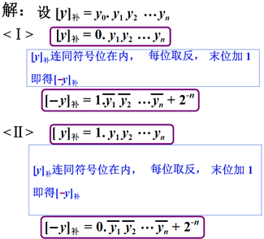
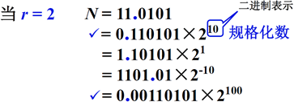

## 无符号数

若无符号数保存在寄存器中，寄存器的位数，反映了无符号数的表示范围

如：如果寄存器位数为8位，存储数据范围为：

$$
\Box\Box\Box\Box\Box\Box\Box\Box
\newline
8 位
\newline
0 \sim 255
$$

如果寄存器位数为16位，存储数据的位数范围：

$$
\Box\Box\Box\Box\Box\Box\Box\Box\Box\Box\Box\Box\Box\Box\Box\Box
\newline
16 位
\newline
0 \sim 65535
$$

## 有符号数

### 真值和机器数


#### 真值

真值是指在数值前面用 `+` 号表示正数，用 `-` 号表示负数的带符号二进制数

因为机器数第一位是符号位，所以机器数的形式值就不等于真正的数值，所以，为区别起见，将带符号位的机器数对应的真正数值称为机器数的真值

#### 机器数

机器数（又称为机器码）是指在数字系统中用 `0` 表示符号 `+`，用 `1` 表示符号 `-`，即把符号“数值化”后的带符号二进制数

机器数在计算机中能够直接被硬件直接识别和处理

把一个数据保存在计算机中需要保存三部分内容：

- 符号
- 小数点位置
- 数的数值位

在计算机中没有专门硬件表示小数点，计算机中的小数点都是以约定的方式给出的

- 对于保存小数，小数点默认在符号位的后面
- 而对于整数，小数点的位置在设计硬件时约定放于数值部分的最后

这样可以把定点计算机（小数点位置固定的计算机）分为两类

- 小数定点机
- 整数定点机

常用的机器数表现形式有

- 原码
- 反码
- 补码
- 移码

简单的对应关系为（不包含移码）：


### 原码表示法

#### 整数表示

- 对于正数

原码表示方式为将数据的符号位用 `0` 表示

为了使得符号位用 `0` 表示，只需要在数值位的最高位添加 `0` 即可

- 对于负数

原码表示方式为将数据的符号位用 `1` 表示

为了使得符号位用 `1` 表示，只需要在真值的绝对值的基础上加上 `2^n` 即可

根据以上分析，得到如下定义


根据以上的定义举例如下


#### 小数表示

- 对于正数

原码的表示方式和真值去掉符号后相同，但是，小数点前面的 0，在真值中表示这是这小数，在原码中表示这个原码的符号位为正号

- 对于负数

原码的表示方式为：去掉符号，将小数点前的 0 变为 1，表示符号为负。只需要在真值的绝对值的基础上加 1 即可

得到定义如下


根据以上定义，举例如下



无论是整数中的逗号，还是小数中的小数点，在计算机中是不存储的，仅仅是为了为的直观识别而添加的

#### 原码特点

原码的表示形式是简单，直观

定义中，正数的范围 X>=0，负数 X<=0，如果 X = 0，计算出来的 X 原码不同


如果用原码表示，让符号位也参与计算，显然对于减法来说，结果是不正确的，例如：

$$
1 - 1 = 1 + (-1) = [00000001] 原  + [10000001] 原  = [10000010] 原  = -2
$$

因此不能让符号位参与运算


对于上面的操作，同样的加法操作，但是运算器实际的操作可能是加法，也可能是减法，对于运算器来说是比较麻烦的

那能不能对加法和减法进行归一化：只用加法就能完成加法和减法的操作。即：找到一个与负数等价的正数来代替这个负数， 就可使得加负数和加另一个正数结果相同，即将减法操作转化为了加法操作，这样就能将加法和减法操作统一为加法操作

补码就是为了解决加减法归一化的问题

### 反码表示法

反码表示为符号位不变，其余位按位取反

#### 整数表示

具体定义如下


举例如下


#### 小数表示

具体定义如下


举例如下


#### 反码特点

反码解决了带符号位运算的问题，但是还有一个问题没有解决：就是现们有两个 `0`，一个 `+0`， 一个 `-0`，这两者在数学上是没有区别的，并且占了两个编码

通过反码逻辑的设计，还可以发现现在正负数相加获得的都是 `1111`，也就是 `-0`

### 补码表示法

由于计算机中位运算均是以补码形式操作的，正数的补码是其本身，负数的补码为其反码加 1。

#### 补的概念

对于时钟，如果我们要把时钟从 6 点调整到 3 点，我们可以进行哪些操作？


很显然能想到可以进行顺时针调整和逆时针调整


顺时针调整减去 12，因为时钟以 12 为模，即如果显示的时间到 12，时间归零

所以，对于上面的调整操作，对于这种有模的、能够记录数据的设备，我们可以使用 9 代替 -3，把减法变成加法操作

这时候我们可以称 +9 是 -3 以 12 为模的补数，记作：


对于对时钟的调整操作，可以得出以下结论：

（1）一个负数加上 “模” 即得该负数的补数 

（2）一个正数和一个负数互为补数时，它们绝对值之和即为模数

计算机中的数据存储设备和时钟是相似的，比如我们要存放一个整数，存放这个整数的寄存器的位数为 4 位，那这个寄存器计数的时候，一旦进行加法操作的时候，它的值大于或者等于 16，进位部分将会被自动的丢弃，这点和时钟很相似，区别在于时钟以 12 为模，4 为的寄存器以 16 为模。

如把 `1011` 变为 0 有两种方式：


可见 `1011` 可用 `+0101` 代替，记作:


同样的，可以得到如下示例：


以上计算的都是负数的补数，那正数的补数是多少呢？


根据上图可知，正数的补数为其本身

因为 `0101` 即是 `-1011` 的补数，又是 `+0101`（其本身）的补数，那 `+0101` 到底是谁的补数呢？

所以在计算机中：

- 表示 `0101` 的补数时，在其补数前面添加 0 表示符号位，用逗号与数值部分隔开，表示为：`0,0101` 
- 表示 `-1011` 的补数时，在其补数前面添加 1 表示符号位，用逗号与数值部分隔开，表示为：`1,0101`

如下图所示：


`0101` 是 `-1011` 的补数，而 `10101` 是 `-1011` 的补码，如何计算补码呢？

$$
-1011 + 10000 = 补数 = 0101

\newline

补数 + 10000 = 补码 = 10101
$$

即得到：

$$
-1011的补码 = -1011 + 10000 + 10000 = -1011 + 2 ^ 4 + 2 ^ 4 = -1011 + 2^5
$$

这样，得到的补码，就可以用最高位区分是正数还是负数，而此时原数和补码之间的模就是 $2^{(n+1)}$，即如下所示：


#### 同余

这个规律就是数学中的同余：两个整数 `a`，`b`，若它们除以整数 `m` 所得的余数相等，则称 `a`，`b` 对于模 `m` 同余

记作 `a ≡ b (mod m)`，`a` 与 `b` 关于模 `m` 同余

```bash
5 mod 12 = 5

17 mod 12 = 5

29 mod 12 = 5

# 所以 `5`，`17`，`29` 关于模 `12` 同余
```

mod 运算的数学定义：

$$
x \bmod y = x\,-\,y\,\llcorner\,x/y\,\lrcorner
$$

`x mod y` 等于 `x` 减去`y` 乘上 `x` 与 `y` 的商的下界

举个例子 `-3 mod 2`等于 $ -3 – 2 \times \llcorner -1.5\lrcorner $，等于 `-3 - 2 * (-2)`，结果为 `1`

#### 整数表示

根据上面的分析，可以得出整数的补码定义如下


举例如下


#### 小数表示

小数的补码定义如下


举例如下


#### 补码特点

推导过程如下：


如上图所示，将 $2 ^ 5$ 表示为 $2 ^ 5 - 1 + 1$， 其中 $2 ^ 5 - 1 - 1010$ 为 `11111 - 1010`，即相当于原码（`11010`）符号位不变按位取反

所以可以得出如下结论：

当真值为负时，补码 = 原码除符号位外每位取反，末位加 1

从补码的定义 $[X]补 = 2^{(n + 1)} + X$ 可知，从补码到原码的推导过程依然符合以上结论

举例如下：


上图中，补码 `1.0000` 表示的真值是 `-1.0000`，没有对应的原码

另外，已知 $[y]补$ 求 $[ -y]补$，解如下：



### 源码、反码、补码总结

（1）最高位为符号位，书写上用 `,`（整数）或 `.`（小数）将数值部分和符号位隔开

（2）对于正数，原码 = 补码 = 反码

（3）对于负数 ，符号位为 1，其数值部分

反码 = 原码除符号位外每位取反

补码 = 原码除符号位外每位取反末位加 1

（4）设机器数字长为 8 位（其中１位为符号位） 对于整数，当其分别代表无符号数、原码、补码和 反码时，对应的真值范围


### 移码表示法

补码表示很难直接判断其真值大小，具体情况如下：


如果此时不使用补码比较大小，而是将 $X + 2^n$得：


这种表示方法为移码，移码定义如下：


移码在数轴上表示：


举例：


移码定义中：

（1） 不管是正数还是负数，变成移码的方式都是加上 $2^n$

（2） 从定义中看，只有整数形式定义，没有小数形式定义，这和移码在计算机的数据表示中的作用有关，通常情况下，移码用于表示浮点数据表示的阶码部分，阶码都是整数，所以移码中只给出了整数形式的定义

移码和补码比较：


结论：补码与移码只差一个符号位

真值、补码和移码的对照表如下：


移码的特点：


可见，最小真值的移码为全 0

用移码表示浮点数的阶码 ，能方便地判断浮点数的阶码大小

## 定点数和浮点数表示

### 定点表示

定点表示中，小数点按照约定方式给出，位置由计算机体系结构设计人员在设计计算机体系结构的时候约定的，在硬件实现和软件实现的时候，都要遵守这个约定， 根据约定位置的不同，有两种形式：


根据上图：

（1）如果小数点在左图中的位置，表示计算机中存放或者处理的定点数都是小数，如果是补码形式，它能够表示的唯一的整数就是 -1

（2）如果小数点放在右图中的位置，计算机中的定点数都是整数

根据一台定点计算机约定的小数点的位置，可以把定点计算机分为两类：

- 小数定点机： 小数点放在数符的后面，数值的前面，如上左图

- 整数定点机： 小数点位置放在数值部分的后面，如上右图


定点存储存在如下问题：

（1）编程困难，程序员要调节小数点的位置；

在编写程序过程中，经常会使用到浮点数，在定点机中，如果用到浮点数，需要程序员自己调整小数点

（2）数据的表示范围非常小，为了能够表示两个大小相差很大的数据，需要很长的机器字长

如果在某一个科学计算的问题上，需要同时保存电子的质量和太阳的质量，两者的差距是 $10^{61} $，为了能够在计算机中同时保存两个数据，如果用二进制数表示这么大的差距，需要 203 位的二进制数据

（3）数据存储的利用率很低

刚刚的问题中，即使有了203位存储单元，这个存储单元可以两个数据，但是保存电子质量的那个存储单元大部分的值都是 0，尤其是高位部分，就会导致大量的空间被浪费

### 浮点表示

浮点数的格式如下：


- S 小数，可正可负
- j 整数，可正可负

- r 取 2、4、8、16
  - r = 2，尾数中 1 位二进制数，表示了一位 2 进制的数
  - r = 4，尾数中 2 位二进制数，表示了一位 4 进制的数
  - r = 8，尾数中 3 位二进制数，表示了一位 8 进制的数
  - r = 16，尾数中 4 位二进制数，表示了一位 16 进制的数



上面的举例中，阶码 j 用二进制表示，`11.0101` 将其右移 2 位变为 `0.110101`，相当于将其变为原来的四分之一，为了保持不变，需要将 `0.110101 `乘以 4，所以是 2 的 2 次方，j = 2 用二进制表示，为 `10` 所以为 `0.110101 * 2^10`，其余同理

在上面，对于 `r = 2，N = 11.0101` 共使用了五中表示形式，其中有两种表示形式是合法的，如上图中划对号的两个，两个的尾数采用小数定点表示，尾数的值均是小于等于 1 的，两种方式都可以把其存放于计算机中，但是其中第一种方式是比较特殊的，数值位的最高位是非 0 的，这种表示形式称为规格化数

在计算机中，浮点数如何进行存储呢，前面说过，数据在计算机中表示方式为机器数，浮点数在计算机中进行存储，也需要以机器数形式进行存储，如果在设计计算机过程中，已经约定了尾数的基值 r 采用二进制（r = 2），或者采用四进制（r = 4）等，那么，在浮点数的存储过程中，只需要把浮点数的尾数部分，阶码部分，包括数符和阶符存储起来，用之前讲解的机器数的表示形式，按照计算机设计的时候的规定尾数取多少位，数符是一位，阶符是一位，这样就可以把浮点数存计算机中

经过分析，得出浮点数存放形式如下：


依据刚刚给出的浮点数的表示格式，分析浮点数的表示范围，假设，现在不考虑数据的规格化，无论是尾数还是阶码，都是用原码形式进行表示，那么给定浮点数的表示方式，在数轴上可以分析浮点数表数范围：


上图中，表示了浮点数的范围，并将 m = 4，n = 10 带入计算，当 m = 4， n = 10 时，实际上这种方式能表示的数据的长度一共是 16位，一位表示阶符，一位表示尾符，4 位表示阶码，10 表示尾数数值部分。能够表示的二进制数的个数是 2^ 16，如果我们的机器使用这样的格式表示浮点数，那就是使用 2^16 个二进制数来表示最小负数和最大整数之间的所有的数。

举例，设 `m=4`，`n=10`，`r=2`，尾数规格化后的浮点数表示范围


由上可知，位数决定数据的精度，阶码决定数据大小。

举例：


**为什么要引入规格化表示?**

尽可能保证数据的精度，如果不进行规格化，尾数的小数点后面可能会有若干个 0，在计算机中，尾数的长度是有限的，超出给定长度的尾数的值被截断扔掉，要种影响尾数精度，为了尽可能保证数据精度，所以要让有效位数尽可能多，所以采用规格化形式，则有：


即，基数不同，浮点数的规格化形式不同。将浮点数进行规格化的方式：


从上面可以看出：基数 r 越大，可表示的浮点数的范围越大 ，浮点数的精度降低。

**机器 0**

（1）当浮点数尾数为 0 时，不论其阶码为何值按机器零处理 

（2）当浮点数阶码等于或小于它所表示的最小数时，不论尾数为何值，按机器零处理


这种机器零方式，有利于机器中“ 判 0 ” 电路的实现

**目前浮点数表示格式的标准是什么？**

IEEE 754 标准，格式如下：


上面的格式中，小数点的位置即是阶码小数点位置，又是尾数小数点位置，要求尾数为规格化表示 ，如果使用这种方式进行表示，在基值为 2 的情况下，不管是原码、补码、反码，尾数非 “0” 的有效位最高位为 “1”。既然最高位一定是 1，那第一位就可以直接隐含掉，可以不在数据中进行表示，在计算中进行补齐即可，这样做的好处实际上增加了尾数的位数，增大了尾数能够表示的精度。

IEEE 754 标准中对实数有三种规定：


