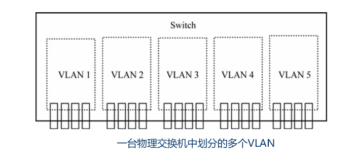
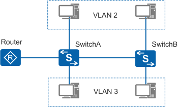
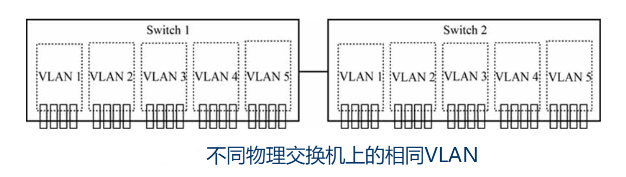
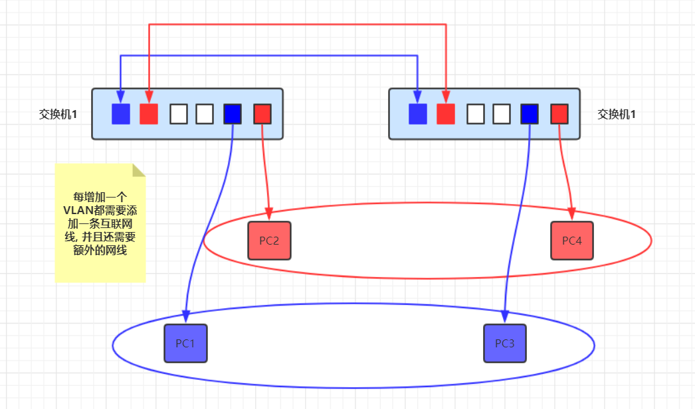

## VLAN 简介

VLAN（Virtual Local Area Network）即虚拟局域网，是将一个物理的 LAN 在逻辑上划分成多个广播域的通信技术。VLAN 内的主机间可以直接通信，而 VLAN 间不能直接互通，从而将广播报文限制在一个 VLAN 内，把单一结构的大 LAN 划分成相互逻辑独立的小型虚拟 LAN

- 广播流量不会占据更多带宽资源

  - ARP 在 MAC 地址寻址时会产生广播数据帧

  - DHCP 服务器在为客户端自动分配 IP 地址时也会产生许多广播数据帧

  - ...

- 同时也提高网段间的安全性

- 广播域缩小，广播风暴产生的可能性也大大降低

在物理 LAN 中，各主机是可以直接通过第二层，即数据链路层进行通信的，但划分 VLAN 后，不同 VLAN 中的主机是不可以直接通过第二层进行通信的，必须通过第三层，即网络层

## VLAN 工作原理

### 同一物理交换机中的 VLAN

通过不同的划分规则把连接的交换机上的各个用户主机划分到不同的 VLAN 中，同一个交换机中划分的各个 VLAN 可以理解为一个个虚拟交换机

### 不同物理交换机中的 VLAN

一个 VLAN 可以跨越多台物理交换机，这就是 VLAN 的中继（Trunk）功能

五台（VLAN 1、VLAN 2、VLAN 3、VLAN 4 和 VLAN 5）仅存在逻辑连接关系，但两台物理交换机中相同的 VLAN 间有相互物理连接关系的虚拟交换机

不同交换机上可以有相同的 VLAN，而且这些不同物理交换机上的相同 VLAN 间一般情况下是可以直接互访的

- 它们都位于同一个 IP 网段

- 物理交换机连接的端口上允许这些 VLAN 数据包通过

如果位于不同交换机上的两个不同 VLAN 处于同一个 IP 网段，且交换机间连接的两个端口是分别隶属通信双方 VLAN 的 Access 端口，或者不带 VLAN 标签的 Hybrid 端口，则这两个 VLAN 间也是可以直接通信的

### VLAN 标签

## 参考资料

- <https://www.cnblogs.com/wang-a/p/15959272.html>
- <https://blog.51cto.com/u_15073468/2795169>
- <https://support.huawei.com/enterprise/zh/doc/EDOC1100086528>

- <https://blog.csdn.net/qq_40610003/article/details/133342658>
