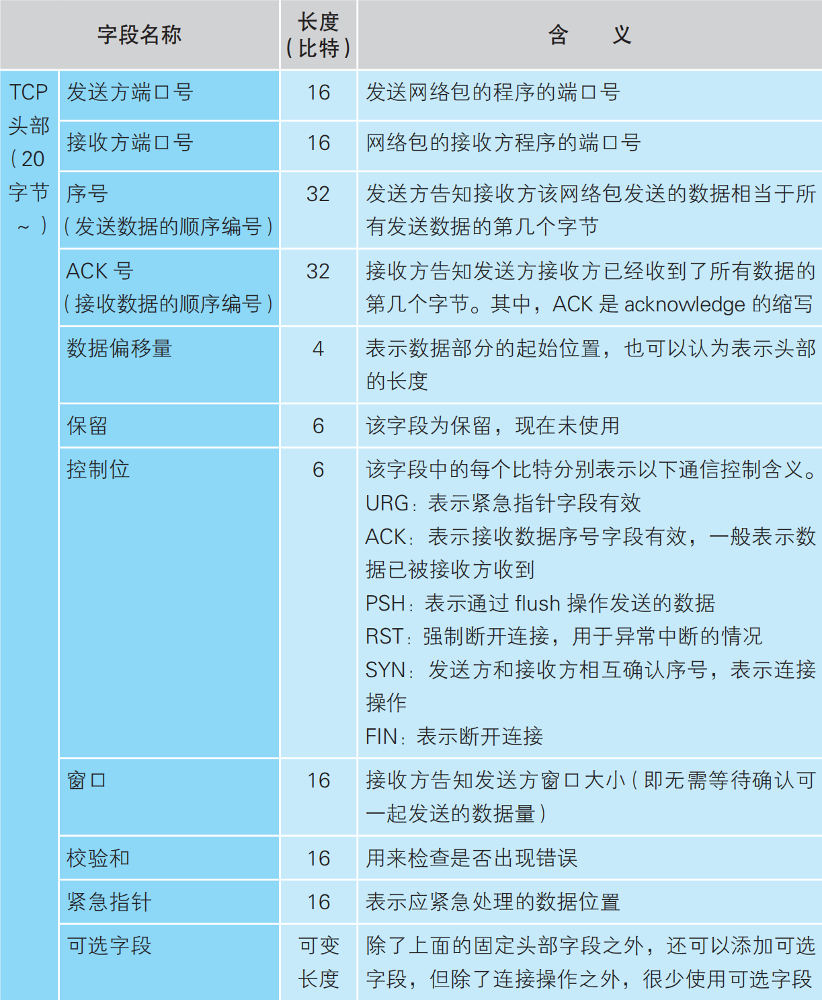

TCP 报文

TCP 三次握手

TCP 四次挥手

将连接建立和连接断开的两个时序状态图综合起来，就是这个著名的 TCP 的状态机

## 参考资料

- <https://github.com/bigcoder84/study-notes/blob/master/%E5%9F%BA%E7%A1%80%E7%AC%94%E8%AE%B0/%E8%AE%A1%E7%AE%97%E6%9C%BA%E7%BD%91%E7%BB%9C/images/42.jpg>