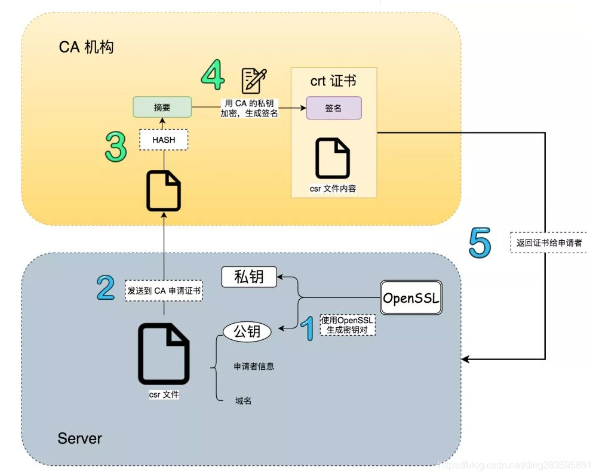

## OpenSSL

OpenSSL 是一个开源项目，其组成主要包括一下三个组件：

- openssl：多用途的命令行工具
- libcrypto：加密算法库
- libssl：加密模块应用库，实现了 ssl 及 tls

### 对称加密

对称加密需要使用的标准命令为 enc ，用法如下：

```bash
openssl enc -ciphername [-in filename] [-out filename] [-pass arg] [-e] [-d] [-a/-base64]
       [-A] [-k password] [-kfile filename] [-K key] [-iv IV] [-S salt] [-salt] [-nosalt] [-z] [-md]
       [-p] [-P] [-bufsize number] [-nopad] [-debug] [-none] [-engine id]
```


## 证书

### 常见的生成工具

- OpenSSL
- JDK 自带的 KeyStone
- cfssl

### 各字段的含义

| 参数名称                 | 简称 | 参数值                                                 |
| ------------------------ | ---- | ------------------------------------------------------ |
| Country Name             | C    | 国家代码，比如中国就是 CN                              |
| State or Province Name   | ST   | 省名称                                                 |
| Locality Name            | L    | 城市名称                                               |
| Organization Name        | O    | 机构名称                                               |
| Organizational Unit Name | OU   | 机构单位名称                                           |
| Common Name              | CN   | 重点参数：授权给什么，因为机构是根节点所以是授权给自己 |
| Email Address            |      | 邮件地址                                               |

查看证书的内容

```bash
openssl x509 -in ca.crt -noout -text|egrep -i "issuer|subject|serial|dates"
openssl x509 -noout -text -in tls.crt
cfssl-certinfo -cert tls.crt
```

### 证书格式

PKCS 全称是 Public-Key Cryptography Standards ，是由 RSA 实验室与其它安全系统开发商为促进公钥密码的发展而制订的一系列标准，PKCS 目前共发布过 15 个标准。 常用的有：

1. `PKCS#7` Cryptographic Message Syntax Standard
2. `PKCS#10` Certification Request Standard
3. `PKCS#12` Personal Information Exchange Syntax Standard

`X.509` 是常见通用的证书格式。所有的证书都符合为 Public Key Infrastructure (PKI) 制定的 ITU-T X509 国际标准。

1. `PKCS#7` 常用的后缀是： `.P7B`、`.P7C`、`.SPC`
2. `PKCS#12` 常用的后缀有： `.P12`、`.PFX`
3. `X.509 DER` 编码(ASCII)的后缀是： `.DER`、`.CER`、`.CRT`
4. `X.509 PAM` 编码(Base64)的后缀是： `.PEM`、`.CER`、`.CRT`
5. .`cer/.crt` 是用于存放证书，它是 2 进制形式存放的，不含私钥
6. `.pem` 跟 crt/cer 的区别是它以 ASCII 来表示
7. `pfx/p12` 用于存放个人证书/私钥，他通常包含保护密码，2 进制方式
8. `p10` 是证书请求
9. `p7r` 是 CA 对证书请求的回复，只用于导入
10. `p7b`以树状展示证书链(certificate chain)，同时也支持单个证书，不含私钥

## 证书生成过程



## 完整生成过程

### 创建自签名的 CA 证书

生成 CA 私钥：

```bash
openssl genpkey \
  -algorithm RSA \
  -out ca-key.pem \
  -pkeyopt rsa_keygen_bits:2048
```

生成 CA 证书：

```bash
openssl req \
  -x509 -new -nodes \
  -key ca-key.pem -sha256 \
  -days 36500 \
  -out ca-cert.pem \
  -subj "/C=CN/ST=State/L=City/O=Organization/OU=Unit/CN=example.com"
```

### 创建泛域名证书

生成服务器私钥：

```bash
openssl genpkey \
  -algorithm RSA \
  -out server-key.pem \
  -pkeyopt rsa_keygen_bits:2048
```

创建证书签名请求 (CSR)， 创建一个配置文件 `server.csr.cnf`：

```ini
[req]
default_bits       = 2048
prompt             = no
default_md         = sha256
distinguished_name = dn

[dn]
C  = CN
ST = State
L  = City
O  = Organization
OU = Unit
CN = *.example.com

```

然后生成 CSR：

```bash
openssl req -new -key server-key.pem -out server.csr -config server.csr.cnf
```

创建证书扩展文件，创建一个配置文件 `server.ext`：

```ini
authorityKeyIdentifier=keyid,issuer
basicConstraints=CA:FALSE
keyUsage = digitalSignature, nonRepudiation, keyEncipherment, dataEncipherment
extendedKeyUsage = serverAuth
subjectAltName = @alt_names

[alt_names]
DNS.1 = *.example.com
DNS.2 = example.com

```

签署服务器证书：

```bash
openssl x509 -req -in server.csr -CA ca-cert.pem -CAkey ca-key.pem -CAcreateserial -out server-cert.pem -days 36500 -sha256 -extfile server.ext
```

### Linux 安装 CA 证书

将 CA 证书复制到系统的信任证书目录：

对于 Ubuntu：

```bash
# 注意：Ubuntu 只能是 crt 后缀
sudo cp ca-cert.pem /usr/local/share/ca-certificates/ca-cert.crt
sudo update-ca-certificates
```

对于 CentOS：

```bash
sudo cp ca-cert.pem /etc/pki/ca-trust/source/anchors/
sudo update-ca-trust
```

验证 CA 证书是否已安装：

```bash
# openssl verify -CAfile /etc/ssl/certs/ca-certificates.crt server-cert.pem
openssl verify server-cert.pem
```

### Windows 安装 CA 证书

将 CA 证书复制到 Windows 机器：将 `ca-cert.pem` 文件从创建它的系统复制到 Windows 机器

安装 CA 证书

1. 打开证书管理控制台：
   - 按 `Win + R` 打开运行对话框，输入 `mmc` 并按回车键。
   - 在“文件”菜单中，选择“添加/删除管理单元...”。
2. 添加证书管理单元：
   - 在“添加/删除管理单元”对话框中，从左侧列表中选择“证书”，然后点击“添加”按钮。
   - 选择“计算机账户”，然后点击“下一步”。
   - 选择“本地计算机”，然后点击“完成”。
3. 导入 CA 证书：
   - 在“控制台根”节点下，展开“证书 (本地计算机)”。
   - 展开“受信任的根证书颁发机构”节点，然后右键点击“证书”，选择“所有任务” -> “导入...”。
4. 导入向导：
   - 在证书导入向导中，点击“下一步”。
   - 点击“浏览”并找到复制到 Windows 机器上的 `ca-cert.pem` 文件，然后点击“下一步”。
   - 选择“将所有的证书放入下列存储”并确认选择的是“受信任的根证书颁发机构”，然后点击“下一步”。
   - 点击“完成”完成证书的导入。
5. 确认安装：
   - 导入成功后，应该会看到一个消息框提示“导入成功”。

验证 CA 证书

1. 打开浏览器：
   - 打开浏览器（如 Chrome、Edge、Firefox）。
2. 访问受信任的网站：
   - 尝试访问使用自签名证书保护的网站。例如，`https://example.com`。
3. 检查证书：
   - 在浏览器中，点击地址栏中的锁图标，然后查看证书详细信息。确认证书链中包含刚刚安装的 CA 证书。

通过以上步骤，已经在 Windows 系统中成功安装了自签名的 CA 证书。这样，浏览器或其他应用程序将信任由该 CA 签发的证书。

### MacOS 安装证书

将 `ca-cert.pem` 文件从创建它的系统复制到 macOS 机器。

在 macOS 上安装 CA 证书

1. 打开“钥匙串访问”：
   - 可以通过 Spotlight 搜索 `钥匙串访问` 或者在 `/应用程序/实用工具/钥匙串访问` 中找到它并打开。
2. 导入 CA 证书：
   - 在“钥匙串访问”窗口中，选择左侧的“系统”钥匙串，然后在右侧窗口的上方工具栏中选择“文件” > “导入项目...”。
   - 找到并选择 `ca-cert.pem` 文件，然后点击“打开”。
3. 信任 CA 证书：
   - 在导入证书后，需要将其设置为信任。找到导入的证书，通常会显示在“证书”类别中。
   - 双击导入的证书，打开证书信息窗口。
   - 在“信任”部分，展开选项卡并将“使用此证书时”设置为“始终信任”。
   - 关闭证书信息窗口，系统将提示您输入管理员密码来确认更改。

验证 CA 证书是否已安装

1. 打开终端：

   - 可以通过 Spotlight 搜索 `终端` 或者在 `/应用程序/实用工具/终端` 中找到它并打开。

2. 运行命令查看证书：

   使用以下命令来验证 CA 证书是否已安装：

   ```
   security find-certificate -c "Your CA Certificate Name" /Library/Keychains/System.keychain
   ```

   将 `"Your CA Certificate Name"` 替换为证书名称。

测试证书

1. 使用浏览器测试：
   - 打开浏览器（如 Safari、Chrome、Firefox）。
   - 访问自签名 CA 签发的证书保护的 HTTPS 网站。例如，`https://example.com`。
   - 检查地址栏中的锁图标，点击它查看证书详细信息，确认证书是由自签名 CA 签发的，并且浏览器信任该证书。

通过以上步骤，已经在 macOS 系统中成功安装了自签名的 CA 证书。这样，浏览器或其他应用程序将信任由该 CA 签发的证书。

## 快速生成自签证书

生成证书

```bash
openssl req -x509 -nodes -days 700 -newkey rsa:2048 -keyout tls.key -out  ca.crt -subj "/CN=poc.com"
```

创建 kubernetes 证书

```bash
kubectl -n istio-system create secret tls istio-ingressgateway-certs --key tls.key --cert ca.crt --dry-run -o yaml | kubectl apply  -f -
```

## 生成带 subjectAltName 的证书

```bash
domainName=domain.com
consoleNS=ns
k8sSecretName=sso-x509-https-secret

# 支持 addext 参数需要将 OpenSSL 更新到 1.1.1d
openssl req -x509 -nodes -days 700 -newkey rsa:2048 -keyout ${consoleNS}-tls.key -out ${consoleNS}-ca.crt -subj "/CN=${domainName}" -addext "subjectAltName = DNS:${domainName}"

kubectl -n $consoleNS  create secret tls ${k8sSecretName}  --key ${consoleNS}-tls.key --cert ${consoleNS}-ca.crt --dry-run -o yaml |kubectl apply  -f -

```

## 参考链接

- <https://www.tangyuecan.com/2021/12/17/%E5%B1%80%E5%9F%9F%E7%BD%91%E5%86%85%E6%90%AD%E5%BB%BA%E6%B5%8F%E8%A7%88%E5%99%A8%E5%8F%AF%E4%BF%A1%E4%BB%BB%E7%9A%84ssl%E8%AF%81%E4%B9%A6/>