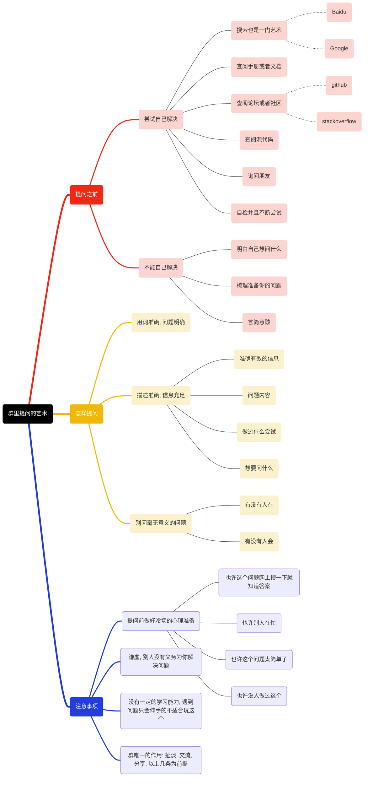

```mermaid
%% graph定义了这是流程图，方向从左到右
graph LR

%% 然后别急着画图，我们把每个节点定义成变量。（写代码是一门艺术，一定要写的逻辑清楚，我用o表示根节点，后面按层级的规律给它编码）
o(群里提问的艺术)
o1(提问之前)
o11(尝试自己解决)
o111(搜索也是一门艺术)
o1111(Baidu)
o1112(Google)
o112(查阅手册或者文档)
o113(查阅论坛或者社区)
o1131(github)
o1132(stackoverflow)
o114(查阅源代码)
o115(询问朋友)
o116(自检并且不断尝试)
o12(不能自己解决)
o121(明白自己想问什么)
o122(梳理准备你的问题)
o123(言简意赅)
o2(怎样提问)
o21(用词准确, 问题明确)
o22(描述准确, 信息充足)
o221(准确有效的信息)
o222(问题内容)
o223(做过什么尝试)
o224(想要问什么)
o23(别问毫无意义的问题)
o231(有没有人在)
o232(有没有人会)
o3(注意事项)
o31(提问前做好冷场的心理准备)
o311(也许这个问题网上搜一下就知道答案)
o312(也许别人在忙)
o313(也许这个问题太简单了)
o314(也许没人做过这个)
o32(谦虚, 别人没有义务为你解决问题)
o33(没有一定的学习能力, 遇到问题只会伸手的不适合玩这个)
o34(群唯一的作用: 扯淡, 交流, 分享, 以上几条为前提)

%% 定义变量后再开始连接节点。
o --- o1
o --- o2
o --- o3
o1 --- o11
o1 --- o12
o2 --- o21
o2 --- o22
o2 --- o23
o3 --- o31
o3 --- o32
o3 --- o33
o3 --- o34
o11 --- o111
o111 -.- o1111
o111 -.- o1112
o11 --- o112
o11 --- o113
o113 -.- o1131
o113 -.- o1132
o11 --- o114
o11 --- o115
o11 --- o116
o12 --- o121
o12 --- o122
o12 --- o123
o22 --- o221
o22 --- o222
o22 --- o223
o22 --- o224
o23 --- o231
o23 --- o232
o31 --- o311
o31 --- o312
o31 --- o313
o31 --- o314

%% 到这里连接就写完了，其实这里就足够了，下面是美化样式的方法，精益求精，也可以不求。
%% -------------------------------------------------------------------------
%% 下面开始绘制节点的样式，fill管背景色，stroke管边框，color是字体颜色，有点类似css的语法。
style o fill:black,stroke:black,stroke-width:1px,color:white
style o1 fill:#f22816,stroke:#f22816,stroke-width:1px,color:white
style o2 fill:#f2b807,stroke:#f2b807,stroke-width:1px,color:white
style o3 fill:#233ed9,stroke:#233ed9,stroke-width:1px,color:white
style o11 fill:#fcd4d0,stroke:#fcd4d0,stroke-width:1px
style o12 fill:#fcd4d0,stroke:#fcd4d0,stroke-width:1px
style o111 fill:#fcd4d0,stroke:#fcd4d0,stroke-width:1px
style o112 fill:#fcd4d0,stroke:#fcd4d0,stroke-width:1px
style o113 fill:#fcd4d0,stroke:#fcd4d0,stroke-width:1px
style o114 fill:#fcd4d0,stroke:#fcd4d0,stroke-width:1px
style o115 fill:#fcd4d0,stroke:#fcd4d0,stroke-width:1px
style o116 fill:#fcd4d0,stroke:#fcd4d0,stroke-width:1px
style o121 fill:#fcd4d0,stroke:#fcd4d0,stroke-width:1px
style o122 fill:#fcd4d0,stroke:#fcd4d0,stroke-width:1px
style o123 fill:#fcd4d0,stroke:#fcd4d0,stroke-width:1px
style o1111 fill:#fcd4d0,stroke:#fcd4d0,stroke-width:1px
style o1112 fill:#fcd4d0,stroke:#fcd4d0,stroke-width:1px
style o1131 fill:#fcd4d0,stroke:#fcd4d0,stroke-width:1px
style o1132 fill:#fcd4d0,stroke:#fcd4d0,stroke-width:1px
style o21 fill:#fcf1cd,stroke:#fcf1cd,stroke-width:1px
style o22 fill:#fcf1cd,stroke:#fcf1cd,stroke-width:1px
style o221 fill:#fcf1cd,stroke:#fcf1cd,stroke-width:1px
style o222 fill:#fcf1cd,stroke:#fcf1cd,stroke-width:1px
style o223 fill:#fcf1cd,stroke:#fcf1cd,stroke-width:1px
style o224 fill:#fcf1cd,stroke:#fcf1cd,stroke-width:1px
style o23 fill:#fcf1cd,stroke:#fcf1cd,stroke-width:1px
style o231 fill:#fcf1cd,stroke:#fcf1cd,stroke-width:1px
style o232 fill:#fcf1cd,stroke:#fcf1cd,stroke-width:1px

%% 下面开始绘制线条的样式，以第一个为例子，0代表第一根线，顺序以代码的线出现的位置为准
linkStyle 0 stroke:#f22816,stroke-width:5px;
linkStyle 1 stroke:#f2b807,stroke-width:5px;
linkStyle 2 stroke:#233ed9,stroke-width:5px;
linkStyle 3 stroke:#f22816,stroke-width:3px;
linkStyle 4 stroke:#f22816,stroke-width:3px;
linkStyle 5 stroke:#f2b807,stroke-width:3px;
linkStyle 6 stroke:#f2b807,stroke-width:3px;
linkStyle 7 stroke:#f2b807,stroke-width:3px;
linkStyle 8 stroke:#233ed9,stroke-width:3px;
linkStyle 9 stroke:#233ed9,stroke-width:3px;
linkStyle 10 stroke:#233ed9,stroke-width:3px;
linkStyle 11 stroke:#233ed9,stroke-width:3px;

```

参考资料：<https://blog.csdn.net/weixin_43982359/article/details/136002742>