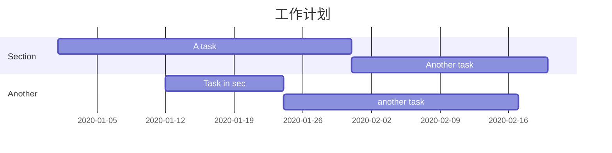
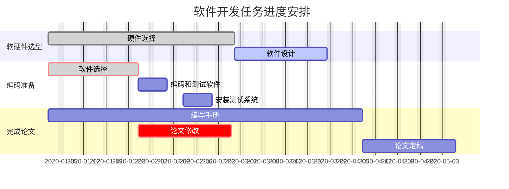

甘特图一般用来表示项目的计划排期，目前在工作中经常会用到

语法也非常简单，从上到下依次是图片标题、日期格式、项目、项目细分的任务

```plain
gantt
    title 工作计划
    dateFormat  YYYY-MM-DD
    section Section
    A task           :a1, 2020-01-01, 30d
    Another task     :after a1  , 20d
    section Another
    Task in sec      :2020-01-12  , 12d
    another task      : 24d
```






