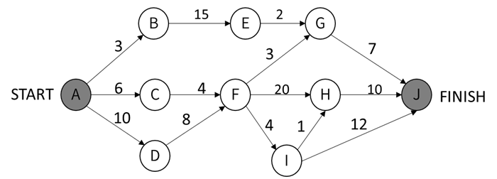

## 什么是关键路径

工程中一个活动何时开始依赖于其前驱活动何时结束，只有所有的前驱活动都结束后这个活动才可以开始，前驱活动都结束的时间就是这个活动的最早开始时间。与此同时，在不影响工程完工时间的前提下，有些活动的开始时间存在一些余量，在时间余量允许的范围之内推迟一段时间开始活动也不会影响工程的最终完成时间，活动的最早开始时间加上这个时间余量就是活动的最晚开始时间。活动不能在最早开始时间之前开始，当然，也不能在最晚开始时间之后开始，否则会导致工期延误。

如果一个活动的时间余量为 0，即该活动的最早开始时间和最晚开始时间相同，则这个活动就是关键活动，由这些关键活动[串](http://data.biancheng.net/view/303.html)起来的一个工程活动路径就是关键路径。根据关键路径的定义，一个工程中的关键路径可能不止一个，我们常说的关键路径指的是工程时间最长的那条路径，也就是从源点到汇点之间最长的那条活动路径。

## 实例

下面是一个软件项目活动图，其中顶点表示项目里程碑，连接顶点的边表示包含的活动，边上的权重表示活动的持续时间（天）

将各个活动的最早开始和完成时间、最晚开始和完成时间、持续时间和总时差分别进行标注，结果如下：

节点最早开始时间（正推最大）/ 最晚开始时间（反推最小）

## 参考资料

<http://data.biancheng.net/view/151.html>