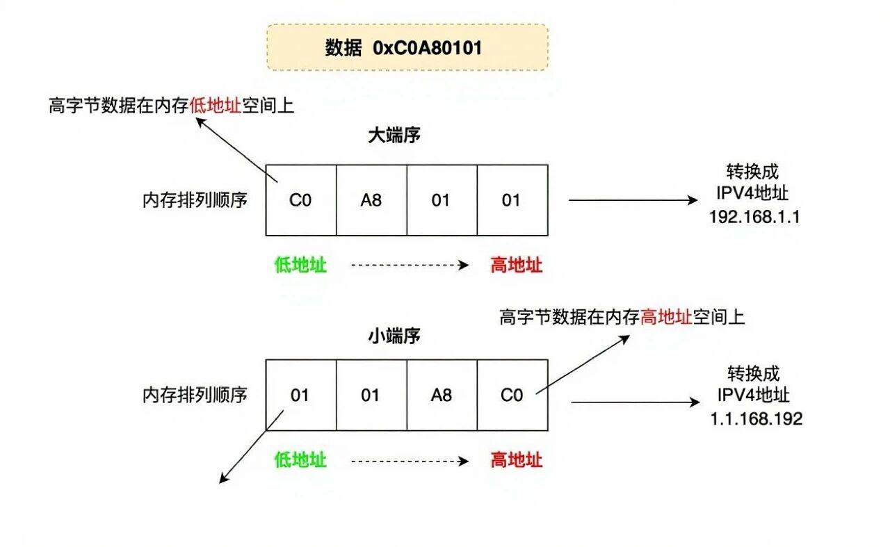

# 字节序简介

字节序是指多字节数据在计算机内存中存储或者网络传输时各字节的存储顺序。

在计算机中存储是以字节为单位，每个地址对应一个字节，一个字节 8bit。在 C 中，除了 8bit 的 char 以外，还有 16bit 的 short，32 位的 int，64 位 long，当然具体要由编译器决定。在计算机系统中，当物理单位的长度大于 1 个字节时，就要区分字节顺序。

## 大端和小端

常见的字节顺序有两种：**大端字节序**（Big-endian）和**小端字节序**（Little-endian）。

- 大端序：高位字节存放在低地址，低位字节存放在高地址。例如，16 位整数 0x1234 会以 12 34 的顺序存储，符合人类读写习惯。
- 小端序：低位字节存放在低地址，高位字节存放在高地址。例如，0x1234 会以 34 12 的顺序存储，便于计算机高效处理。



## 网络字节序和主机字节序

处理器体系：

1. 小端序体系：x86，MOS Technology 6502，Z80，VAX，PDP-11 等处理器为 Little Endian
2. 大端序体系：Motorola 6800，Motorola 68000，PowerPC 970，System/370，SPARC（除 V9 外）等处理器为 Big Endian
3. 可配置：ARM, PowerPC (除 PowerPC 970 外), DEC Alpha, SPARCV9, MIPS, PA-RISC and IA64 的字节序是可配置的

网络字节序：大端字节序。TCP/IP 各层协议将字节序定义为 Big Endian，因此 TCP/IP 协议中使用的字节序通常称之为网络字节序。所以当两台主机之间要通过 TCP/IP 协议进行通信的时候就需要调用相应的函数进行主机序列 (Little Endian) 和网络序 (Big Endian) 的转换。

核心区别：大端序更直观，小端序更高效。

字节序转换函数

```c
#include <arpa/inet.h> 
 
//htons函数 发 将主机字节序的端口 转换成 网络字节序的端口
uint16_t htons(uint16_t host16bitvalue);    //返回网络字节序的值
 
//htonl函数 发 将主机字节序的IP地址 转换成网络字节序的IP地址
uint32_t htonl(uint32_t host32bitvalue);    //返回网络字节序的值
 
//ntohs函数 收 将网络字节序的端口 转换成 主机字节序的端口
uint16_t ntohs(uint16_t net16bitvalue);     //返回主机字节序的值
 
//ntohl函数 收 将网络字节序的IP地址
uint32_t ntohl(uint32_t net32bitvalue);     //返回主机字节序的值
```

