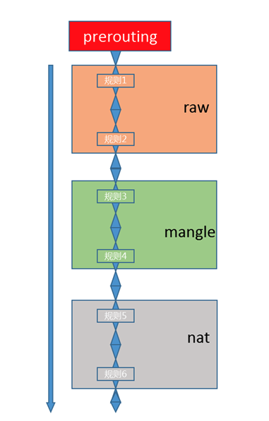
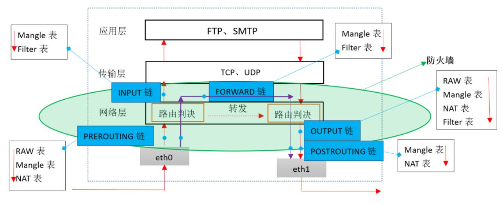

## 基础概念

### 防火墙

从逻辑上，防火墙可以分为

- 主机防火墙：针对于单个主机进行防护
- 网络防火墙：往往处于网络入口或边缘，针对于网络入口进行防护，服务于防火墙背后的本地局域网

网络防火墙和主机防火墙并不冲突，可以理解为，网络防火墙主外（集体）， 主机防火墙主内（个人）

从物理上，防火墙可以分为

- 硬件防火墙：在硬件级别实现部分防火墙功能，另一部分功能基于软件实现，性能高，成本高
- 软件防火墙：应用软件处理逻辑运行于通用硬件平台之上的防火墙，性能低，成本低

### iptables 和 netfilter

iptables 其实不是真正的防火墙，可以把它理解成一个客户端代理，用户通过 iptables 这个代理，将用户的安全设定执行到对应的”安全框架”中，netfilter 才是防火墙真正的安全框架（framework）

Netfilter 是 Linux 操作系统核心层内部的一个数据包处理模块，它具有如下功能：

- 网络地址转换(Network Address Translate)
- 数据包内容修改
- 数据包过滤的防火墙功能

netfilter 位于内核空间，iptables 其实是一个命令行工具，位于用户空间，用这个工具操作真正的框架

netfilter/iptables 组成 Linux 平台下的包过滤防火墙，与大多数的 Linux 软件一样，这个包过滤防火墙是免费的，它可以代替昂贵的商业防火墙解决方案，完成封包过滤、封包重定向和网络地址转换（NAT）等功能

## iptables 概念

### 规则

规则（rules）是网络管理员预定义的条件，规则一般的定义为”如果数据包头符合这样的条件，就这样处理这个数据包”

规则存储在内核空间的信息包过滤表中，这些规则分别指定了源地址、目的地址、传输协议（如 TCP、UDP、ICMP）和服务类型（如 HTTP、FTP 和 SMTP）等。当数据包与规则匹配时，iptables 就根据规则所定义的方法来处理这些数据包，如放行（accept）、拒绝（reject）和丢弃（drop）等

配置防火墙的主要工作就是添加、修改和删除这些规则

### 链

当客户端访问服务器的 web 服务时，客户端发送报文到网卡，而 tcp/ip 协议栈是属于内核的一部分，所以，客户端的信息会通过内核的 TCP 协议传输到用户空间中的 web 服务中，而此时，客户端报文的目标终点为 web 服务所监听的套接字（IP：Port）上，当 web 服务需要响应客户端请求时，web 服务发出的响应报文的目标终点则为客户端，这个时候，web 服务所监听的 IP 与端口反而变成了原点

netfilter 才是真正的防火墙，它是内核的一部分，所以，如果想要防火墙能够达到” 防火” 的目的，则需要在内核中设置关卡，所有进出的报文都要通过这些关卡，经过检查后，符合放行条件的才能放行，符合阻拦条件的则需要被阻止，于是，就出现了 input 关卡和 output 关卡，而这些关卡在 iptables 中不被称为” 关卡”, 而被称为” 链”

其实上面描述的场景并不完善，因为客户端发来的报文访问的目标地址可能并不是本机，而是其他服务器，当本机的内核支持 IP_FORWARD 时，可以将报文转发给其他服务器，所以，这个时候，就会提到 iptables 中的其他”关卡”，也就是其他”链”：“路由前”、”转发”、”路由后”

报文的流向：

- 到本机某进程的报文：PREROUTING –> INPUT

- 由本机转发的报文：PREROUTING –> FORWARD –> POSTROUTING

- 由本机的某进程发出报文（通常为响应报文）：OUTPUT –> POSTROUTING

为了更方便的管理，还可以在某个表里面创建自定义链，将针对某个应用程序所设置的规则放置在这个自定义链中，但是自定义链接不能直接使用，只能被某个默认的链当做动作去调用才能起作用

### 五链

- input 入站链

处理入站数据包

- output 出站链

处理出站数据包

- forward 流量转发链

处理转发数据包

- frerouting 客户端目标地址转换链

在进行路由选择前处理数据包

- postrouting 内部源地址转换链

在进行路由选择后处理数据包

### 表

防火墙的作用就在于对经过的报文匹配”规则”，然后执行对应的”动作”，所以，当报文经过这些关卡的时候，则必须匹配这个关卡上的规则，但是，这个关卡上可能不止有一条规则，而是有很多条规则，当我们把这些规则串到一个链条上的时候，就形成了”链”，所以，把每一个”关卡”想象成如下图中的模样，这样来说，把他们称为”链”更为合适，每个经过这个”关卡”的报文，都要将这条”链”上的所有规则匹配一遍，如果有符合条件的规则，则执行规则对应的动作

对每个” 链” 上都放置了一串规则，但是这些规则有些很相似，比如，A 类规则都是对 IP 或者端口的过滤，B 类规则是修改报文，那么这个时候，是不是能把实现相同功能的规则放在一起

把具有相同功能的规则的集合叫做” 表”，所以说，不同功能的规则，可以放置在不同的表中进行管理，而 iptables 已经定义了 4 种表，每种表对应了不同的功能，而定义的规则也都逃脱不了这 4 种功能的范围

### 表链关系

某些”链”中注定不会包含”某类规则”，就像某些”关卡”天生就不具备某些功能一样，比如，A ”关卡”只负责打击陆地敌人，没有防空能力，B ”关卡”只负责打击空中敌人，没有防御步兵的能力

下图 prerouting 链上的规则存在于哪些表：

prerouting ”链” 只拥有 nat 表、raw 表和 mangle 表所对应的功能，所以，prerouting 中的规则只能存放于 nat 表、raw 表和 mangle 表中

数据包经过一个”链”的时候，会将当前链的所有规则都匹配一遍，但是匹配时总归要有顺序

prerouting 链中的规则存放于三张表中，而这三张表中的规则执行的优先级如下：raw –> mangle –> nat

### 四表

iptables 4 张”表”处于同一条”链”时，执行的优先级（由高而低）：raw –> mangle –> nat –> filter

- raw 表

确定是否对该数据包进行状态跟踪

- mangle 表

为数据包设置标记

- nat 表

修改数据包中的源、目标 IP 地址或端口

- filter 表

确定是否放行该数据包（过滤）

## 数据经过防火墙的流程

总结：

- 表里存放链, 链里存放防火墙规则

- iptables 是 四表五链

## 规则

规则：根据指定的匹配条件来尝试匹配每个流经此处的报文，一旦匹配成功，则由规则后面指定的处理动作进行处理

通俗解释：每条”链”都是一个”关卡”，每个通过这个”关卡”的报文都要匹配这个关卡上的规则，如果匹配，则对报文进行对应的处理，比如说，你我二人此刻就好像两个”报文”，你我二人此刻都要入关，可是城主有命，只有器宇轩昂的人才能入关，不符合此条件的人不能入关，于是守关将士按照城主制定的”规则”，开始打量你我二人，最终，你顺利入关了，而我已被拒之门外，因为你符合”器宇轩昂”的标准，所以把你”放行”了，而我不符合标准，所以没有被放行，其实，”器宇轩昂”就是一种”匹配条件”，”放行”就是一种”动作”，”匹配条件”与”动作”组成了规则

### 规则的组成

规则包含

- 匹配条件
  - 基本匹配条件：源地址Source IP，目标地址 Destination IP
  - 扩展匹配条件：除了上述的条件可以用于匹配，还有很多其他的条件可以用于匹配，这些条件泛称为扩展条件，这些扩展条件其实也是 netfilter 中的一部分，只是以模块的形式存在，如果想要使用这些条件，则需要依赖对应的扩展模块

- 处理动作：处理动作在 iptables 中被称为 target，动作也可以分为基本动作和扩展动作
  - ACCEPT：允许数据包通过
  - DROP：直接丢弃数据包，不给任何回应信息
  - REJECT：拒绝数据包通过，必要时会给数据发送端一个响应的信息，客户端刚请求就会收到拒绝的信息
  - SNAT：源地址转换，解决内网用户用同一个公网地址上网的问题
  - MASQUERADE：是 SNAT 的一种特殊形式，适用于动态的、临时会变的 ip 上
  - DNAT：目标地址转换
  - REDIRECT：在本机做端口映射
  - LOG：在 `/var/log/messages` 文件中记录日志信息，然后将数据包传递给下一条规则，也就是说除了记录以外不对数据包做任何其他操作，仍然让下一条规则去匹配

## 参考资料

- <https://blog.51cto.com/u_15080031/3480190>

- <https://www.tkng.io/services/clusterip/dataplane/iptables/>

- <https://dustinspecker.com/posts/iptables-how-kubernetes-services-direct-traffic-to-pods/>
