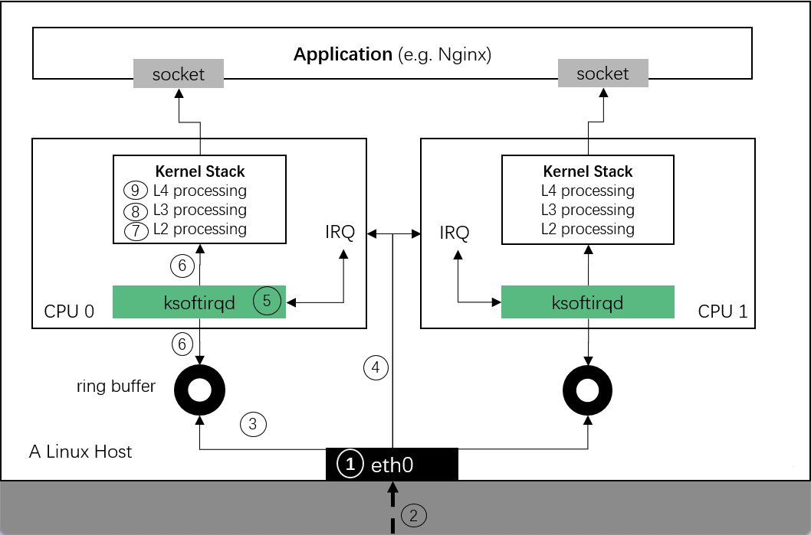

## 收包过程（RX）

一个数据包从被网卡接收到进入 socket 的整个过程如下：

1. 内核：初始化网卡驱动；其中包括了注册 `poll()` 方法；
2. 网卡：收到包；
3. 网卡：通过 DMA 将包复制到内核内存中的 ring buffer；
4. 网卡：如果此时 NAPI 没有在执行，就产生硬件中断（IRQ），通知系统收到了一个包（否则不用额外 IRQ 就会把包收走）；触发软中断；
5. 内核：调度到软中断处理线程 `ksoftirqd`；
6. 内核：软中断处理，调用 NAPI 的 `poll()` 从 ring buffer 收包，并以 `skb` 的形式送至更上层处理；
7. 协议栈：L2 处理；
8. 协议栈：L3 处理；
9. 协议栈：L4 处理。
