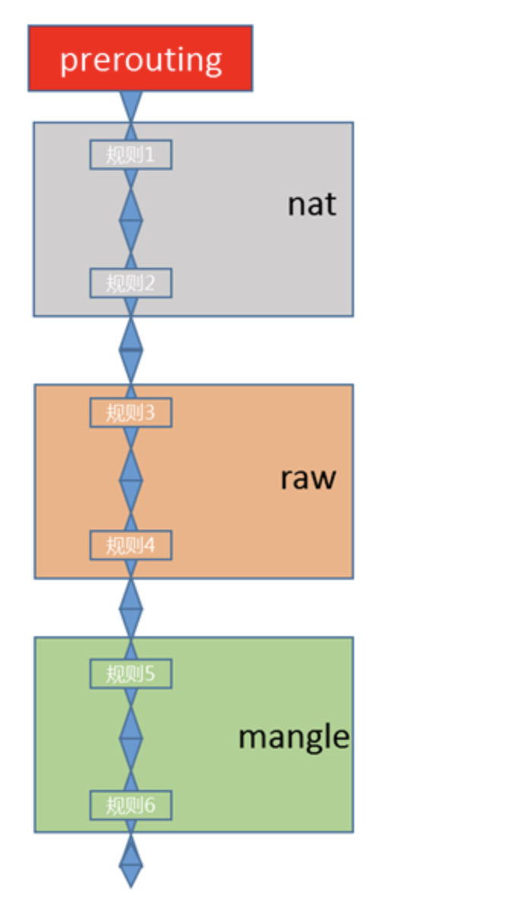

<https://www.zsythink.net/archives/1199>

<https://blog.51cto.com/u_15080031/3480190>

<https://www.tkng.io/services/clusterip/dataplane/iptables/>

<https://dustinspecker.com/posts/iptables-how-kubernetes-services-direct-traffic-to-pods/>
