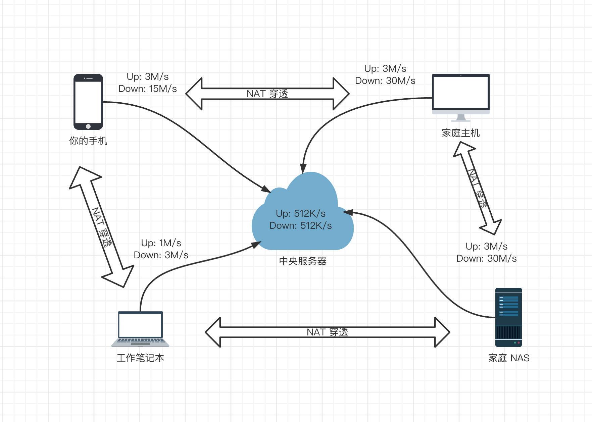

## Tailscale 简介

### Tailscale

TailScale 你可以理解为 VPN，或者说 Wireguard 外面包了一层壳子。它可以将一些设备连接起来，形成一个虚拟局域网。一个很简单的例子，你可以在星巴克里，读取家里任意电脑上的文件。

比如最常见的需求就是，公司有一个内网办公环境，当你外出办公时，也希望你的电脑能够接入办公网络。 因为外网的机器和内网的机器不能互联，所以一般会有一个中心服务器， 所有的子节点都和中心服务器相连，然后中心服务器转发所有的流量


这样做的缺点显而易见，首先是中心服务器（hub）会成为`瓶颈`。 其次，某种极端情况下，如果节点 A 和 节点 B 距离非常近，但是都离 hub 很远， 这样就会导致非常高的延迟。


那么，能不能让节点间直接互联呢？ 这就是 mesh VPN，其实现就是 wireguard


wireguard 的每一个节点都会存储其他所有节点的信息，并且和其他所有的节点都建立 tls 连接。 如果涉及到内网穿透的话，那么你需要找到一台处于网关位置的节点（内外网都可达），将其设置为 coordinator， 扮演类似于 hub 的角色， 分发穿透内外网的流量。

Tailscale（<https://github.com/tailscale/tailscale>） 是一种基于 WireGuard 的虚拟组网工具，它在用户态实现了 WireGuard 协议，相比于内核态 WireGuard 性能会有所损失，但在功能和易用性上下了很大功夫：

- 开箱即用
  - 无需配置防火墙
  - 没有额外的配置
- 高安全性/私密性
  - 自动密钥轮换
  - 点对点连接
  - 支持用户审查端到端的访问记录
- 在原有的 ICE、STUN 等 UDP 协议外，实现了 DERP TCP 协议来实现 NAT 穿透
- 基于公网的控制服务器下发 ACL 和配置，实现节点动态更新
- 通过第三方（如 Google） SSO 服务生成用户和私钥，实现身份认证

Tailscale 是一款基于 WireGuard 的异地组网工具，它可以将不同网络环境的设备组成一个虚拟局域网，使其可以互相访问。我们只需要在路由器或者 Nas 上安装 Tailscale 进行组网，就可以实现以下效果：

- 连接到 Tailscale 的设备，可以直接使用内网 IP 访问家庭局域网
- 内网设备可以直接使用 Tailscale 分配的 IP 来访问连接到 Tailscale 的设备
- 支持多个局域网互相访问，每个局域网只需一台设备安装 Tailscale ( 每个局域网的网段不能相同 )

Tailscale 部署方案


需要部署的组件


### WireGuard

WireGuard 相比于传统 VPN 的核心优势是没有 VPN 网关，所有节点之间都可以点对点（P2P）连接，也就是我之前提到的全互联模式（Full Mesh），效率更高，速度更快，成本更低

可以将 Tailscale 看成是更为易用、功能更完善的 WireGuard

### Headscale

Tailscale 的控制服务器是不开源的，而且对免费用户有诸多限制

开源实现：<https://github.com/juanfont/headscale>

## STUN

Tailscale 的终极目标是让两台处于网络上的任何位置的机器建立点对点连接（直连），但现实世界是复杂的，大部份情况下机器都位于 NAT 和防火墙后面，这时候就需要通过打洞来实现直连，也就是 NAT 穿透。

### NAT

NAT 按照 NAT 映射行为和有状态防火墙行为可以分为多种类型，但对于 NAT 穿透来说根本不需要关心这么多类型，只需要看 NAT 或者有状态防火墙是否会严格检查目标 Endpoint，根据这个因素，可以将 NAT 分为  Easy NAT 和 Hard NAT。

- Easy NAT 及其变种称为 “Endpoint-Independent Mapping” (EIM，终点无关的映射) 这里的 Endpoint 指的是目标 Endpoint，也就是说，有状态防火墙只要看到有客户端自己发起的出向包，就会允许相应的入向包进入，不管这个入向包是谁发进来的都可以。
- Hard NAT 以及变种称为 “Endpoint-Dependent Mapping”（EDM，终点相关的映射） 这种 NAT 会针对每个目标 Endpoint 来生成一条相应的映射关系。在这样的设备上，如果客户端向某个目标 Endpoint 发起了出向包，假设客户端的公网 IP 是 2.2.2.2，那么有状态防火墙就会打开一个端口，假设是 4242。那么只有来自该目标 Endpoint 的入向包才允许通过 2.2.2.2:4242，其他客户端一律不允许。这种 NAT 更加严格，所以叫 Hard NAT。

对于 Easy NAT，只需要提供一个第三方的服务，它能够告诉客户端“它看到的客户端的公网 ip:port 是什么”，然后将这个信息以某种方式告诉通信对端（peer），后者就知道该和哪个地址建连了！这种服务就叫 STUN (Session Traversal Utilities for NAT，NAT会话穿越应用程序)。它的工作流程如下图所示：

- 笔记本向 STUN 服务器发送一个请求：“从你的角度看，我的地址什么？”
- STUN 服务器返回一个响应：“我看到你的 UDP 包是从这个地址来的：ip:port”


### 中继是什么

对于 Hard NAT 来说，STUN 就不好使了，即使 STUN 拿到了客户端的公网 ip:port 告诉通信对端也于事无补，因为防火墙是和 STUN 通信才打开的缺口，这个缺口只允许 STUN 的入向包进入，其他通信对端知道了这个缺口也进不来。通常企业级 NAT 都属于 Hard NAT。

这种情况下打洞是不可能了，但也不能就此放弃，可以选择一种折衷的方式：创建一个中继服务器（relay server），客户端与中继服务器进行通信，中继服务器再将包中继（relay）给通信对端。

至于中继的性能，那要看具体情况了：

- 如果能直连，那显然没必要用中继方式；
- 但如果无法直连，而中继路径又非常接近双方直连的真实路径，并且带宽足够大，那中继方式并不会明显降低通信质量。延迟肯定会增加一点，带宽会占用一些，但相比完全连接不上，还是可以接受的。

事实上对于大部分网络而言，Tailscale 都可以通过各种黑科技打洞成功，只有极少数情况下才会选择中继，中继只是一种 fallback 机制。

### 中继协议简介

中继协议有多种实现方式

（1）TURN

TURN 即 Traversal Using Relays around NAT，这是一种经典的中继实现方式，核心理念是：

- 用户（人）先去公网上的 TURN 服务器认证，成功后后者会告诉你：“我已经为你分配了 ip:port，接下来将为你中继流量”，
- 然后将这个 ip:port 地址告诉对方，让它去连接这个地址，接下去就是非常简单的客户端/服务器通信模型了。

与 STUN 不同，这种协议没有真正的交互性，不是很好用，因此 Tailscale 并没有采用 TURN 作为中继协议。

（2）DERP

DERP 即 Detoured Encrypted Routing Protocol，这是 Tailscale 自研的一个协议：

- 它是一个通用目的包中继协议，运行在 HTTP 之上，而大部分网络都是允许 HTTP 通信的。
- 它根据目的公钥（destination’s public key）来中继加密的流量（encrypted payloads）。

Tailscale 会自动选择离目标节点最近的 DERP server 来中继流量

Tailscale 使用的算法很有趣，所有客户端之间的连接都是先选择 DERP 模式（中继模式），这意味着连接立即就能建立（优先级最低但 100% 能成功的模式），用户不用任何等待。然后开始并行地进行路径发现，通常几秒钟之后，我们就能发现一条更优路径，然后将现有连接透明升级（Upgrade）过去，变成点对点连接（直连）。

因此，DERP 既是 Tailscale 在 NAT 穿透失败时的保底通信方式（此时的角色与 TURN 类似），也是在其他一些场景下帮助我们完成 NAT 穿透的旁路信道。换句话说，它既是我们的保底方式，也是有更好的穿透链路时，帮助我们进行连接升级（Upgrade to a peer-to-peer connection）的基础设施。

### NAT 穿透与网状拓扑

设备其实就组成了一个非标准的网状拓扑:



在这种拓扑下, 两个设备之间的通讯速度已经不在取决于中央服务器, 而是直接取决于两端设备的带宽, 也就是说达到了设备网络带宽峰值. 当然 NAT 穿透也不是百分百能够成功的, 在复杂网络情况下有些防火墙不会按照预期工作或者说有更严格的限制; 比如 IP、端口、协议限制等等, 所以为了保证可靠性可以让中央服务器中转做后备方案, 即尽量尝试 NAT 穿透, 如果不行走中央服务器中继

## Headscale 部署

### 完整的部署文件

```yaml
services:
  postgresql:
    image: docker.io/library/postgres:16.6-bookworm
    restart: always
    healthcheck:
      test: ["CMD-SHELL", "pg_isready -d $${POSTGRES_DB} -U $${POSTGRES_USER}"]
      start_period: 20s
      interval: 30s
      retries: 5
      timeout: 5s
    shm_size: "256m"
    volumes:
      - ./postgresql:/var/lib/postgresql/data
    environment:
      POSTGRES_PASSWORD: ${HEADSCALE_PG_PASS:?database password required}
      POSTGRES_USER: ${HEADSCALE_PG_USER:-headscale}
      POSTGRES_DB: ${HEADSCALE_PG_DB:-headscale}
    networks:
      - tailscale
  headscale:
    image: docker.io/headscale/headscale:${HEADSCALE_VERSION}
    restart: always
    depends_on:
      postgresql:
        condition: service_healthy
    volumes:
      - "./headscale/config:/etc/headscale"
      - "./headscale/acls:/etc/headscale-acls"
      - "./headscale/data:/var/lib/headscale"
    environment:
      TZ: Asia/Shanghai
    command:
      - serve
    cap_add:
      - NET_ADMIN
      - SYS_MODULE
      - NET_RAW
      - CAP_NET_BIND_SERVICE
    sysctls:
      - net.ipv4.ip_forward=1
    networks:
      - tailscale
    ports:
      - 8080:8080
      - 9090:9090 # metrics
      - 50443:50443 # grpc
  headplane:
    image: ghcr.io/tale/headplane:${HEADPLANE_VERSION}
    restart: always
    volumes:
      - "./headscale/config:/etc/headscale"
      - "./headscale/data:/var/lib/headscale"
      - "/var/run/docker.sock:/var/run/docker.sock:ro"
    environment:
      TZ: Asia/Shanghai
      COOKIE_SECRET: "${COOKIE_SECRET}"
      HEADSCALE_PUBLIC_URL: "${HEADSCALE_PUBLIC_URL}"
      HEADSCALE_INTEGRATION: 'docker'
      HEADSCALE_CONTAINER: 'headscale'
      HOST: '0.0.0.0'
      PORT: '3000'
      COOKIE_SECURE: 'false'
      ROOT_API_KEY: ${ROOT_API_KEY}
      OIDC_ISSUER: ${OIDC_ISSUER}
      OIDC_CLIENT_ID: ${OIDC_CLIENT_ID}
      OIDC_CLIENT_SECRET: ${OIDC_CLIENT_SECRET}
      OIDC_CLIENT_SECRET_METHOD: client_secret_basic
      OIDC_REDIRECT_URI: ${OIDC_REDIRECT_URI}
      DISABLE_API_KEY_LOGIN: true
    networks:
      - tailscale
    ports:
      - 3000:3000
  derper:
    image: ghcr.io/fredliang44/derper:${DERP_VERSION}
    volumes:
      - /var/run/tailscale/tailscaled.sock:/var/run/tailscale/tailscaled.sock
      - ./derper/certs:/app/certs
    # network_mode: "host"
    restart: always
    environment:
      DERP_DOMAIN: derp-bj-jdcloud.liaosirui.com
      DERP_CERT_MODE: manual
      DERP_CERT_DIR: /app/certs
      DERP_ADDR: :19851
      DERP_VERIFY_CLIENTS: true
    networks:
      - tailscale
    ports:
      - 3478:3478/udp
      - 19850:80
      - 19851:19851
  dex-idp:
    image: ghcr.io/dexidp/dex:v2.42.0
    restart: always
    volumes:
      - './dex-idp:/etc/dex-idp'
    expose:
      - '5556'
    ports:
      - '5556:5556'
    networks:
      - tailscale
    entrypoint: /bin/sh
    command: |
      -c 'dex serve --web-http-addr 0.0.0.0:5556 --telemetry-addr 0.0.0.0:5558 /etc/dex-idp/config.yaml'
networks:
  tailscale:
    ipam:
      driver: default
      config:
        - subnet: "172.29.1.0/24"
          ip_range: 172.29.1.0/24
          gateway: 172.29.1.254

```

`.env` 配置参考，为空的值需要自己填写 key

```bash
HEADSCALE_VERSION=0.25.0
HEADPLANE_VERSION=0.4.1
DERP_VERSION=v1.80.0

HEADSCALE_PG_PASS=iotysh6px1icxa

COOKIE_SECRET=""
HEADSCALE_PUBLIC_URL=headscale.liaosirui.com
ROOT_API_KEY=
OIDC_ISSUER=https://oidc.liaosirui.com
OIDC_CLIENT_ID=alpha-quant-app
OIDC_CLIENT_SECRET=
OIDC_REDIRECT_URI=https://headscale.liaosirui.com/admin/oidc/callback
```

### 部署 Headscale

下载镜像

```bash
docker-pull() {
  skopeo copy docker://${1} docker-daemon:${1}
}
docker-pull "docker.io/headscale/headscale:0.25.0"
```

创建 Headscale 配置文件：

```bash
mkdir -p ./headscale/config
wget https://github.com/juanfont/headscale/raw/v0.25.0/config-example.yaml \
  -O ./headscale/config/config-example.yaml
wget https://github.com/mikefarah/yq/releases/download/v4.44.3/yq_linux_amd64 \
  -O /usr/local/bin/yq && chmod +x /usr/local/bin/yq
  
set +C
grep -v '#' config-example.yaml |grep -v '^$'> config.yaml
```

修改配置：

- 修改配置文件，将 `server_url` 改为公网 IP 或域名 `yq `

- 修改 `listen_addr` 为 `0.0.0.0:8080`

```bash
# 基础配置
yq -i '.server_url = "https://headscale.liaosirui.com"' ./config.yaml
yq -i '.listen_addr = "0.0.0.0:8080"' ./config.yaml
yq -i '.metrics_listen_addr = "0.0.0.0:9090"' ./config.yaml
yq -i '.grpc_listen_addr = "0.0.0.0:50443"' ./config.yaml
```

- 可自定义私有网段，也可同时开启 IPv4 和 IPv6

```bash
# network
yq -i '.prefixes.v4 = "100.64.0.0/16"' ./config.yaml
yq -i '.prefixes.v6 = "fd7a:115c:a1e0::/48"' ./config.yaml
yq -i '.prefixes.allocation = "random"' ./config.yaml
```

- 开启 derp

```bash
# derp
yq -i '.derp.server.enabled = false' ./config.yaml
yq -i '.derp.urls = ["https://controlplane.tailscale.com/derpmap/default"]' ./config.yaml
yq -i '.derp.paths = ["/etc/headscale/derp.yaml"]' ./config.yaml
```

- 配置数据库

```bash
# database
yq -i '.database.type = "postgres"' ./config.yaml
yq -i '.database.postgres.host = "postgresql"' ./config.yaml
yq -i '.database.postgres.port = 5432' ./config.yaml
yq -i '.database.postgres.name = "headscale"' ./config.yaml
yq -i '.database.postgres.user = "headscale"' ./config.yaml
yq -i '.database.postgres.pass = "dbpassword"' ./config.yaml
yq -i '.database.postgres.max_open_conns = 10' ./config.yaml
yq -i '.database.postgres.max_idle_conns = 10' ./config.yaml
yq -i '.database.postgres.conn_max_idle_time_secs = 3600' ./config.yaml
yq -i '.database.postgres.ssl = false' ./config.yaml
```

- 修改日志等级

```bash
# log
yq -i '.log.level = "error"' ./config.yaml
```

- 配置 acl

```bash
# acl
yq -i '.policy.mode = "file"' ./config.yaml
yq -i '.policy.path = "/etc/headscale-acls/policy.hujson"' ./config.yaml
```

- `magic_dns` 配置

```bash
# DNS
yq -i '.dns.magic_dns = true' ./config.yaml
yq -i '.dns.base_domain = "tailscale-node.liaosirui.com"' ./config.yaml
yq -i '.dns.nameservers.global = ["223.5.5.5","223.6.6.6"]' ./config.yaml
```

- 建议打开随机端口，将 randomize_client_port 设为 true

```bash
# randomize_client_port
yq -i '.randomize_client_port = true' ./config.yaml
```

直接执行如下命令

创建数据

```bash
mkdir -p ./headscale/data
```

创建初始化的 acl

```bash
mkdir -p ./headscale/acls
touch ./headscale/acls/policy.hujson
```

ACL 如下

```json
{
    // groups are collections of users having a common scope. A user can be in multiple groups
    // groups cannot be composed of groups
    "groups": {
        "group:admin": [
            "sirui.liao"
        ],
    },
    // tagOwners in tailscale is an association between a TAG and the people allowed to set this TAG on a server.
    // This is documented [here](https://tailscale.com/kb/1068/acl-tags#defining-a-tag)
    // and explained [here](https://tailscale.com/blog/rbac-like-it-was-meant-to-be/)
    "tagOwners": {
    },
    // hosts should be defined using its IP addresses and a subnet mask.
    // to define a single host, use a /32 mask. You cannot use DNS entries here,
    // as they're prone to be hijacked by replacing their IP addresses.
    // see https://github.com/tailscale/tailscale/issues/3800 for more information.
    "hosts": {
    },
    "acls": [
        // admin have access to all servers
        {
            "action": "accept",
            "src": [
                "group:admin"
            ],
            "dst": [
            ]
        },
        // We still have to allow internal users communications since nothing guarantees that each user have
        // their own users.
        {
            "action": "accept",
            "src": [
                "sirui.liao"
            ],
            "dst": [
                "sirui.liao:*"
            ]
        }
    ]
}

```

配置 OIDC 登录

为了方便，使用无需数据库的 dex-idp 进行

```yaml
enablePasswordDB: true
issuer: https://oidc.liaosirui.com
frontend:
  issuer: HeadScale 登录
  theme: light
  dir: /srv/dex/web
oauth2:
  skipApprovalScreen: true
  alwaysShowLoginScreen: false
web:
  http: 0.0.0.0:5556
telemetry:
  http: 0.0.0.0:5558
storage:
  type: memory
  # type: sqlite3
  # config:
  #   file: /dex.db
staticClients:
  - id: alpha-quant-app
    redirectURIs:
      - "https://headscale.liaosirui.com/oidc/callback"
      - "https://headscale.liaosirui.com/admin/oidc/callback"
    name: "Alpha Quant"
    secret: ""
staticPasswords:
  - email: "headscale-admin@liaosirui.com"
    # bcrypt hash of the string "password": $(echo userpass | htpasswd -BinC 10 headscale-admin | cut -d: -f2)
    # 自定义密码生成 hash 填到下方
    hash: ""
    username: "headscale-admin"
    userID: "08a8684b-db88-4b73-90a9-3cd1661f5466"
connectors: []

```

填入 `config.yaml` 中关于 IDC 的配置

```bash
# oidc
cat >> ./config.yaml << EOF
oidc:
  only_start_if_oidc_is_available: true
  issuer: "https://oidc.liaosirui.com"
  client_id: "alpha-quant-app"
  client_secret: ""
  scope: ["openid", "profile", "email"]
  extra_params:
    domain_hint: liaosirui.com
  allowed_domains:
    - liaosirui.com
  # allowed_groups:
  #   - /headscale
  allowed_users:
    - headscale-admin@liaosirui.com
  pkce:
    enabled: false
    method: S256
  strip_email_domain: true
EOF
```

启动

```bash
docker compose up postgresql dex-idp -d
```

先测试 IDP 是否可以访问，然后再启动 headscale

```bash
docker compose up headscale -d
docker compose up derper -d
```

### 配置 Headscale

Tailscale 中有一个概念叫 tailnet，可以理解成租户，租户与租户之间是相互隔离的，具体看参考 Tailscale 的官方文档：[What is a tailnet](https://tailscale.com/kb/1136/tailnet/)。Headscale 也有类似的实现叫 user，即用户。需要先创建一个 user，以便后续客户端接入，例如：

```bash
alias headscale='docker compose exec -it headscale headscale'

headscale user create '<用户名>' -d '<用户名>' -e '<用户邮箱>'
```

查看命名空间：

```bash
headscale user list
```

### 可视化界面

- <https://github.com/tale/headplane>

需要通过 API Key 来接入 Headscale，所以在使用之前需要先创建一个 API key

```bash
headscale apikey create
```

访问 `<ip:port>/admin`

将 Headscale 公网域名和 API Key 填入 Headscale-Admin 的设置页面，同时取消勾选 Legacy API，然后点击「Save」

接入成功后，点击左边侧栏的「Users」，然后点击「Create」开始创建用户

启动服务

```bash
docker compose up headplane -d
```

### 打通局域网

只是打造了一个点对点的 Mesh 网络，各个节点之间都可以通过 WireGuard 的私有网络 IP 进行直连

配置方法很简单，首先需要设置 IPv4 与 IPv6 路由转发：

```bash
echo 'net.ipv4.ip_forward = 1' | tee /etc/sysctl.d/ipforwarding.conf
echo 'net.ipv6.conf.all.forwarding = 1' | tee -a /etc/sysctl.d/ipforwarding.conf

sysctl -p /etc/sysctl.d/ipforwarding.conf
```

客户端修改注册节点的命令，在原来命令的基础上加上参数 `--advertise-routes=10.244.244.0/24 --advertise-exit-node`，告诉 Headscale 服务器“我这个节点可以转发这些地址的路由”。

```bash
# --advertise-routes 路由到此设备的网段
# --accept-routes 接收其他设备的子网，不添加只能访问其他设备的100.x.x.x
# --reset 重置设置
tailscale up \
  --login-server=http://<HEADSCALE_PUB_ENDPOINT>:8080 \
  --advertise-routes=10.244.244.0/24 \
  --accept-routes=true \
  --accept-dns=false \
  --reset
```

在 Headscale 端查看路由，可以看到相关路由是关闭

```bash
headscale nodes list
 
# 替换为节点 ID
headscale routes list -i 1
```

开启路由：

```bash
headscale routes enable -r 1
```

其他节点启动时需要增加 `--accept-routes=true` 选项来声明 “我接受外部其他节点发布的路由”

其他非 tailscaled 的节点

```bash
# linux
ip route add 100.64.0.0/10 via 10.244.244.12 # 此为 tailscale vpn 的网段
ip route add 10.244.244.0/24 via 10.244.244.12 # 此为 LAN1 的网段
# windows
route add 100.64.0.0 mask 255.192.0.0 10.244.244.12 # 此为 tailscale vpn 的网段
route add 10.244.244.0 mask 255.255.255.0 10.244.244.12 # 此为 LAN1 的网段
```

根据官方推荐 <https://tailscale.com/kb/1214/site-to-site>，需要设置如下防止 MTU 不一致导致无法通信：

```bash
iptables -t mangle -A FORWARD -o tailscale0 -p tcp -m tcp \
--tcp-flags SYN,RST SYN -j TCPMSS --clamp-mss-to-pmtu
```

调试方式：

```bash
tracepath 10.244.244.11
```

### Tailscale 更多设置

#### 子网

子网功能一般在路由器上部署，当然，如果有一台内网设备，也可以利用其内网转发能力设置子网宣告，这一点要比 OpenWrt 稍微方便一些

#### MagicDNS

设备加入 Tailscale 网络之后，Tailscale 软件会在本地设置一个 VPN 虚拟网络接口，带宽显示 100Gbps，即无上限。通过该接口发送出去的流量，会被 Tailscale 软件截获，二次处理、打包后通过默认路由发送出去。

Tailscale VPN 网络中的所有设备都有这样的一个虚拟网络接口，他们的 IP 均是 `100.x.x.x/32` 的格式。只要设备的 Tailscale 可用，就可以通过这种 IP 地址联系到对应的其他设备

然而，这种 IP 地址是不可自定义的，所以准确记忆这些地址非常麻烦。好在 Tailscale daemon 程序提供了一个名为 MagicDNS 的功能，我们可以直接使用 Tailscale 配发的域名解析到该 IP 地址。

1. 运行 Tailscale daemon 之后，程序会在机器的 DNS 缓存里插入一些解析记录，格式为 `<host_name>.xxx-xxx.ts.net`，其中
   - `<host_name>` 是 Tailscale Admin 界面看到的设备名，一般是设备的主机名；
   - `xxx-xxx` 是 Tailscale 为该用户分配的唯一的二级域名。可以通过摇号的方式再次获取；
   - `ts.net` 是该 FQDN 的一级域名，属于 Tailscale 公司所有。
2. 通过访问该地址，用户即可访问到对应设备。
3. 关闭 Tailscale 服务，该解析记录缓存自动被移除，MagicDNS 将变得不再可用

MagicDNS 运作原理，基于 100.100.100.100 本地 Tailscale DNS 服务器。以上游 8.8.8.8 作为回落地址


推荐使用 MagicDNS 而非 IP 地址。此外，MagicDNS 搭配 HTTPS，能实现更方便、更合规的 VPN 网络

#### Tailscale HTTPS

Tailscale 提供了 acme 功能，可以自动申请 Let’s Encrypt 证书

执行下列命令

```bash
tailscale cert t630-win10.cat-silverside.ts.net
```

即可在当前目录得到私钥和对应的证书：

```bash
t630-debian.cat-silverside.ts.net.crt
t630-debian.cat-silverside.ts.net.key
```

将这两个文件拷贝至合适的目录，重启对应服务即可使用。我们以 cockpit 为例：

```bash
sudo cp t630-debian.cat-silverside.ts.net.key t630-debian.cat-silverside.ts.net.crt /etc/cockpit/ws-certs.d/
sudo systemctl restart cockpit
```

现在，即可使用 MagicDNS 域名 `https://t630-debian.cat-silverside.ts.net:9090/` 打开 HTTPS 服务页面

### Exit node

Exit-Node 功能非常有用，它可以让我们方便地实现流量伪装、IP 隐藏，甚至是全局流量转发。如果在 WireGuard 上将 Allowded-IPs 设置为 `0.0.0.0/0` 也能实现相同效果，但是 WireGuard 修改配置文件比较麻烦。

Exit 一般指的是出口，比如楼道里、消防门上方都会表示 Exit，表示从这里可以走出这个现代建筑物。一般来说，符合消防标准的大楼一定会配置 Exit 标识。在 Tailnet （即 Tailscale 网络）中，一般认为 Exit Node 是这样的设备：

- 它宣告自己可以帮你代理，你可以将自己所有的流量发给它，它会做一层 SNAT，随后即可以它的名义对外发起访问。原则上它就变成了你的逻辑网关
- 在 Tailnet 中，如果有一台设备想隐藏自己的 IP，就可以将某个 Exit 节点选中，随后自己的公网流量均由该节点代理。

举例：人在北京，老家的台式机宣告自己为 Exit Node，那么我在北京即可使用山东 IP 进行上网。抖音、微博等均认为我人在山东，我评论、发内容也会显示我在山东

注意：一台设备宣告自己为 Exit Node 之后，还需要将其审核通过才行，否则 Exit 功能不起作用

在 Linux 机器上开启 Exit-Node 功能，需要指定启动命令，我们以 Debian 12 为例：

```bash
tailscale up --accept-routes --ssh --advertise-exit-node
```

### DEPR  部署

官方内置了很多 DERP 服务器

```bas
- tok: 96.6ms  (Tokyo)
- sfo: 179.8ms (San Francisco)
- sea: 181.3ms (Seattle)
- dfw: 218.6ms (Dallas)
- ord: 229.7ms (Chicago)
- nyc: 233.8ms (New York City)
- fra: 257.7ms (Frankfurt)
- lhr: 259.1ms (London)
- sin: 265ms   (Singapore)
- syd: 317.1ms (Sydney)
- sao: 352.8ms (São Paulo)
- blr: 368.5ms (Bangalore)
```

为了实现低延迟、高安全性，可以参考 Tailscale 官方文档自建私有的 DERP 服务器

- <https://tailscale.com/kb/1118/custom-derp-servers/>
- <https://tailscale.com/kb/1118/custom-derp-servers#why-run-your-own-derp-server>

部署有以下的要求：

- 需要能够公网访问。这是为了让各个 Tailscale 节点可以直接访问到该 DERP 服务器，以此来便于进行后续的流量转发等操作

- 需要运行 HTTPS 服务。本质上是为了在传输数据给 DERP 服务器时数据可以通过 TLS 加密。HTTPS 服务通常需要 带有一个 TLS 证书。DERP 服务器只认 Let‘ s Encrypt 这家服务商颁发的证书，但该服务商不会给纯 IP 的服务器颁发证书。这实际上就隐含了一个条件：还需要一个公共域名

- 必须分配 80 端口来运行 HTTP 服务。这个要求很强烈，限制死了端口
- 需要额外暴露两个端口来运行 HTTPS 和 STUN 服务
  - stunport: 3478 默认情况下也会开启 STUN 服务，UDP 端口是 3478
- 必须允许 ICMP 流量的出入。Tailscale Document 中用的是 must 来指定其重要性，但个人感觉应该是不需要这个要求
- 可以指定参数 `verify-clients` 来限制使用当前 DERP 服务的只能是自己的 tailscale 节点，防止白嫖。不过启用该服务需要当前 DERP 服务器本身就是一个 tailscale 节点，或者存在 socket 文件 `/var/run/tailscale/tailscaled.sock`

注册当前节点：

```bash
# 官方提供了静态编译的二进制文件
curl -fsSL https://tailscale.com/install.sh | sh

# 启动 tailscaled.service 并设置开机自启
systemctl enable --now tailscaled

ls -al /var/run/tailscale/tailscaled.sock

tailscale up \
  --login-server=https://headscale.com \
  --accept-routes=false \
  --accept-dns=false \
  --authkey $KEY

```

确认关闭内嵌的 DERP 服务

```bash
yq -i '.derp.server.enabled = false' ./headscale/config/config.yaml
```

部署好 derper 之后，就可以修改 Headscale 的配置来使用自定义的 DERP 服务器了。Headscale 可以通过两种形式的配置来使用自定义 DERP：

- 一种是在线 URL，格式是 JSON，与 Tailscale 官方控制服务器使用的格式和语法相同
- 另一种是本地文件，格式是 YAML

```yaml
# ./headscale/config/derp.yaml
regions:
  901:
    regionid: 901
    regioncode: Beijing
    regionname: JDCloud Beijing 
    nodes:
      - name: 901a
        regionid: 901
        hostname: 'derp-bj.com'
        ipv4: ''
        stunport: 3478
        stunonly: false
        derpport: 19851
        insecurefortests: true

```

- egions 是 YAML 中的对象，下面的每一个对象表示一个可用区，每个可用区里面可设置多个 DERP 节点，即 nodes。
  每个可用区的 regionid 不能重复。
- 每个 node 的 name 不能重复。
- regionname 一般用来描述可用区，regioncode 一般设置成可用区的缩写。
- ipv4 字段不是必须的，如果你的域名可以通过公网解析到你的 DERP 服务器地址，这里可以不填。如果你使用了一个二级域名，而这个域名你并没有在公共 DNS server 中添加相关的解析记录，那么这里就需要指定 IP（前提是你的证书包含了这个二级域名，这个很好支持，搞个泛域名证书就行了）。
- stunonly: false 表示除了使用 STUN 服务，还可以使用 DERP 服务。
- hostname和 ipv4部分根据你的实际情况填写。

接下来还需要修改 Headscale 的配置文件，引用上面的自定义 DERP 配置文件。需要修改的配置项如下：

```bash
# disable??: https://controlplane.tailscale.com/derpmap/default
# yq -i '.derp.urls = []' ./headscale/config/config.yaml

yq -i '.derp.paths = ["/etc/headscale/derp.yaml"]' ./headscale/config/config.yaml
```

自签证书

```bash
mkdir -p ./derper/certs && cd ./derper/certs

# 生成私钥
DERP_HOST="derp-bj.com"
openssl genpkey -algorithm RSA -out ${DERP_HOST}.key

# 生成证书请求 (CSR)：
openssl req -new -key ${DERP_HOST}.key -out ${DERP_HOST}.csr

# 生成自签名证书，设置过期期限为 100 年，防止后续再重新操作
openssl x509 -req \
    -days 36500 \
    -in ${DERP_HOST}.csr \
    -signkey ${DERP_HOST}.key \
    -out ${DERP_HOST}.crt \
    -extfile <(printf "subjectAltName=DNS:${DERP_HOST}")

# 查看生成的证书
openssl x509 -in ${DERP_HOST}.crt -noout -text 
```

拉取镜像

```bash
docker-pull() {
  skopeo copy docker://${1} docker-daemon:${1}
}
docker-pull "docker.io/fredliang/derper:latest"
```

部署

```yaml
services:
  headscale:
    image: docker.io/headscale/headscale:0.24.0
    volumes:
      - ./headscale/config:/etc/headscale
      - ./headscale/data:/var/lib/headscale
    network_mode: "host"
    restart: always
    command:
      - serve
    # networks:
    #   - tailscale
    # ports:
    #   - 8080:8080
  headscale-admin:
    image: docker.io/goodieshq/headscale-admin:0.1.12b
    restart: always
    networks:
      - tailscale
    ports:
      - 16080:80
  derper:
    image: docker.io/fredliang/derper:latest
    volumes:
      - /var/run/tailscale/tailscaled.sock:/var/run/tailscale/tailscaled.sock
    # network_mode: "host"
    restart: always
    environment:
      - DERP_DOMAIN=derp-bj.com
      - DERP_CERT_MODE=letsencrypt
      - DERP_ADDR=:19851
      - DERP_VERIFY_CLIENTS=true
    networks:
      - tailscale
    ports:
      - 3478:3478/udp
      - 19850:80
      - 19851:19851
networks:
  tailscale:
    ipam:
      driver: default
      config:
        - subnet: "172.29.1.0/24"

```

在 Tailscale 客户端上使用以下命令查看目前可以使用的 DERP 服务器：

```bash
tailscale netcheck
```

tailscale netcheck 实际上只检测 3478/udp 的端口， 就算 netcheck 显示能连，也不一定代表端口可以转发流量，最好是打开 DERP_ADDR 验证一下

端口见：<https://tailscale.com/kb/1082/firewall-ports>

设置一下 DERP 的访问权限，derper 启动时加上参数 --verify-clients

## Tailscale 客户端接入

可以查看：

- `http://<HEADSCALE_PUB_IP>:8080/windows`
- `http://<HEADSCALE_PUB_IP>:8080/apple`
- <https://github.com/tailscale/tailscale/wiki/Tailscaled-on-macOS>

### Linux 安装 tailscale

Tailscale 官方提供了各种 Linux 发行版的软件包

```bash
# 官方提供了静态编译的二进制文件
curl -fsSL https://tailscale.com/install.sh | sh

# 例如
# https://tailscale.com/download/linux/rhel-9

# 启动 tailscaled.service 并设置开机自启
systemctl enable --now tailscaled
```

### MacOS 安装 tailscale

安装

```bash
brew install go@1.22

export GOPROXY=https://goproxy.cn,direct
export PATH="/usr/local/opt/go@1.22/bin:$PATH"
go install tailscale.com/cmd/tailscale{,d}@v1.80.0

sudo $HOME/go/bin/tailscaled install-system-daemon
# 卸载守护进程：sudo $HOME/go/bin/tailscaled uninstall-system-daemon
```

需要自己加入 PATH

```bash
export PATH="$HOME/go/bin:$PATH"
```

### 其他 Linux 发行版

- OpenWrt：<https://github.com/adyanth/openwrt-tailscale-enabler>
- 群晖：<https://github.com/tailscale/tailscale-synology>
- 威联通：<https://github.com/tailscale/tailscale-qpkg>

### Pre-Authkeys 接入

首先在服务端生成 pre-authkey 的 token，有效期可以设置为 1 小时：

```bash
headscale preauthkeys create -e 2h --user '<用户名>'
```

查看已经生成的 key：

```bash
headscale --user '<用户名>' preauthkeys list
```

现在新节点就可以无需服务端同意直接接入

````bash
# 如果在自己的服务器上部署的，请将 <HEADSCALE_PUB_ENDPOINT> 换成 Headscale 公网 IP 或域名
tailscale up \
  --login-server=http://<HEADSCALE_PUB_ENDPOINT>:8080 \
  --accept-routes=true \
  --accept-dns=false \
  --authkey $KEY

# snat-subnet-routes 通过本节点访问局域网设备时，不做源地址转换，默认为 true，仅支持 Linux
#    --snat-subnet-routes=false
````

## 客户端网络调试

在调试中继节点或者不确定网络情况时, 可以使用一些 Tailscale 内置的命令来调试网络

### Linux 路由查看

回到 Tailscale 客户端所在的 Linux 主机，可以看到 Tailscale 会自动创建相关的路由表和 iptables 规则。路由表可通过以下命令查看：

```bash
[root@dev-router ~]# ip route show table 52
100.64.0.1 dev tailscale0
100.100.100.100 dev tailscale0
```

查看 iptables 规则

```bash
iptabls -S
```

### Ping 命令

`tailscale ping` 命令可以用于测试 IP 连通性, 同时可以看到时如何连接目标节点的。

默认情况下 Ping 命令首先会使用 Derper 中继节点通信, 然后尝试 P2P 连接; 一旦 P2P 连接成功则自动停止 Ping:

```bash
tailscale ping 100.64.0.2
```

由于其先走 Derper 的特性也可以用来测试 Derper 连通性

### Status 命令

通过 `tailscale status` 命令可以查看当前节点与其他对等节点的连接方式, 通过此命令可以查看到当前节点可连接的节点以及是否走了 Derper 中继:

查看与通信对端的连接方式及状态

```bash
> tailscale status

[root@dev-router ~]# tailscale status
100.64.0.2      dev-router           default      linux   -
100.64.0.1      liaosirui-mbp        default      macOS   -
100.64.0.3      node201              default      linux   idle, tx 11240 rx 11064
```

### NetCheck 命令

有些情况下我们可以确认是当前主机的网络问题导致没法走 P2P 连接, 但是我们又想了解一下当前的网络环境; 此时可以使用 `tailscale netcheck` 命令来检测当前的网络环境, 此命令将会打印出详细的网络环境报告:

```bash
tailscale netcheck
```

## 参考资料

- <https://junyao.tech/posts/18297f50.html>
- <https://kiprey.github.io/2023/11/tailscale-derp/>
- <https://mritd.com/2022/10/19/use-headscale-to-build-a-p2p-network/>
- <https://linux.do/t/topic/171651>
