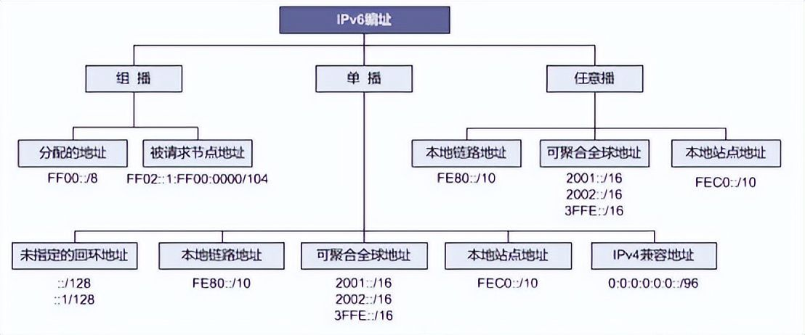
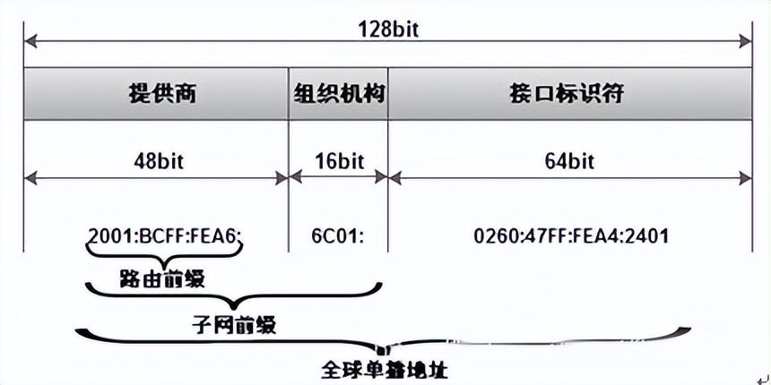
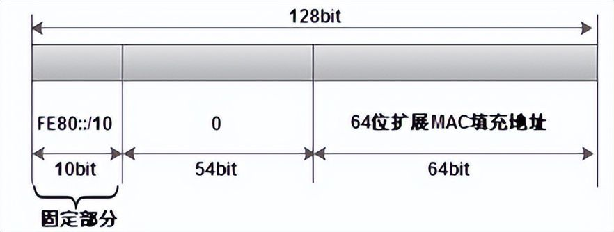
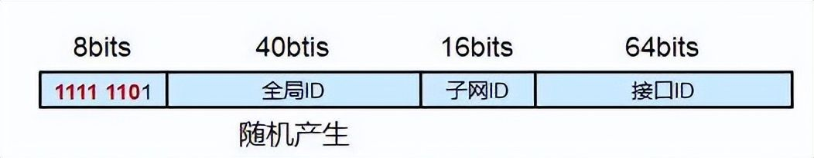
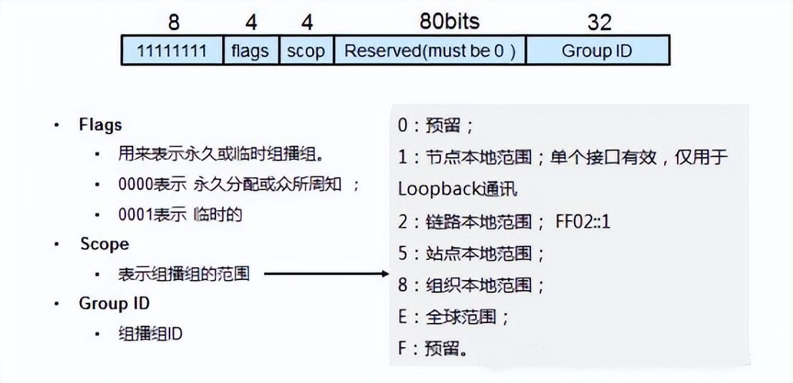

## IPv6 地址

整个 IPv6 地址的长度一共 128 位，前 64 位通常用于 IPv6 地址的前缀和子网，所有单播地址（全球公网地址）中子网必须是 64 位，而后 64 位则通常作为接口（通俗的讲，这用于标记到底是哪个设备）。



IPv6 地址分为三大类：组播、单播、任意播（也称泛播）。

单播可分为：全球单播地址、本地链路地址、站点本地地址、回环地址、未指定地址、内嵌 IPv4 地址。

### 缩写

一个 IPv6 地址中间可能包含很长的一段 0，可以把连续的一段 0 压缩为 `::`。但为保证地址解析的唯一性，地址中 `::` 只能出现一次。

另外，每个冒号之间的数据，如果前面是 0，那么可以省略，比如 `:801:` 的完整表示是 `:0801:`。当全部是 0 时，则可以只用一个 0 表示，比如 `:0000:` 可以表示位 `:0:`。

### 单播地址

Pv6 公网地址（全球单播地址，Aggregatable Global Unicast Addresses）可在全球范围内路由和到达的，相当于 IPv4 里面的 global addresses，前三个 bit 是 `001`。



地址范围为：`2xxx:xxxxx/3` ~ `3FFF::FFFF`；其中 `2001::/16` 为 IPv6 因特网地址。

接口标识符指 64 位的 MAC 地址，或者是基于 48 位 MAC 地址扩展为 64 位（EUI 64）。在全球单播地址中，如 `2001:BCFF:FEA6::/48` 表示一个 IPv6 路由前缀，如 `2001:BCFF:FEA6:6C01::/64` 表示一个 IPv6 子网前缀。

### 链路本地地址

`fe80` 开头的 IPv6 地址是链路本地地址（link local address），就像 `169.254.0.0/16`，是设备在本地网络中通讯时用的地址，是这个网段里没人给你分配 IP，自动协商的地址，其地址不能在网络上路由，IPv6 的路由器不会转发链路本地地址的数据包，也就是说通常无法用于上网。

LLA 是本地链路的地址，是在本地网络通讯的，不通过路由器转发，因此 IPv4 下网关为 `0.0.0.0`，掩码为 `255.255.0.0`。

当一个节点启用 IPv6 时自动生成链路本地地址，格式如下，64 位扩展由 MAC 地址按照 EUI 64 转换而来：



### 站点本地地址

对于无法访问 Internet 的本地网络，可以使用站点本地地址（Site-Local Addresses），这个相当于 IPv4 里面的 private address（`10.0.0.0/8`、`172.16.0.0/12` 和 `192.168.0.0/16`）。

站点本地地址的前 10 个 bit 是 `1111 1110 11`，最后是 16 位的子网 ID 和 64 位的接口 ID，所以它的前缀是 `FEC0::/48`。

类似于 IPv4 中的私有地址，仅在内部网络使用。

对于 IPv6 本地站点地址的配置，必须通过 DHCPv6 进行地址的分配、无状态的前缀公告、或者手工的进行配置。

### 唯一本地地址

唯一的本地 IPv6 单播地址（ULA，Unique Local IPv6 Unicast Address）在 RFC4193  中标准化了一种用来在本地通信中取代单播站点本地地址的地址，其概念上相当于私有 IP，仅能够在本地网络使用，在 IPv6 Internet  上不可被路由。

上面提到的站点本地地址由于起初的标准定义模糊而被弃用，而后 RFC 又重新定义了唯一本地地址以满足本地环境中私有 IPv6 地址的使用。

ULA 拥有固定前缀 `FC00::/7`，分为两块：`FC00::/8` 暂未定义，`FD00::/8` 定义如下：



ULA 目前拥有固定前缀 `FD00::/8`，后面跟一个被称为全局 ID 的 40 位随机标识符。

### 回环地址

回环地址（Loopback address）回环地址 `::1` 用于标识一个回环接口，可以使一个节点可以给自己发送数据包，相当于 IPv4 的回环地址 `127.0.0.1`。

### 未指定地址

未指定地址（Unspecified address）为 `0:0:0:0:0:0:0:0` 或者 `::` 当一个有效地址还不能确定，一般用未指定地址作为源地址，未指定地址不能作为一个目标地址来使用。

### 多播 IPv6 地址

多播 IPv6 地址（Multicast IPv6 Addresses）的前 8 个 bit 为 `1111 1111`，其中：

- `FF01::` 到 `FF0F::` 的多播地址是保留专用地址；
- `FF01::1` 为节点本地范围所有节点多播地址；
- `FF02::1` 为链路本地范围所有节点多播地址；
- `FF01::2` 为节点本地范围所有路由器多播地址；
- `FF02::2` 为链路本地范围所有路由器多播地址；
- `FF05::2` 为站点本地范围所有路由器多播地址。



### 发现邻居

ping 多播地址 `ff02::1` 可以发现其它节点：

```
~# ping ff02::1%eth0
```

ping 完之后可以查看邻居列表：

```
~# ip -6 neigh
```

### 运营商 IPv6 地址

- 电信：240e 开头（240e::/20）
- 移动：2409 开头（2409:8000::/20）
- 联通：2408 开头（2408:8000::/20）

## 前缀

下列前缀已留作特殊用途：

- `2002::/16`

  指示后跟 6to4 路由前缀；

- `3ffe::/16`

  用于 6bone 测试目的的前缀；

- `fe80::/10`

  指示后跟链路本地地址；

- `ff00::/8`

  指示后跟多点传送地址。

## 兼容 IPv4 的地址

IPv4 映射地址（IPv4-mapped address）形如 `::w.x,y.z`，这里的 `w.x.y.z` 是 IPv4 公共地址的十进制点号表示法，用于 `IPv6 / IPv4` 节点们（同时支持）在使用仅支持 IPv4 的网络上用 IPv6 的协议进行通信。

IPv6 地址与 IPv4 地址并没有公式进行对应，也就是说两者之间并没有绝对的映射关系，事实证明这种技术不是个好主意，RFC4291 中废弃了对这类地址的使用。

### IPv4 映射地址

IPv4 映射地址（IPv4-mapped address）形如 `::FFFF:w.x.y.z`，这里的 `w.x.y.z` 是 IPv4 公共地址的十进制点号表示法，用于一个仅支持 IPv4 的节点表现为一个 IPv6 的节点。

### 6over4 地址

形如 `[64bit-prefix]:0:0:WWXX:YYZZ`，其中的 `WWXX:YYZZ`是 `w.x.y.z` IPv4 公共地址的十进制点号表示法，用于一个使用 6to4 协议的隧道机制的节点。

### 6to4 地址

形如 `2002:WWXX:YYZZ:[SLA ID]:[Interface ID]`，用于表示一个使用 6to4 协议的隧道机制节点。

## 地址分配

IPv6 的一个主要特征就是允许主机自动配置接口。通过相邻节点搜索，主机可以在本地链路上查找 IPv6 路由器并请求站点前缀。在自动配置过程中，主机将执行以下操作：

- 为每个接口创建链路本地地址，该操作不要求链路上有路由器；
- 检验地址在链路上是否唯一，该操作不要求链路上有路由器；
- 确定全局地址是应通过无状态机制、有状态机制还是这两种机制来获取（要求链路上有路由器）。

IPv6 地址的分配方式主要是两种：

- 有状态分配

  即传统的分配方案，与 IPv4 时代的路由器内网地址类似，这是由路由器生成一个地址给设备，有时间限制，甚至可以理解为动态 IP 地址；

- 无状态分配

  通常就是指 SLAAC，SLAAC 是一种很简单好用的配置方式：由于在 IPv6 地址中，前缀和子网都是确定好的，如果路由器支持无状态分配，通常情况下的分配方式是，系统会使用设备的 MAC 地址来作为其 IPv6 接口的一部分。

  无状态机制允许主机生成其本身的地址，无状态机制使用本地信息以及由路由器通告的非本地信息来生成地址。

  如果没有路由器，主机可以只生成链路本地地址，链路本地地址只能用于和同一链路上的节点进行通信。

## 子网

IPv6 地址的站点前缀最多占用 IPv6 地址最左侧的 48 位。

前缀之后的那一段 16 位的数据，用于标记子网 ID。子网 ID 通常是您家庭网络的部分（家庭网络的 ID 号，如果以此为界最多可以分配 65535 个家庭使用）。

IPv6 不用子网掩码来切，而是用 `前缀 + 子网ID` 来切。IPv6 可以隔离不同子网的广播域，也可以利用子网的划分区分不同的网络设备。

家庭网络一般会分到 `/64` 或 `/56` 的子网，这些信息由系统与 IPv6 路由器自动协商管理，不需要自己去管理。

对于 `/64` 的前缀下的情况（有的地区是直接给 `/64` 前缀，只有一个子网），再接一级路由的情况，想使用 IPv6 可以考虑 NAT6。