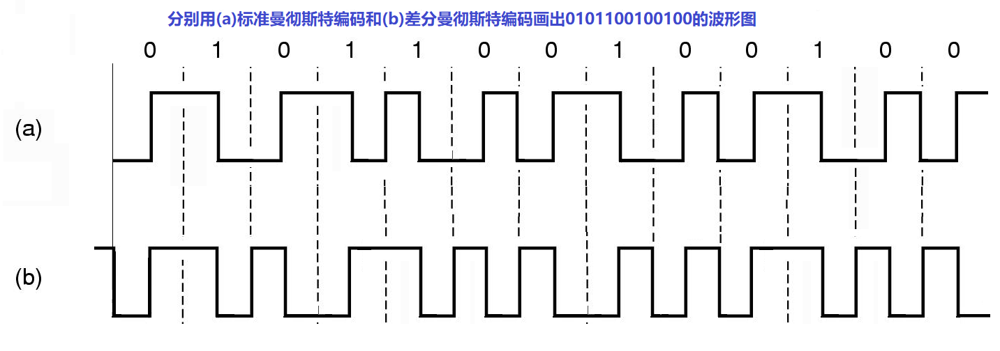
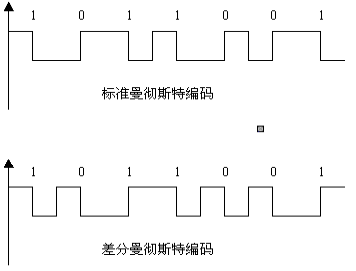

## 数字信号编码

数字信号编码是要解决数字数据的数字信号表示问题，即通过对数字信号进行编码来表示数据

数字信号编码的工作一般由硬件完成，常用的编码方法有以下三种：

- 不归零码
- 曼彻斯特编码
- 差分曼彻斯特编码

### 不归零码

- <https://baike.baidu.com/item/%E4%B8%8D%E5%BD%92%E9%9B%B6%E7%A0%81/8553875>

### 曼彻斯特码

曼彻斯特编码（Manchester Encoding）

曼彻斯特编码，常用于局域网传输。在曼彻斯特编码中，每一位的中间有一跳变，位中间的跳变既作时钟信号，又作数据信号

### 差分曼彻斯特编码

## 对比差分曼彻斯特和曼彻斯特

表示 `1 0 1 1 0 0 1`

- 标准曼彻斯特编码波形图 1 代表从高到低，0 代表从低到高

- 差分曼彻斯特编码波形图 1 代表没有跳变（也就是说上一个波形图在高现在继续在高开始，上一波形图在低继续在低开始）开始画 0 代表有跳变（也就是说上一个波形图在高位现在必须改在低开始，上一波形图在高位必须改在从低开始）

- <https://blog.csdn.net/qq_37790902/article/details/79616450>