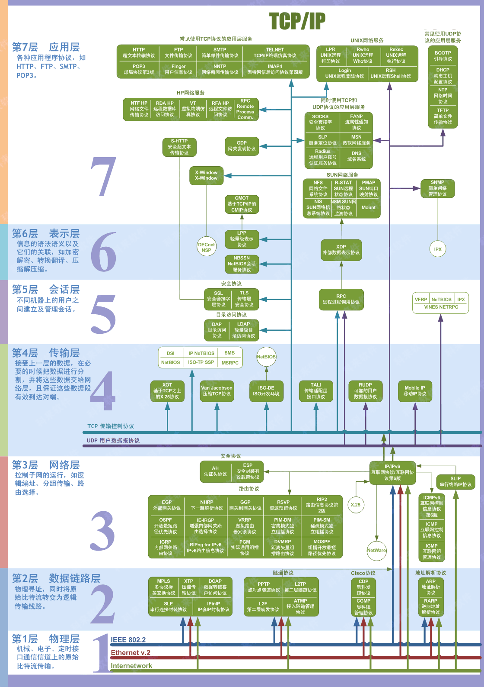

应用层原本广义上理解为应用程序接口，比如 HTTP、SFTP、TELNET、DNS

表示层原本广义上理解为数据的格式转换/编码/压缩/加密，比如 LPP、XDP

会话层面原本广义上理解为会话维持、控制、续传等，比如 SSL/TLS 通道、RPC 远程过程调用

简图：

## TCP/IP 协议栈

<https://mp.weixin.qq.com/s/5Zt-YA5QBk9SqqBVGkRk1g>

网络抓包实战：

- <https://xie.infoq.cn/article/99c014e8ecdad2778a045c2ca>

- https://xie.infoq.cn/article/9919d2c96647e99310bba09ed