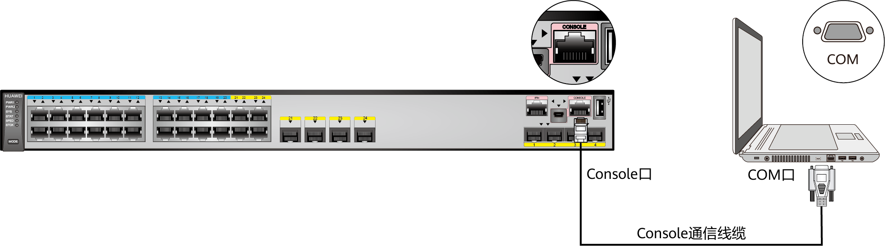

## Console

该方式是登录交换机最基本的方式，属于带外管理，也是其他登录方式（如Telnet、STelnet）的基础



### 连接 Console

直接在终端上，输入命令 `screen /dev/cu.usbserial-xxxxxx 9600` 其中9600是波特率

如果需要跳出，就要用 `ctrl -`

需要重新连接，先找到原来的连接 `screen -ls` 然后用 `screen -r 16582`，16582 为通过前面命令查看到的连接的数字

### 重置登录密码

长按（6秒以上）PNP键，使交换机恢复出厂配置并自动重新启动

S200，S1700，S5700交换机忘记密码怎么办？如何修改或清除密码？<https://support.huawei.com/enterprise/zh/doc/EDOC1100197181>

（1）BootRom 密码

V100R003C00：9300

V100R005C01：huawei

V100R006C00–V100R006C03：框式交换机为 9300，盒式为 huawei

V100R006C05：`Admin@huawei.com`

V200R001C00–V200R0012C00及之后版本：`Admin@huawei.com`

（2）Console 口密码

对于 V200R010C00 之前版本，使用 Console 口首次登录设备时没有缺省密码，首次登录时的界面会提示用户配置 Console 口登录密码

对于 V200R010C00-V200R019 版本，使用 Console 口登录设备的缺省用户名为`admin`，缺省密码为`admin@huawei.com`

对于 V200R020 版本，使用 Console 口首次登录设备时没有缺省密码，首次登录时的界面会提示用户配置 Console 口登录密码

（3）重置管理密码

<https://blog.csdn.net/weixin_39137153/article/details/126898949>

## 重置配置

```bash
<HUAWEI>reset saved-configuration

Warning: The action will delete the saved configuration in the device.
The configuration will be erased to reconfigure. Continue? [Y/N]:Y
```

## 基础配置

进入系统视图

```bash
<HUAWEI>system-view
```

设置设备名称

```bash
[HUAWEI]sysname HW-SW-01
```

关闭信息中心（可选，减少日志干扰）

```bash
[HW-SW-01]info-center disable
```

设置时区

```bash
[HW-SW-01]clock timezone UTC+08:00 add 08:00:00
```

配置管理 VLAN（示例：VLAN 1）

```bash
[HW-SW-01]vlan 1
[HW-SW-01-vlan1]quit
```

配置管理 IP 和默认网关

```bash
[HW-SW-01]interface Vlanif 1
[HW-SW-01-Vlanif1]ip address 172.31.24.150 255.255.255.0
[HW-SW-01-Vlanif1]ip route-static 0.0.0.0 0.0.0.0 172.31.24.254
```

## SSH 配置

开启 SSH 服务功能

```bash
<HUAWEI>system-view
[HUAWEI]stelnet server enable
```

生成密钥对

```bash
[HUAWEI]rsa local-key-pair create
```

创建  ssh 用户名为 huawei

```bash
[HUAWEI]ssh user huawei
[HUAWEI]ssh user huawei authentication-type password
[HUAWEI]ssh user huawei service-type stelnet
```

进入 aaa 模式下配置用户

```bash
[HUAWEI]aaa
[HUAWEI-aaa]local-user huawei password cipher changeme
[HUAWEI-aaa]local-user huawei privilege level 15
[HUAWEI-aaa]local-user huawei service-type ssh
```

配置 vty 界面支持的登录协议

```bash
[HUAWEI]user-interface vty 0 4
[HUAWEI-ui-vty0-4]authentication-mode aaa
[HUAWEI-ui-vty0-4]protocol inbound ssh
```

quit 命令退至用户视图，save 命令保存
