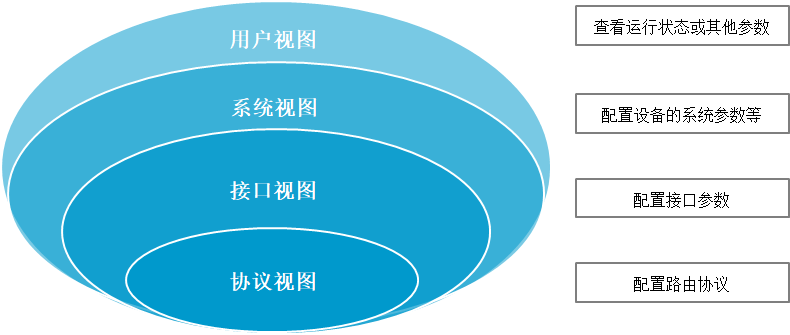
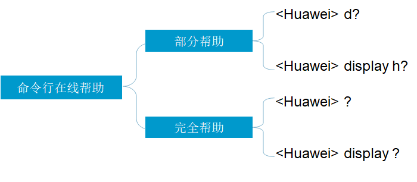

## VRP 系统

VRP 系统（通用路由平台）是华为公司数据通信产品的通用网络操作系统平台，包括路由器、交换机、防火墙、WLAN 等众多系列产品

查看命令行热键

```bash
display hotkey
```

VRP 系统提供了“不完整关键字输入”功能，例如查看当前配置：

```bash
display current-configuration 
d cu
dis cu
```

按 `?` 可以在线查找命令帮助文档，例如

```bash
display acl ?
```

若有多个交换机或路由器，需要给设备更改名称，方便区分不同设备，避免配置错误

```bash
<Huawei>system-view 
[Huawei]sysname AR1
[AR1]
```

几乎所的配置命令（不包括管理类的命令）都有对应的 undo 命令格式，其中 undo 作为这些命令的关键字，即为 undo 命令行。

undo 命令行一般用来恢复缺省情况、禁用某个功能或者删除某项设置

```bash
sysname abc
undo sysname
```

## 命令视图 





用户视图：

- `<HUAWEI>` 查看交换机简单的运行状态和统计信息
- 建立连接就能进入
- `quit` 断开与交换机的连接

系统视图：

- `[HUAWEI]` 配置系统参数
- 在用户视图下输入 `system-view`
- `quit` 返回用户视图

以太网端口视图：

- `[HUAWEI-Ethernet0/0/1]`配置以太网端口
- 系统视图下键入 `interface ethernet0/0/1`
- `quit`返回用户视图

NULL 接口视图：

- `[HUAWEI-NULL0]` 配置 NULL 接口视图参数（转发到 null 接口的网络数据报文会被丢弃）
- 系统视图下键入 `interface null 0`

Tunnel 接口视图：

- `[HUAWEI-Tunnel0]` 配置隧道接口视图参数
- 系统视图下键入 `interface tunnel 0`

