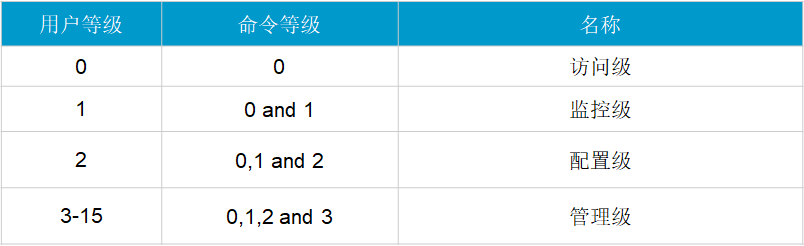
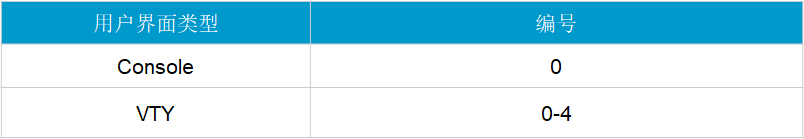

## 交换机命名规则

华为交换机分为 S1700、S2700、S3700、S5700、S6700、S7700 和 S9700 共七个产品系列。

根据用户规模的不同可分为家庭网络、中小型企业园区网、大型企业园区网

- S1700 系列：百兆二层交换机，适用于中小型网络接入层

- S2700 系列：百兆二层交换机，适用于中小型网络接入层

- S3700 系列：百兆三层交换机（支持千兆上行），适用于中型网络的接入层和小型网络的汇聚层

- S5700 系列：全千兆三层交换机，适用于大中型网络的汇聚层，中小型数据中心的接入层

- S6700 系列：万兆三层交换机，适用于中型网络的核心层、大中型网络的汇聚层，大中型数据中心的接入层

- S7700、S9300 和 S9700 系列：T 比特路由交换机，定位于大型网络的核心层和大型数据中心的核心层

华为交换机命名规则文档：<https://support.huawei.com/enterprise/zh/doc/EDOC1000013512/6bd51a51>

## VRP 系统

VRP 系统（通用路由平台）是华为公司数据通信产品的通用网络操作系统平台，包括路由器、交换机、防火墙、WLAN 等众多系列产品

### 常用命令

查看命令行热键

```bash
display hotkey
```

VRP 系统提供了“不完整关键字输入”功能，例如查看当前配置：

```bash
display current-configuration 
d cu
dis cu
```

按“?”可以在线查找命令帮助文档，例如

```bash
display acl ?
```

若有多个交换机或路由器，需要给设备更改名称，方便区分不同设备，避免配置错误

```bash
<Huawei>system-view 
[Huawei]sysname AR1
[AR1]
```

几乎所的配置命令（不包括管理类的命令）都有对应的 undo 命令格式，其中 undo 作为这些命令的关键字，即为 undo 命令行。undo 命令行一般用来恢复缺省情况、禁用某个功能或者删除某项设置

```bash
sysname abc
undo sysname
```

### 进阶命令

（1）查看和更改设备的当前时间

需要在用户视图下配置设备的当前时间

```bash
<AR1>display clock 
2017-12-06 17:53:51
Wednesday
Time Zone(BJ) : UTC+08:00
```

配置时间之前要先配置时区

```bash
clock timezone CST add 8
<AR1>clock timezone BJ add 08:00:00
```

再通过以下命令更改时间

```bash
clock datetime 17:0:0 2012-1-1
<AR1>clock datetime 10:00:00 2017-12-07
```

（2）查看设备的版本信息

```bash
display version
```

（3）（4）查看设备的配置信息

```bash
display current-configuration
```

（5）配置用户登录前和登录后提示信息

在系统视图下，配置登录前信息，配置的信息需要用 `#` 包括起来

```bash
header login information
[AR1]header login information "welcome to huawei device"
```

配置登录后的信息

```bash
header shell information
[AR1]header shell information "pelase don`t reboot the device"
```

## 配置登录设置

### 首次登录进行初始化

VRP 系统的首次登录必须采用本地登录方式，因为此时交换机还没配备用于远程登录的用户、IP 地址等必需配置。华为 S 系列交换机可以通过 Console 口进行首次登录，实现对新交换机的基本配置

（1）配置交换机名称和 IP 地址

这里所配置的 IP 地址可以看成是管理 IP 地址，专为日后进行 Telnet 之类的远程交换机登录使用。但这里要注意的是，在华为交换机中除了一些交换机提供的专门管理口（通常为 Ethernet0/0/0 接口）外，不能直接在物理接口上配置 IP 地址，仅可在 VLAN 接口、Loopback、Tunnel、子接口等这些逻辑接口上配置 IP 地址

管理 IP 地址通常是在管理接口，或者 VLAN 接口上配置，如果交换机没有提供管理接口，通常是在 VLAN 接口上配置，可直接在缺省的 VLAN1 接口上配置

```bash
<HUAWEI>system-view
[HUAWEI] interface Vlanif 1
[HUAWEI-Vlanif2] ip address 10.253.253.254 24
[HUAWEI-Vlanif2] ip address 10.253.253.1 255.255.255.0 sub
```

（2）选择配置的用户界面

华为 S 系列交换机的 VRP 系统支持 “Console 用户界面” 和 “VTY 用户界面” 这两大类。

- Console 用户界面

当用户通过 Console 口或者 MiniUSB 口登录交换机实现本地维护时，可以根据使用需求或对交换机安全的考虑，配置相应的 Console 用户界面属性。

Console 类型的用户界面只有一个。Console 编号：固定为 CON 0，且只有这一个编号。

- VTY 用户界面（Virtual Type Terminal，虚拟类型终端）

VTY 是一种虚拟线路端口。用户通过终端与交换机建立 Telnet 或 SSH 连接后，即建立了一条 VTY 连接（或称 VTY 虚拟线路）。
当用户通过 Telnet 或 SSH 方式登录交换机实现本地或远程维护时，可以根据用户使用需求以及对交换机安全的考虑，配置 VTY 用户界面。

VTY 类型的用户界面有多个，每个用户界面可以分配给一个用户使用。VTY 编号：第一个为 VTY 0，第二个为 VTY 1，最高编号为 VTY 14，共有 15 个

- LTT：堆叠场景下，从非主交换机 Console 口登录设备的用户

可用 `display user-interface`（不带参数）命令查看交换机当前支持的用户界面以及它们的绝对编号

```bash
display user-interface
```

（3）选择用户界面的用户验证方式

VRP 系统中对用户的验证方式有两种：Password 验证和 AAA 验证

- Password 验证：只需要进行密码验证，不需要进行用户名验证，所以只需要配置密码，不需要配置本地用户。此为缺省认证方式
- AAA 验证：需要同时进行用户名验证和密码验证，所以需要创建本地用户，并为其配置对应的密码。这种方式更安全

配置 VTY 就是配置通过 telnet 访问，默认支持 5 个用户通过 telnet 访问，最大支持 15 个用户。用户界面优先级 VRP 系统支持对登录用户进行分级管理，与命令级别一样，用户级别也对应分为 0～15 共 16 个级别，标识越高则优先级越高。

优先级：用户所能访问命令的级别由其所使用的用户界面配置的优先级或者为用户自身配置的用户优先级别决定，但高级别用户可以访问比他低的所有级别命令。也就是在 AAA 验证方式下，用户级别不是由所使用的用户界面级别确定，而是由具体的用户账户优先级别确定，更加灵活，因为这样一来，同一用户界面下的不同用户的用户级别可能不一样。当然，这也决定了在 AAA 验证方式下，必须为具体的用户配置具体的用户优先级

（4）配置用户界面 Console 口登录

当用户通过 Console 口登录交换机实现本地维护时，可以根据实际需求配置相应的 Console 用户界面属性，包括 Console 用户界面的物理属性、终端属性、用户优先级和用户验证方式等

进入用户界面之后，更改认证模式

```bash
# 进入 console 的用户界面
user-interface console 0

# 使用 aaa 验证
authentication-mode aaa
# 配置 aaa 视图的账号和密码
local-user admin password huaweiu huaweip

# 其他登录方式：
# （1）不使用密码验证
authentication-mode none
# （2）使用密码验证
authentication-mode password
```

### 配置 telnet 登录

先进入接口视图，开启接口，然后设置 IP 地址和子网掩码，用于外部设备访问本机的 IP

```bash
dis ip int brief
int m0/0/0
undo shutdown
ip address 10.1.1.1 24
```

配置被访问设备的用户界面的密码

```bash
# 路由器 AR2 10.1.1.10
# 因为 telnet 是 vty 连接，因此需要配置 vty 界面
user-interface vty 0 4

# 为简便起见，这里设置的是密码模式
authentication-mode password
```

接着在另一台路由器的用户视图通过 telnet 访问设备的 ip 地址

```bash
# 路由器 AR1
telnet 10.1.1.10
# 再输入密码
```

配置 vty 界面的命令等级

```bash
# 查看用户的访问等级
display user-interface

# 设置用户的访问等级为 3
user privilege level 3
```

参考：<https://support.huawei.com/enterprise/zh/doc/EDOC1000178156/43609ffc>

| 用户级别 | 命令级别   | 级别名称 | 说明                                                         |
| -------- | ---------- | -------- | ------------------------------------------------------------ |
| 0        | 0          | 参观级   | 网络诊断工具命令（ping、tracert）、从本设备出发访问外部设备的命令（Telnet客户端）等 |
| 1        | 0、1       | 监控级   | 用于系统维护，包括display等命令                              |
| 2        | 0、1、2    | 配置级   | 业务配置命令，包括路由、各个网络层次的命令，向用户提供直接网络服务 |
| 3～15    | 0、1、2、3 | 管理级   | 用于系统基本运行的命令，对业务提供支撑作用，包括文件系统、FTP、TFTP下载、用户管理命令、命令级别设置命令以及用于业务故障诊断的debugging命令等 |



设置命令等级

```bash
<R1> system-view
[R1]command-privilege level 3 view user save
```



```bash
<AR1>system-view
[AR1]user-interface vty 0 4                             *进入接口*
[AR1-ui-vty0-4]set authentication password cipher ar1   *设置密码*
[AR1-ui-vty0-4]user privilege level 1                   *配置权限*
[AR1-ui-vty0-4]idle-timeout 5 0                         *设置超时时间*
```

更改登录访问模式

由于通过密码访问是所有管理员使用同一个密码，若多个管理员希望使用不同密码，则可以使用 aaa 模式

```bash
# 1. 进入 vty 界面，更改认证模式为 aaa
user-interface vty 0 4
authentication-mode aaa

# 2. 进入 aaa 视图
aaa
local-user admin password huaweiu huaweip
# 配置用户权限
local-user admin privilege level 15
# 注意：若 console 视图使用 aaa 模式，配置 telnet 的服务类型后，就不能用 console 口登录
local-user admin service-type telnet
# 可多选服务类型
local-user admin service-type telnet terminal http
```

### 配置 web 登录

HTTP Web 网管登录方式的配置比较简单，有如下基本配置思路。
（1）向交换机上传并加载 Web 网页文件。
（2）同时使能 HTTPS 和 HTTP 服务功能，配置 HTTP 服务属性参数，如 HTTP 服务监听端口和超时时间。当然也可以不配置这些属性参数，因为它们都有缺省值
（3）在 AAA 视图下创建用于 HTTP Web 网管登录的本地用户账户，配置用户级别和对 HTTP 服务的支持
（4）在浏览器地址栏中输入交换机的管理 IP 地址即可实现成功登录

```bash
# 开启 http 服务
[HTTP-Server] http server enable

# 进入 aaa 视图创建 web 的账号和密码，并配置服务类型为 http 访问
[HTTP-Server] aaa
[HTTP-Server-aaa] local-user admin password cipher huawei
[HTTP-Server-aaa] local-user admin privilege level 15
[HTTP-Server-aaa] local-user admin service-type http
[HTTP-Server-aaa] quit
```

在交换机的命令行界面下执行 display http server 任意视图命令可以看到交换机配置的 HTTP 服务器的当前状态，可以验证配置是否正确

```bash
display http server
```

在用户 PC 的 Web 浏览器地址栏中直接输入 <http://192.168.0.1>（此处假设交换机的管理 IP 地址为 192.168.0.1）

## 参考资料

VLAN 划分相关：

- <https://blog.csdn.net/qq_40610003/article/details/133342658>

- <https://blog.csdn.net/2301_76462724/article/details/139454793>


- <https://zixujing.github.io/2019/10/22/switch/%E4%BA%A4%E6%8D%A2%E6%9C%BA%E7%99%BB%E5%BD%95%E9%85%8D%E7%BD%AE/>

- <https://juejin.cn/post/7084931746013282341>
