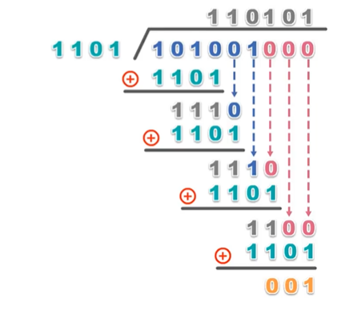
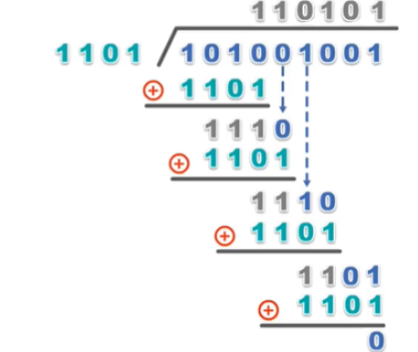

## CRC 概述

- CRC 即 Cyclic Redundancy Check 的缩写
- CRC 循环冗余校验属于`检错码`，只能检测出现了错误，但无法纠正错误。
- 与 CRC 循环冗余校验类似的，还有奇/偶校验，但是 CRC 漏检率更低，因此在实际应用中更为重要

## 使用 CRC 校验数据流程

- 首先需要发送方在原始数据的基础上，加上 CRC 校验码，组成新的发送数据
- 然后接收方对收到的`原始数据 + 校验码`进行校验，判断数据在传输过程中是否出现错误

### 发送方对原始数据追加校验码

- 假设原始数据是：`101001`
- 生成待追加的校验码，需要使用一个`生成多项式，G(x)(收发双方事先约定)`，例如 G(x) = x3 + x2 + 1
- 构造被除数：原始数据 + 生成多项式最高次项个0，即：`101001000`



### 接收方对收到的数据进行校验




## 代码实现

实现：

```cpp
unsigned short crc16(unsigned short crc, unsigned char *p, int len)
{
          while (len--)
               crc = (crc >> 8) ^ crctab[(crc ^ *p++) & 0xff];
          return crc;
}
```


- <https://blog.csdn.net/TL18382950497/article/details/113794438>
