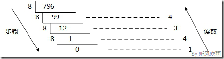
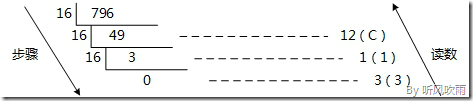
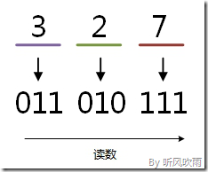
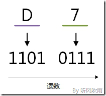

> 在数字后面加上不同的字母来表示不同的进位制。B（Binary) 表示二进制，O（Octal）表示八进制，D（Decimal）或不加表示十进制，H（Hexadecimal）表示十六进制。例如：`(101011)B=(53)O=(43)D=(2B)H`

## 按权展开

r 进制转十进制可以使用按权展开法。

为什么其他进制按权展开就直接是 10 进制? 简单的一句话就是因为权项结果是用 10 进制表示（正整数 N，基数为 r）
$$
\begin{aligned}
N & =d_{n-1} d_{n-2} \cdots d_{1} d_{0} \\
& =d_{n-1} \mathrm{r}^{n-1}+d_{n-2} \mathrm{r}^{n-2}+\cdots+d_{1} r+d_{0}
\end{aligned}
$$

以 11111 为例子，转为 10 进制的时候：
$$
1 \times 2^{4}+1 \times 2^{3}+1 \times 2^{2}+1 \times 2^{1}+1 \times 2^{0}=16+8+4+2+1=31
$$
其中 `16+8+4+2+1` 的过程已经使用了十进制。

对于二进制数字 11111 因为逢二进一所以按权展开就是要这样：
$$
1 \times 2^{4}+1 \times 2^{3}+1 \times 2^{2}+1 \times 2^{1}+1 \times 2^{0}
$$

由于习惯性的把加起来的和等于十进制的 15，所以我们会误认为按权展开就是十进制，其实准确的写法应该是：

- 十进制

$$
1 \times 2^{4}+1 \times 2^{3}+1 \times 2^{2}+1 \times 2^{1}+1 \times 2^{0}=(31)_{10}
$$

- 二进制

$$
1 \times 2^{4}+1 \times 2^{3}+1 \times 2^{2}+1 \times 2^{1}+1 \times 2^{0}=(11111)_2
$$

- 十六进制

$$
1 \times 2^{4}+1 \times 2^{3}+1 \times 2^{2}+1 \times 2^{1}+1 \times 2^{0}=(1F)_{16}
$$

> 如果在小数点的右方，幂的值为负

## 短除法

- 十进制 → 二进制

方法：除 2 取余法，即每次将整数部分除以 2，余数为该位权上的数，而商继续除以 2，余数又为上一个位权上的数，这个步骤一直持续下去，直到商为 0 为止，最后读数时候，从最后一个余数读起，一直到最前面的一个余数。 

例：将十进制的 `(43)D` 转换为二进制的步骤如下：

1. 将商 43 除以 2，商 21 余数为 1；

2. 将商 21 除以 2，商 10 余数为 1；

3. 将商 10 除以 2，商 5 余数为 0；

4. 将商 5 除以 2，商 2 余数为 1；

5. 将商 2 除以 2，商 1 余数为 0； 

6. 将商 1 除以 2，商 0 余数为 1； 

7. 读数，因为最后一位是经过多次除以 2 才得到的，因此它是最高位，读数字从最后的余数向前读，`101011`，即 `(43)D=(101011)B`。

- 十进制 → 八进制

方法：除 8 取余法，即每次将整数部分除以 8，余数为该位权上的数，而商继续除以 8，余数又为上一个位权上的数，这个步骤一直持续下去，直到商为 0 为止，最后读数时候，从最后一个余数起，一直到最前面的一个余数。

例：将十进制的(796)D转换为八进制的步骤如下：

1. 将商 796 除以 8，商 99 余数为 4；

2. 将商 99 除以 8，商 12 余数为 3；

3. 将商 12 除以 8，商 1 余数为 4；

4. 将商 1 除以 8，商 0 余数为 1；

5. 读数，因为最后一位是经过多次除以 8 才得到的，因此它是最高位，读数字从最后的余数向前读，`1434`，即 `(796)D=(1434)O`。

- 十进制 → 十六进制

方法：除 16 取余法，即每次将整数部分除以 16，余数为该位权上的数，而商继续除以 16，余数又为上一个位权上的数，这个步骤一直持续下去，直到商为 0 为止，最后读数时候，从最后一个余数起，一直到最前面的一个余数。

例：将十进制的 `(796)D`转换为十六进制的步骤如下：

1. 将商 796 除以 16，商 49 余数为 12，对应十六进制的 C；

2. 将商 49 除以 16，商 3 余数为 1；

3. 将商 3 除以 16，商 0 余数为 3；

4. 读数，因为最后一位是经过多次除以 16 才得到的，因此它是最高位，读数字从最后的余数向前读，`31C`，即 `(796)D=(31C)H`。

## 二、八、十六进制互转

- 二进制 → 八进制

方法：

取三合一法，即从二进制的小数点为分界点，向左（向右）每三位取成一位，接着将这三位二进制按权相加，然后，按顺序进行排列，小数点的位置不变，得到的数字就是我们所求的八进制数。

如果向左（向右）取三位后，取到最高（最低）位时候，如果无法凑足三位，可以在小数点最左边（最右边），即整数的最高位（最低位）添0，凑足三位。

八进制转二进制则相反

二进制和八进制对应表

| 二进制 | 八进制 |
| ------ | ------ |
| 000    | 0      |
| 001    | 1      |
| 010    | 2      |
| 011    | 3      |
| 100    | 4      |
| 101    | 5      |
| 110    | 6      |
| 111    | 7      |

- 二进制 → 十六进制

方法：

取四合一法，即从二进制的小数点为分界点，向左（向右）每四位取成一位，接着将这四位二进制按权相加，然后，按顺序进行排列，小数点的位置不变，得到的数字就是我们所求的十六进制数。

如果向左（向右）取四位后，取到最高（最低）位时候，如果无法凑足四位，可以在小数点最左边（最右边），即整数的最高位（最低位）添0，凑足四位。

十六进制转二进制则相反

